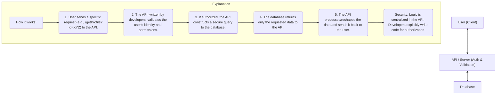
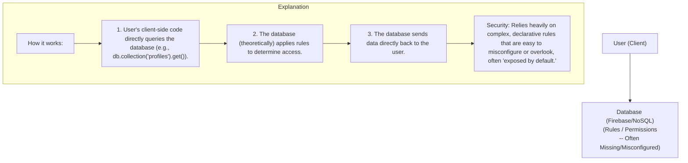

If you haven't been following, Tea is an app designed for women to share insights about men they've dated. Regardless of your personal feelings about the app's premise (and trust me, we all have them!), the security snafu that hit them is an absolute masterclass in "what not to do."

While many are calling it a simple data leak, I'm unapologetically calling it a hack. And no, it wasn't some fancy zero-day exploit or "vibe coding" gone wrong. It was, quite simply, a symphony of bad design decisions that turned a simple file bucket into a data public square. And spoiler alert: Firebase plays a starring role in this drama.

Let's uncork this bottle of un-tea-fied chaos.

### What Went Down? The "Tea" on the Breach

First, the facts. To ensure only women could sign up for Tea, the app required users to submit identity verification photos or IDs. These highly sensitive files (we're talking faces, government IDs, and even raw metadata like location from phone cameras!) were stored in a public Firebase bucket. And then, well, someone found all the URLs, saved every file, and _poof_ – hundreds of thousands of people's private data were exposed to the world.

To add insult to injury, this specific bucket hadn't even been in active use since mid-2024, meaning it primarily affected older users who thought their data was safe. And just when you thought it couldn't get worse, a second breach exposed all their in-app message data, forcing them to shut down the messaging feature entirely.

**The chilling takeaway?** Whether you love or hate this app, no one expects their identity documents or private conversations to be laid bare for the internet to feast upon. This is a fundamental betrayal of user trust.

### The Unlocked Door Fallacy: Why It's Still a Hack

Now, let's address the elephant in the room: "But the bucket was public! It wasn't a hack!"

My take? That's just silly. We use the term "hack" similarly to "steal." If someone leaves their front door unlocked, and a person walks in, rummages through their belongings, and takes their valuables, did they not steal? Absolutely! They just didn't have to pick a lock.

The same logic applies here. Yes, the files were on publicly accessible URLs. But those URLs are usually randomly generated (like UUIDs) and virtually impossible to guess en masse. You can't just "sniff" every public URL on the internet. To get _all_ the files, the perpetrators needed an _index_—a list of every single URL. And guess what? They got that index by hitting an exposed Firebase API endpoint that conveniently listed all the data in the bucket.

**This is the crucial distinction:** Exposing individual public URLs isn't ideal, but it’s often a design choice (like unlisted YouTube videos). Exposing an _endpoint that provides a comprehensive list of all those URLs_? That, my friends, is a fundamental security flaw that was exploited. They didn't "break in" through a strong door, but they sure as heck walked through an open garage, found the keys to the house, and took everything. That's a hack in my book.

### The Root Cause: When Your Database Becomes a Public Square

So, how did this happen? It all boils down to an architectural philosophy that, frankly, sends shivers down my spine: allowing direct client-to-database access without a proper API layer.

Let's visualize the difference:

**Diagram 1: The Secure API Model**

**Diagram 2: The Direct Database Access Model (Firebase / Bad Pattern)**

### Firebase: A Convenient Trap?

Firebase, being a "backend as a service" provider, simplifies app development by handling databases, file storage, authentication, and more. It gained popularity, especially among mobile developers, because it offered a seemingly elegant solution to avoid writing server-side code. "Why build an API," the thinking goes, "when the user can just query the database directly?"

This is where the convenience becomes a trap. In a traditional API, you're _forced_ to write code that explicitly defines _how_ data is accessed and _who_ can access it. When you're building an endpoint like `/getProfile`, it's glaringly obvious that you need to add authentication and authorization checks. It's part of the coding process.

With Firebase (and similar services that promote direct client access), you're often given a database that is "exposed by default." You then layer on rules or permissions to _restrict_ access. The problem? It's much easier to forget to restrict something, or to misconfigure a complex rule, than it is to forget to _write_ the code that grants access in the first place. This leads to common misconfigurations where an endpoint that should only show _your_ profile data ends up revealing everyone's, or worse, listing every single file in a storage bucket.

### Learning from the Spill: How to Brew Secure Apps

The core lesson from the Tea App fiasco is simple, yet often overlooked: **All data access should be explicitly defined in your source code, on a server.**

If you're building an application, you should be defining specific API endpoints (functions, mutations, queries) that act as the gatekeepers to your data. This forces you to think about:

- **Authentication:** Is the user who they say they are?
- **Authorization:** Does this user have permission to access _this specific piece_ of data?
- **Data Transformation:** Do I need to reshape or filter the data before sending it to the user?

Platforms like Convex (a personal favorite, full disclosure!) mandate this approach. You can't directly query the database from the client. Instead, you define explicit queries and mutations (as actual functions in your codebase) that mediate access, often with built-in authentication helpers. This makes security an integral part of development, not an afterthought.

### Beyond the Mobile Bubble: A Call for Full-Stack Sanity

A big reason issues like this persist, in my opinion, is a divide in the developer world. There's a tendency, especially among some mobile developers (and I say this as a former mobile dev!), to have an almost phobic aversion to anything server-side. Building "real" backend infrastructure often gets pushed aside for the convenience of services like Firebase, promising to remove the need to "think about infra."

But guess what? If you're not thinking about your infrastructure, you're leaving a gaping hole for disaster. The "Tea App" isn't an isolated incident; stories abound of companies, even major fast-food chains, getting "Fireponed" because mobile teams built their backends with publicly exposed databases.

My advice for every developer, regardless of your specialty: **Break out of your bubble!**

- **Mobile Devs:** Go build a proper web backend. Understand servers, APIs, and databases. Conquer your fear of JavaScript (or whatever language your backend uses).
- **Web Devs:** Dive into mobile development. Learn Swift/Kotlin, understand platform-specific challenges. Or truly dig deep into backend architecture.

Understanding the entire stack — from client to API to database — makes you a more valuable, more secure, and frankly, a more complete engineer. The average mobile dev can sometimes be indistinguishable from a "vibe coder" when it comes to server knowledge, and that's a problem we need to fix.

### Key Takeaways (The Strong Brew)

Here's the concentrated essence of what we've discussed:

1. **Write Your Data Access Code**: Always define server-side functions or API endpoints that control how data is accessed from your database. Don't rely solely on declarative database rules.
2. **Beware of "Exposed by Default"**: If a service encourages direct client-to-database access, or if data is exposed by default, proceed with extreme caution. It's a disaster waiting to happen.
3. **Broaden Your Horizons**: Don't limit yourself to one part of the stack. A deeper understanding of how front-end, back-end, and databases interact is crucial for building secure and robust applications.

This hack wasn't fancy. It was a basic failure of architectural understanding and secure defaults. Let this be a bitter lesson that we all take to heart.

What do you think? Was I too harsh on Firebase, or did I hit the nail on the head? Let me know your thoughts in the comments!

Until next time, Nerd...Keep Coding
