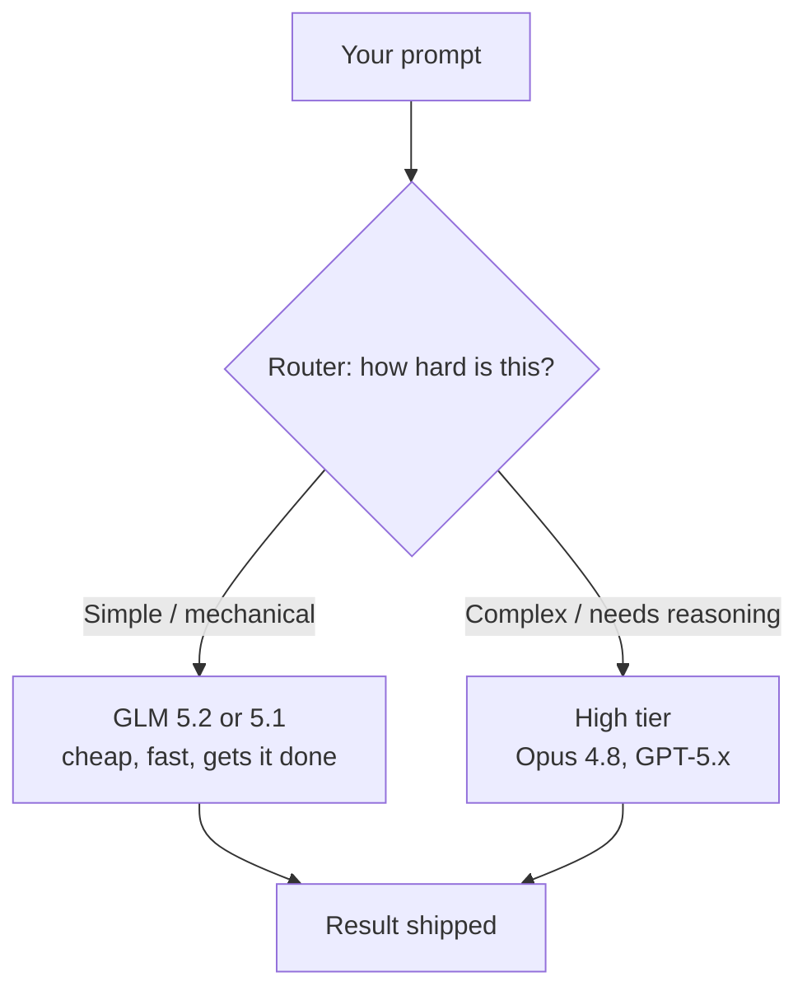
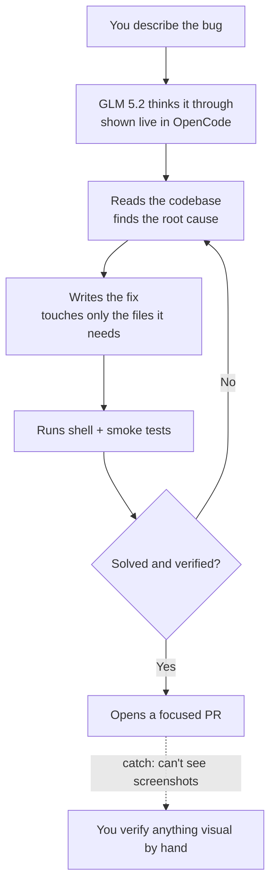

I told you at the end of the Fable 5 post that I had a pile of GLM 5.2 notes and a whole write-up coming. Here it is.

I've been running GLM 5.2 for a month straight — not a weekend trial, a month of real work inside OpenCode. I'm on a full subscription now, and GLM 5.2 is wired in as my Hermes agent, my default core agent for basically everything. Setup was painless. Point OpenCode at the Go provider, pick GLM-5.2, done.

And here's the short version before I get into it: this is the best value in AI coding right now, full stop. It's also blind, hungry, and unoptimized in ways that'll make you wince. Both things are true. Let me show you.

## TL;DR — the short version

- **What:** GLM 5.2 is Z.ai's open-weight coding model. I ran it for a month as my main agent in OpenCode, on the **OpenCode Go** plan ("low-cost coding models for everyone").
- **What it's great at:** code review, writing code, searching a codebase, and — surprisingly — knowing *when a problem is above its pay grade*. It's relentless: it diagnoses a bug, fixes it, runs its own shell and smoke tests, and loops until it's actually solved.
- **The proof:** it root-caused and fixed three real bugs in my macOS app **Vitals** — a chart-rendering stall (**history-scroll CPU ~89% → ~13%**, 126/126 tests passing), a nav-bar lag on the Processes tab, and a battery drain (**143/143 tests, ~50% fewer wakeups on battery**). Each session cost a few dollars of metered compute.
- **The catches:** it **can't see images or screenshots** (no multimodal — a real problem for UI debugging), it's a **token glutton**, and it's **unoptimized**. On pay-per-token (Fireworks) it ate $10–20 of free credits at a speed I still can't quite believe.
- **The verdict:** if you've got a ~$10 budget for coding, there is nothing better. I get 90% of my work done with it. Use **OpenCode Go**, not Zen.

## Quick answers 

**What is GLM 5.2?**
An open-weight coding model from Z.ai (the GLM series). It dropped before Fable 5 came back, got a big wave of hype on X, and the pitch was that it goes toe-to-toe with the frontier on benchmarks at a fraction of the price.

**How do I run it?**
Inside OpenCode, on the OpenCode Go subscription. Select "OpenCode Go" as the provider in your config, pick GLM-5.2, and it becomes your agent. I set it up as my Hermes agent and it's been my default for a month.

**What does it cost?**
The Go plan is cheap — think $5 to start, ~$10/month once you're in. Individual sessions meter a few dollars of compute against your rolling/weekly/monthly usage. On raw pay-per-token providers it's a different, scarier story (more below).

**Is GLM 5.2 as good as Opus 4.8?**
For a big chunk of day-to-day coding, review, and search — close enough that the price gap stops mattering. For anything visual, or anything needing heavy reasoning and optimization, no. That's the honest line.

**Can GLM 5.2 see screenshots?**
No. No image support. It told me so, mid-session, when I pasted a screenshot of a laggy nav bar. That's its single biggest limitation.

**When did I use it?**
Across June 2026, mostly on my Vitals codebase, before and around the Fable 5 saga. All the numbers and screenshots below are from those sessions.

## Setup and the first impression

OpenCode itself is clean. I mean it — the desktop app is genuinely nice to sit in, and the way it streams the model's thinking live is a big part of why I stuck around. You watch GLM 5.2 reason its way through a problem in real time instead of staring at a spinner.

The Go plan is the whole pitch: low-cost coding models for everyone. You get rolling, weekly, and monthly usage meters instead of a raw per-token bill, which — for a token-hungry model like this one — turns out to matter a lot.

So I did what I always do with a new model: I threw a real, annoying bug at it.

## The test: can it actually fix my app?

The hype said GLM 5.2 was on par with Opus 4.8. Fine. My macOS system monitor, **Vitals**, had a real performance problem: when a lot of data loaded, the app lagged hard at peak. I knew Claude could fix it. The question was whether this cheap model could.

Four prompts in, it had found the root cause on its own.

> Root cause confirmed: `AppIconCache.icon(for:)` runs `NSWorkspace.shared.icon(forFile:)` synchronously on the main thread. Each visible `ProcessRow` loads via `.task`, so ~15–20 icon loads serialize on the first frame — that's the lag.

That's not a guess. It read the code, traced the call path, and pointed at the exact synchronous call blocking the main thread. Then it fixed it and verified the fix with its own shell tests — switch-back latency, scroll CPU, the works. It even showed the commands it ran right there in the terminal view, which I love.

The result shipped as a focused pull request:

Four files. +146/−56. History-scroll peak CPU went from **~89% to ~13%**, AX latency flat, **126/126 tests passing**. You can see the actual PR here: [Vitals#66](https://github.com/rafay99-epic/Vitals/pull/66).

And here's the part that told me this model has real taste: it also *prototyped* a bigger `@Observable` migration, hit genuine framework friction (mixing `@Environment` and `@EnvironmentObject` breaks the synthesized initializer, ~25 child views wouldn't compile), and then **reverted it** and shipped the low-risk fix instead — documenting the bigger change as a follow-up. It knew when to stop. That restraint is rare.

One thing I noticed in the PR: it only touched **6 files** across the session and nothing more. That's a very GPT-flavored behavior — surgical, stays in its lane, doesn't go rewriting half your repo to feel productive. I like it.

## Where it earns its keep

After a month, here's what GLM 5.2 is genuinely good at:

**Code review and coding.** It writes solid code and reviews it well. This is the bread and butter and it just works.

**Searching a codebase.** Point it at a repo and it finds the relevant thing fast. Its "explored / N reads" grep-and-read loop is efficient.

**Being relentless.** This is the underrated one. It verifies, and re-verifies, and re-verifies again until the problem is actually solved. It *can* get stuck looping over tokens if it's not careful — but in my month with it, it didn't. It kept its head down and finished.

The battery drain job is the cleanest example. Vitals was eating too much power on my Mac. I described the symptom, and GLM 5.2 traced it to the polling loop itself:

The diagnosis was specific: `VitalsModel.tick()` fires on a fixed timer every couple of seconds and does the full sweep — temps, fans, CPU, memory, GPU, power — with no awareness of whether you're on battery, in Low Power Mode, or whether the lid is even open. So on battery it keeps IOKit and the SMC busy every 1–2 seconds with the screen off and nobody looking. That's the drain.

Then it built the fix — pause sampling on sleep, a power-aware adaptive interval, back off when the window's closed — and verified it end to end:

**143/143 tests passing**, zero lint violations, ~50% fewer wakeups on battery, and it even respected my `AGENTS.md` — no AI attribution in the commits, credited to my company. That's a production-ready change from a $10 model.

## The catches (and they're real)

Now the part where I stop gushing.

**It's blind.** GLM 5.2 has no image support. None. This isn't a minor gap — when I was chasing a nav-bar lag on the Processes tab and pasted a screenshot, it just told me flat out:

> I can't read the image (no image support on this model), but I understand the symptom: the nav bar itself lags when switching to/from the Processes tab.

To its credit, it reasoned its way to the fix from the code alone and solved it. But for UI work — where half the bugs are "look at this, it's wrong" — being unable to see a screenshot is a serious handicap. **This is the number-one thing Z.ai needs to fix.** Give it eyes. Let it see what things actually look like. Half the debugging loop opens up the moment it can.

**It's a token glutton.** Look at the session accounting:

That's **214,922 tokens and $6.01 of metered compute for one session** — and that's a fairly typical one. My sessions ran roughly $3.50 to $6 each. Now, the caching is genuinely good: the first run on a new project is heavy, but after that the cache-read numbers are huge and the effective spend drops. The Go subscription absorbs this into usage meters, which is exactly why the plan works. But make no mistake — this model *eats*.

**On raw pay-per-token, it's brutal.** I ran GLM 5.2 through my Hermes agent on **Fireworks AI**, which handed out about $10–20 in free credits. It chewed through that budget off the clock. I cannot overstate how token-hungry and unoptimized it is when there's no subscription cap in front of it. Sometimes I had to actively redirect it to stop it from wandering. On a metered plan you don't feel it; on a raw meter, you feel every token.

**It runs out.** More than once I hit my usage cap mid-flow, waited ~47 minutes for the rolling window to reset, and got back to it. Annoying, but that's the trade you make for the price.

## The routing insight

Here's the thing the month taught me that I didn't expect: GLM 5.2 is weirdly good at knowing what it *can't* do. And that points at how these models should actually be used.

There's an online harness I came across (the exact name's escaping me) built around this idea — you send it a prompt, it judges how hard the problem is, and it routes accordingly. Simple, mechanical stuff goes to a cheap model like GLM 5.2 or 5.1. Genuinely hard problems get escalated to a high tier — Opus 4.8, or GPT-5.x. You stop paying frontier prices for work a cheap model handles fine.

That's the future I keep landing on. Not one model for everything — the right model for each request, with a cheap workhorse doing the bulk and an expensive brain on call for the hard 10%. GLM 5.2 is a fantastic workhorse.

And this is roughly how it already behaves inside a single task, which is why it works so well on a codebase:

With the right harness and a proper workflow, you can run the model and manage usage quite cheaply. That said, this model is surrounded by a lot of hype. Yes, it is powerful, and yes, it is very much on par with Opus 4.8—even beating it in some cases. However, there are things it simply cannot do, such as sub-agent calling, and its tool calls are not mature enough yet.

Because of this, the harness you use with this model is incredibly important. Running it as a Hermes agent is not a great approach if you are paying raw API pricing. On the other hand, OpenCode—the harness I was using—is excellent, and its ability to deliver these kinds of results is awesome.

## So, is it worth it?

Yes. With caveats you now know by heart.

This is a big win for the Chinese open models. They matched the frontier on benchmarks and, more importantly, they get shit done. For coding specifically — on OpenCode, at $5 to start and ~$10 a month after — there is no better option out there right now. If I had a $10 budget and that was all I could afford, I'd go straight to **OpenCode Go** (Go, specifically — not Zen), because that's the most cost-effective way to run these models, and I can do 90% of my work with GLM 5.2 alone.

The other 10% — the visual debugging, the genuinely hard reasoning — I route elsewhere. That's not a knock. That's just using the right tool.

l will be using this model mostly for code reviews via the Hermes Agent. With a 10-dollar budget, I can automate research, content creation, and code reviews using specialized GitHub Actions and webhooks. The ability to fully automate the agent has been fantastic.

Other Code Review tools are more then 20 or plus withh very limited usage as well, yes this is not cheap but for me I am willing to spend this much to get a full on helper with the code review process. 

Give this model eyes and tighten the token appetite, and it stops being "the best cheap option" and starts being a default. Until then: cheap, relentless, and blind. I'll take two out of three at this price every day.

Until next time, nerds. 👋
