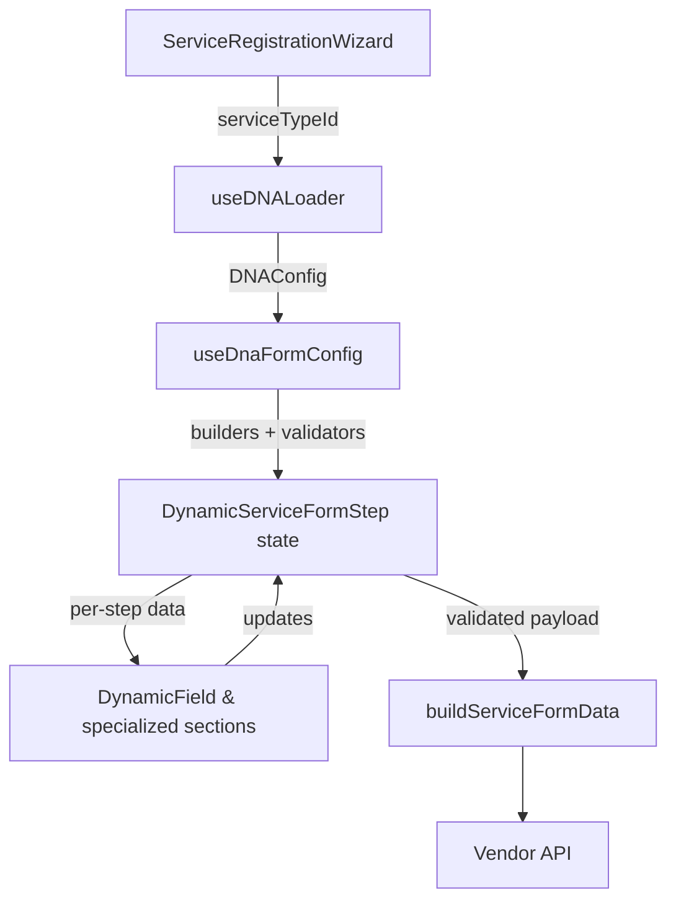

  
Every once in a while, you inherit a greenfield problem that feels equal parts thrilling and mildly panic-inducing. And before we even get into it… yes, I know. I haven’t written a blog post in almost two months. Turns out once you get an actual job and start shipping real features (and occasionally breaking production 🤫), time disappears faster than your console logs during a refactor.

But I’m a “real dev” now — pushing code, fixing bugs, summoning TypeScript errors like Pokémon — so naturally, my first post after this drought had to be about something dramatic.

And ours *was* dramatic: build a vendor onboarding experience where **nothing is hardcoded**, every service type invents its own rules, and the UI, validation, and submission logic all magically assemble themselves from server-delivered JSON we lovingly called **DNA**.

This is the story of how that system came to life inside `webapp_frontend`, what it looks like today, and what I learned while making it production-ready (and not crying… most days).


## The Blank Canvas (But Make It Relatable)

When we kicked things off, there was no schema, no wizard, and definitely no guardrails. It was the kind of blank canvas that sounds empowering until you realize you’re the one expected to paint the Mona Lisa with a broken brush and a deadline.

Product came to us with requirements that basically said:

* “We have dozens of service categories, each with their own weird personality quirks — custom fields, custom pricing knobs, custom documents, custom everything.”
* “Also, the APIs will evolve weekly because business is still figuring out what they want.”
* “Oh, and the UX needs to look premium. Not like one of those sad online form builders from 2010.”

In other words:
**Do not hardcode anything**
**Do not assume anything**
**Do not break anything** (haha)

Hard-coding forms or turning the app into a graveyard of feature flags would’ve collapsed instantly. We needed a lightweight contract that could describe every tiny variation without turning us into part-time archaeologists digging through JSX conditionals.

So we created our hero: **DNA**.

## What DNA Actually Encodes (aka JSON With Superpowers)

DNA is fetched per service type through `useDNALoader`, and it arrives wrapped as a `DNAConfig` object (`src/types/dna.ts`). Think of it as a tiny JSON-powered design system that politely tells the UI what to do, how to behave, and when to panic.

It defines things like:

* **`base_fields`** — all the random inputs: strings, numbers, booleans, selects, regex validations, placeholders, existential crises, etc.
* **`pricing_rules`** — which pricing fields matter and under what mode (hourly, fixed, hybrid, pick-your-own-nightmare).
* **`location_rules`** — whether the service is on-site, remote, or "it depends," and what fields (lat, lng, radius, address) become required.
* **`required_documents`** and **availability** — because sometimes you need an ID card, sometimes you need a portfolio, and sometimes you need *both sides* of something for reasons nobody remembers.

Since React doesn’t know (or care) what service type is being registered, the entire personality of the form comes from interpreting this DNA.

It’s basically configuration-driven UI on steroids — but without becoming unmaintainable spaghetti, because all the logic lives in well-defined hooks rather than scattered `if` conditions.

## Lifecycle at a Glance



This loop means new DNA drops from the backend without a single code change on the frontend.

## Spoiler: Geek-Out Ahead (Developer Mode Activated)

Okay, buckle up — this is the part where we stop pretending this is a “simple” form system and admit it’s basically a miniature runtime. If you came here for architecture candy, reactive state wizardry, and “how the hell is this form alive?” moments… yeah, this is that section.

The snippet below is the whole contract in motion. DNA drops in → hooks assemble defaults → steps self-build → validation slams the brakes if something’s off. It’s the closest thing to watching the UI read its own source code.

```tsx
// src/app/vendors/.../DynamicServiceFormStep.tsx (simplified)
const { dnaConfig, loading, error, reload } = useDNALoader(serviceTypeId);
const {
  filteredBaseFields,
  buildInitialBaseFields,
  buildInitialPricingFields,
  buildInitialDocuments,
  buildInitialAvailability,
  shouldRenderPricing,
  shouldRenderLocation,
  getIgnoredLocationFields,
  validateAll,
} = useDnaFormConfig(dnaConfig);

useEffect(() => {
  if (!dnaConfig) return;
  setBaseFields((prev) => prev ?? buildInitialBaseFields());
  setPricingFields((prev) => prev ?? buildInitialPricingFields());
  setDocuments((prev) => prev ?? buildInitialDocuments());
  setAvailability((prev) => prev ?? buildInitialAvailability());
}, [dnaConfig, buildInitialBaseFields, buildInitialPricingFields, buildInitialDocuments, buildInitialAvailability]);

const steps = useMemo(() => {
  const base = ["details"];
  if (shouldRenderPricing) base.push("pricing");
  if (shouldRenderLocation) base.push("location");
  if (dnaConfig?.required_documents?.length) base.push("documents");
  if (dnaConfig?.availability_required) base.push("availability");
  return [...base, "review"];
}, [dnaConfig, shouldRenderPricing, shouldRenderLocation]);

const canProceed = validateAll({
  baseFields,
  pricingFields,
  locationFields,
  documents,
});
```

Those lines?
That’s the blood circulation system of the entire form engine.

## Inside the Engine Room (Where the Magic Lives)

### 1. Loading + Normalizing (a.k.a. “Nobody Enters Without DNA”)

`useDNALoader` is the bouncer.
No `serviceTypeId`? → no entry.
Backend hiccups? → take a seat, here’s the error.

It guarantees **zero partial renders** — the UI never stumbles into some half-loaded Frankenstein state.

```ts
// src/hooks/useDNALoader.ts
export function useDNALoader(serviceTypeId?: number) {
  const [dnaConfig, setDnaConfig] = useState<DNAConfig | null>(null);
  const [loading, setLoading] = useState(false);
  const [error, setError] = useState<string | null>(null);

  const load = useCallback(async () => {
    if (!serviceTypeId) return setDnaConfig(null);
    setLoading(true);
    try {
      const raw = await getDNALoader(serviceTypeId);
      setDnaConfig(raw.data);
    } catch (err) {
      setError(err instanceof Error ? err.message : "Failed to load DNA configuration");
    } finally {
      setLoading(false);
    }
  }, [serviceTypeId]);

  useEffect(() => void load(), [load]);
  return { dnaConfig, loading, error, reload: load };
}
```

Once DNA arrives, **`useDnaFormConfig` puts on the lab coat** and starts preparing everything the UI will need — initial values, field filters, rules, cross-field validation policies, you name it.

```ts
const filteredBaseFields = useMemo(
  () => dnaConfig?.base_fields.filter((f) => !LOCATION_FIELD_NAMES.has(f.name)) ?? [],
  [dnaConfig],
);
```

We keep all builders inside this hook so when the backend introduces some new exotic field type (yes, it’ll happen), we update *one* place — the entire app becomes fluent instantly.

### 2. State Scaffolding & Wizard Navigation (The Self-Assembling UI)

`DynamicServiceFormStep` is the conductor.
Every step of the wizard is dynamically generated *from DNA*, meaning the UI literally builds itself.

* No pricing in DNA? Pricing step disappears.
* No documents? No documents step.
* Remote-only? Location logic calms down.
* Availability required? Boom — availability step appears.

It feels handcrafted for every service type… but it’s all data-driven.

### 3. Leaf Field Rendering (Where Chaos Becomes UI)

`DynamicField` is the universal renderer.
It’s the place where every weird option, placeholder, boolean, regex, integer, and multi-select transforms into a polished Shadcn component.

Highlights:

* Strings-with-options silently become full dropdowns.
* Number fields allow temporary empty strings (a must-have for UX sanity).
* Boolean fields fall back to chatty radio groups.
* Checkbox fields with options become multi-select arrays.
* File fields gracefully handle single/multi uploads.

And yes — the renderer solves headless UI quirks like a champ.

### 4. Specialized Components for Specialized Pain

Some domains break all the rules, so we isolate them:

* **PricingFields** (hourly, fixed, hybrid — all DNA-driven)
* **LocationFields** (pins, geocoding, radius, toggles)
* **DocumentUploadField** (file sides: front/back/both)
* **AvailabilityCollection** (time slots that don’t break)

Each one keeps UX high-level while offloading the rules into `useDnaFormConfig`. One source of truth, zero surprises.

## Validation & Serialization: The Guardrails That Never Sleep

Before the “Next” button does anything:

### `validateAll` checks everything:

* Required base fields
* Number ranges
* Regex patterns
* Pricing invariants (based on pricing mode)
* Location requirements (lat/lng + address)
* Document requirements (front/back/both)

No step moves unless the data is clean.

### Then, when the user submits:

`buildServiceFormData` serializes the entire payload using the **same DNA definitions**, so backend and frontend never drift.

```ts
form.append(field.name, value ? "true" : "false");
```

Arrays? Indexed keys.
Files? Correct multipart names.
Booleans? `"true"/"false"`.
Complex structures? Flattened but not mangled.

It’s deterministic, predictable, and very hard to break accidentally.


## Guardrails, Battle Scars & Lessons Learned

* Don’t render forms before DNA loads — UI gets cranky.
* Type coercion will betray you, so we centralized every helper.
* Location flows are strict on purpose (broken pins = broken orders).
* Redux persistence saves vendors from rage-quitting on refresh.
* New field types are a 5-step checklist, not a rewrite.


## What This Architecture Actually Proves

This system demonstrates:

* Clean separation of configuration (DNA) and rendering logic.
* A scalable, zero-hardcoding dynamic form engine.
* An onboarding flow that self-adapts as business rules evolve.
* A validation + serialization pipeline that guarantees backend compatibility.
* Hooks that encapsulate async, derived state, and rule logic so components stay readable.

And honestly?
It shows we can take a chaotic requirement like:

> “Make this form build itself from JSON… and make it look premium.”

…and deliver something robust enough to become **the backbone of the vendor onboarding flow**.


## Conclusion: Why This Architecture Was Worth Every Late Night

At the end of the day, this whole DNA-driven system isn’t just a clever trick — it’s a survival strategy. When the business keeps evolving, when service types multiply like Pokémon, and when backend rules shift faster than product can finalize documentation, this architecture becomes the difference between scaling gracefully… and drowning in hard-coded forms.

By pushing all variability into DNA and letting the UI self-assemble, we built something that is:

* **Flexible enough** to support dozens of service categories without rewriting components.
* **Strict enough** to guarantee clean validation and correct API payloads every single time.
* **Extensible enough** that adding new field types or pricing models feels like adding a new Lego piece — not rebuilding the entire castle.
* **Reliable enough** that vendors feel like each flow was handcrafted for them, even though the renderer did all the heavy lifting.

And the best part?

Every time the backend ships a new configuration and the entire UI rearranges itself with zero code changes…
you get that quiet moment of satisfaction that says:

**Yep.
This is why we engineered it properly.
This is why the architecture matters.**

The DNA engine isn’t just a form builder — it’s a foundation.
One that will keep absorbing complexity so the product team can keep dreaming, the backend can keep iterating, and the UI will always stay in sync without ever falling apart.

