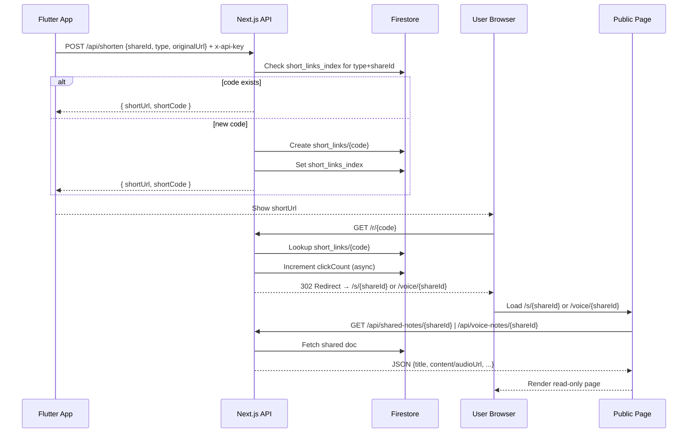
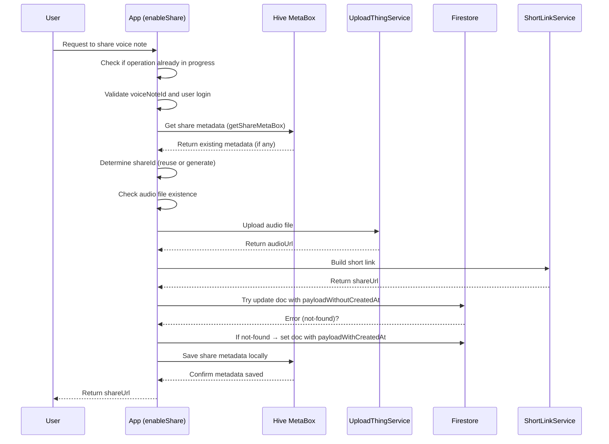

import VideoEmbed from "../../components/ReactComponent/blog/enhancements/video-embed/VideoEmbed";


Not too long ago, I was reading a book called "Second Brain" that really resonated with me. The author talked about creating a personal, digital space where all your notes and information are stored. Inspired, I set out to find the perfect application. I tried everything from Notion to Obsidian, Google Keep, and a dozen others in between, but nothing felt quite right.

So, I built my own: MS Bridge. I had two main goals for this app. First, I needed easy access to all my master notes. Second, I wanted to take detailed notes for both personal and class use.

I wrote an entire blog post and created a video explaining how I built the application, which you can check out here:

<VideoEmbed
  src="https://www.youtube.com/embed/9mFqnIPW9lM?si=9PVDfjC-XgCIbRjT"
  title="MS Bridge - Second Brain Application"
  client:load
/>

The app served me well, and soon I wanted to share some of my personal notes and experiences with my team members. I integrated Firebase Dynamic Links, which worked perfectly. But not too long ago, after a major Flutter upgrade, I noticed a lot of the codebase was relying on deprecated features.

That's not great for security, performance, or even maintainability. I decided it was time to move away from all the outdated code, but in that process, I hit a major roadblock: Firebase Dynamic Links was being deprecated. This feature was critical for me.

Like any other developer, my first instinct was to find a simple solution. My plan was to migrate from Firebase Dynamic Links to a custom solution. It might look complex, but I promise it's straightforward—though I'll admit the debugging and migration process was painful.

Now, you might be thinking, "Why not just use another service?" Shut up, you haven't done the research. All the solutions on the market were either expensive or overly complex; there was no simple drop-in-and-go option.

And like I said, I'm broke. So, I went on the journey of making my own solution. It wasn't easy, but I did it, and I'm very proud of how it turned out. Now, I want to share my experience with you.

## The Solution

The core idea is simple: the Flutter app hits an API endpoint, a server grabs some information, generates a unique link, and redirects the user to the right page.

But you might be wondering where the URL is actually being rendered. The magic happens with a combination of Firebase for the database and a Next.js backend handling the server-side logic, with some back-and-forth communication between the app and the server.

## The Flow

Here’s the gist of it:

1.  **App prepares share info** → The Flutter app identifies what’s being shared (`note` or `voice`) and grabs its unique ID and original URL.
2.  **Request short link** → Flutter calls our Next.js backend (`POST /api/shorten`) with the `{ shareId, type, originalUrl }`.
3.  **Server allocates code** → Next.js checks Firestore to see if a short code already exists for this item. If not, it creates a new one.
4.  **Server responds** → It returns a clean short link, like `https://site/r/abc123`.
5.  **App displays link** → The Flutter app shows the new link, making it easy to copy and share.
6.  **User clicks link** → Their browser hits the `/r/[code]` URL. The server then redirects them to the final destination, either `/s/[shareId]` for notes or `/voice/[shareId]` for voice memos.
7.  **Page loads data** → The web page fetches the shared content using another API call and displays it in a read-only format.

## Sequence Diagram

This diagram shows how all the pieces interact:



## The Code

Now that you understand the flow, let's get into the code. There are two different codebases: the Next.js server and the Flutter application. Before you ask why I used a Next.js server instead of a standard Node.js server or something else, there are three main reasons:

1.  **Next.js is free to host.** Vercel is a beautiful thing.
2.  **MS Bridge needed a website anyway** for hosting the APK, release notes, blog posts, and legal pages like the privacy policy. This keeps everything in one codebase.
3.  I didn't want to pay for a VPS or another server. **Like I said, I'm broke.**

### Flutter Application Code

To avoid repeating code, I created a single service that takes a few parameters and makes the request to the Next.js server.

```dart
class ShortLinkService {
  static const Duration _timeout = Duration(seconds: 8);
  static const int _maxAttempts = 2;

  static String get _baseUrl => config.LinkShortenerConfig.prodBaseUrl;

  static String get _endpoint => config.LinkShortenerConfig.shortenEndpoint;

  static Future<String> generateShortLink({
    required String type, // 'note' | 'voice'
    required String shareId,
    required String originalUrl,
  }) async {
    final Uri url = Uri.parse('$_baseUrl$_endpoint');
    final Map<String, String> headers = <String, String>{
      'Content-Type': 'application/json',
      'x-api-key': config.UpdateConfig.msBridgeApiKey,
    };
    final Map<String, Object?> payload = <String, Object?>{
      'shareId': shareId,
      'type': type,
      'originalUrl': originalUrl,
    };

    int attempt = 0;
    while (attempt < _maxAttempts) {
      attempt += 1;
      try {
        final http.Response res = await http
            .post(url, headers: headers, body: jsonEncode(payload))
            .timeout(_timeout);
        if (res.statusCode == 200) {
          final Object? decoded = jsonDecode(res.body);
          if (decoded is Map && decoded['shortUrl'] is String) {
            return decoded['shortUrl'] as String;
          }
          FlutterBugfender.error('Shorten API: unexpected body ${res.body}');
          return originalUrl;
        }
        FlutterBugfender.error(
            'Shorten API failed: ${res.statusCode} ${res.body}');
      } catch (e) {
        FlutterBugfender.error('Shorten API attempt $attempt failed: $e');
        if (attempt >= _maxAttempts) break;
      }
    }
    return originalUrl;
  }
}
```

#### Code Explanation

This code is pretty simple. It imports the base URL and endpoint from a config file, sets a timeout, and defines a maximum of two retry attempts. It then makes a `POST` request using the `http` package, encoding the payload as JSON.

If the status code is `200`, it decodes the JSON response, grabs the `shortUrl`, and returns it. If there's any error, Bugfender logs it, and the function returns the original URL as a fallback. If the request fails too many times, it breaks the loop and returns the original URL.

Simple and straightforward.

### Note Taking Repo

So, where is this service being called from? I have two repositories in my app: `NoteTakingRepo` and `VoiceTakingRepo`. They handle all the business logic for notes and voice memos, while the UI just renders the output.

```dart
  static String _buildDefaultShareUrl(String shareId) {
    final String base = config.LinkShortenerConfig.prodBaseUrl;
    return '$base/s/$shareId';
  }

  static Future<String> _buildShortLink(String shareId) async {
    return ShortLinkService.generateShortLink(
      type: 'note',
      shareId: shareId,
      originalUrl: _buildDefaultShareUrl(shareId),
    );
  }
```

The code above is from the `NoteTakingRepo`. It just passes the `shareId` (which is the note's ID) to our `ShortLinkService` and returns the short link to the UI so the user can share it.

### Voice Taking Repo

Sharing voice notes is a bit more complex. To be shared, the audio file needs to be stored somewhere accessible via a public URL. Since Firebase Storage is no longer in the free tier, I had to find an alternative.

For that, I integrated a service called **Uploadthing**. It's a great solution for hosting files in the cloud and getting a URL back. When a user wants to share a voice note, the app first uploads the audio file to Uploadthing. The returned URL is then saved in a public document in Firestore. From there, the process is the same: hit the server, generate the short URL, and give it to the user.

```dart
  static const String _shareCollection = 'shared_voice_notes';
  static const String _shareMetaBoxName = 'voice_note_share_meta';
  static bool _isOperationInProgress = false;

  static Future<Box> _getShareMetaBox() async {
    return await Hive.openBox(_shareMetaBoxName);
  }

  static String _buildDefaultShareUrl(String shareId) {
    final String base = config.LinkShortenerConfig.prodBaseUrl;
    return '$base/voice/$shareId';
  }

  static Future<String> _buildShortLink(String shareId) async {
    return ShortLinkService.generateShortLink(
      type: 'voice',
      shareId: shareId,
      originalUrl: _buildDefaultShareUrl(shareId),
    );
  }

  static Future<String> enableShare(VoiceNoteModel voiceNote) async {
    if (_isOperationInProgress) {
      FlutterBugfender.error(
          'Voice note share operation already in progress. Please wait.');
      throw Exception(
          'Voice note share operation already in progress. Please wait.');
    }

    if (voiceNote.voiceNoteId == null || voiceNote.voiceNoteId!.isEmpty) {
      throw Exception('Voice note must be saved before sharing.');
    }

    final User? user = FirebaseAuth.instance.currentUser;
    if (user == null) {
      throw Exception('You must be logged in to enable sharing.');
    }

    _isOperationInProgress = true;

    try {
      final FirebaseFirestore firestore = FirebaseFirestore.instance;
      final Box meta = await _getShareMetaBox();
      final UploadThingService uploadService =
          UploadThingService(apiKey: UploadThingConfig.apiKey);

      // Reuse existing shareId if present
      final Map? existing = meta.get(voiceNote.voiceNoteId) as Map?;
      final String shareId = existing != null &&
              existing['shareId'] is String &&
              (existing['shareId'] as String).isNotEmpty
          ? existing['shareId'] as String
          : generateUuid();

      final audioFile = File(voiceNote.audioFilePath);
      if (!await audioFile.exists()) {
        throw Exception('Audio file not found: ${voiceNote.audioFilePath}');
      }

      final String audioUrl = await uploadService.uploadAudioFile(audioFile);

      final String shareUrl = await _buildShortLink(shareId);

      // Create payload for Firebase
      final Map<String, dynamic> payloadWithoutCreatedAt = {
        'shareId': shareId,
        'voiceNoteId': voiceNote.voiceNoteId,
        'title': voiceNote.voiceNoteTitle,
        'description': voiceNote.description ?? '',
        'audioUrl': audioUrl,
        'duration': voiceNote.durationInSeconds,
        'fileSize': voiceNote.fileSizeInBytes,
        'ownerUid': user.uid,
        'ownerEmail': user.email ?? '',
        'updatedAt': FieldValue.serverTimestamp(),
        'viewOnly': true,
        'shareUrl': shareUrl,
      };

      final Map<String, dynamic> payloadWithCreatedAt = {
        ...payloadWithoutCreatedAt,
        'createdAt': FieldValue.serverTimestamp(),
      };
      final docRef = firestore.collection(_shareCollection).doc(shareId);
      try {
        await docRef.update(payloadWithoutCreatedAt);
      } on FirebaseException catch (e, s) {
        if (e.code == 'not-found') {
          await docRef.set(payloadWithCreatedAt, SetOptions(merge: true));
        } else {
          FlutterBugfender.error(
              'Failed to update voice note share: ${e.code} ${e.message}');
          FlutterBugfender.sendCrash('enableShare update failed', s.toString());
          rethrow;
        }
      }

      await meta.put(voiceNote.voiceNoteId, {
        'shareId': shareId,
        'enabled': true,
        'shareUrl': shareUrl,
        'title': voiceNote.voiceNoteTitle,
        'audioUrl': audioUrl,
        'updatedAt': DateTime.now().toIso8601String(),
      });

      return shareUrl;
    } finally {
      _isOperationInProgress = false;
    }
  }
```

Here's a diagram to make that flow easier to understand:



Hopefully, this gives you a clear picture of how the app works from a code perspective.

### Next.js Server Code

Now for the server where all the magic happens. Spoiler: it's also pretty simple. There are two main endpoints: one to **generate** a link and another to **redirect** it.

1.  `/api/shorten`
2.  `/r/[code]`

You want to know why I named them like this? I have no idea. I was probably sleep-deprived and just trying to get it done. But hey, it works, and I'm not changing it now. So buzz off.

Here is the code for `/api/shorten`:

```typescript
let app: App;
if (!getApps().length) {
  app = initializeApp({
    credential: cert({
      projectId: process.env.FIREBASE_PROJECT_ID,
      clientEmail: process.env.FIREBASE_CLIENT_EMAIL,
      privateKey: (process.env.FIREBASE_PRIVATE_KEY || '').replace(/\\n/g, '\n'),
    }),
  });
} else {
  app = getApps()[0]!;
}
const db = getFirestore(app);

type ShortenRequest = { shareId: string; type: 'note' | 'voice'; originalUrl: string; };

function validateApiKey(apiKey: string | null): boolean {
  const requiredKey = process.env.MS_BRIDGE_API_KEY;
  return !!requiredKey && apiKey === requiredKey;
}

function isValidPayload(body: unknown): body is ShortenRequest {
  if (!body || typeof body !== 'object') return false;
  const { shareId, type, originalUrl } = body as Record<string, unknown>;
  return typeof shareId === 'string' && !!shareId.trim()
    && (type === 'note' || type === 'voice')
    && typeof originalUrl === 'string' && originalUrl.startsWith('http');
}

function generateShortCode(length = 7): string {
  const alphabet = 'abcdefghijklmnopqrstuvwxyz0123456789';
  let result = '';
  for (let i = 0; i < length; i++) result += alphabet[Math.floor(Math.random() * alphabet.length)];
  return result;
}

export async function POST(request: NextRequest) {
  try {
    const apiKey = request.headers.get('x-api-key');
    if (!validateApiKey(apiKey)) {
      return NextResponse.json({ error: 'Invalid or missing API key' }, { status: 401 });
    }

    const body = await request.json();
    if (!isValidPayload(body)) {
      return NextResponse.json({ error: 'Missing or invalid fields' }, { status: 400 });
    }

    const { shareId, type, originalUrl } = body as ShortenRequest;
    const indexId = `${type}_${shareId}`;
    const indexRef = db.collection('short_links_index').doc(indexId);
    const indexSnap = await indexRef.get();

    let code: string | null = indexSnap.exists ? (indexSnap.data()?.code as string | undefined) || null : null;

    if (!code) {
      for (let attempts = 0; attempts < 5; attempts++) {
        const candidate = generateShortCode();
        const codeRef = db.collection('short_links').doc(candidate);
        try {
          await codeRef.create({
            shareId,
            type,
            originalUrl,
            clickCount: 0,
            createdAt: new Date(),
          });
          await indexRef.set({ code: candidate, shareId, type }, { merge: true });
          code = candidate;
          break;
        } catch (error) {
          console.error('Error in shorten:', error);
          // Collision or transient error; retry
          if (attempts === 4) {
            return NextResponse.json({ error: 'Failed to allocate code' }, { status: 500 });
          }
        }
      }
    }

    const siteUrl = process.env.NEXT_PUBLIC_SITE_URL || 'http://localhost:3000';
    return NextResponse.json({ shortUrl: `${siteUrl}/r/${code}`, shortCode: code }, { status: 200 });
  } catch (error) {
    console.error('Error in shorten:', error);
    return NextResponse.json({ error: 'Internal server error' }, { status: 500 });
  }
}
```

And here is the code for `/r/[code]`:

```typescript
const firebaseConfig = {
  apiKey: process.env.FIREBASE_API_KEY,
  authDomain: process.env.FIREBASE_AUTH_DOMAIN,
  projectId: process.env.FIREBASE_PROJECT_ID,
  storageBucket: process.env.FIREBASE_STORAGE_BUCKET,
  messagingSenderId: process.env.FIREBASE_MESSAGING_SENDER_ID,
  appId: process.env.FIREBASE_APP_ID,
  measurementId: process.env.FIREBASE_MEASUREMENT_ID
};

let app;
if (!getApps().length) {
  app = initializeApp(firebaseConfig);
} else {
  app = getApps()[0];
}

const db = getFirestore(app);

export async function GET(
  req: NextRequest,
  { params }: { params: Promise<{ code: string }> }
) {
  try {
    const { code } = await params;
    if (!code) {
      return NextResponse.redirect(new URL('/404', req.url), 302);
    }

    const docRef = doc(db, 'short_links', code);
    const docSnap = await getDoc(docRef);

    if (!docSnap.exists()) {
      return NextResponse.redirect(new URL('/404', req.url), 302);
    }

    const data = docSnap.data() as {
      shareId: string;
      type: 'note' | 'voice';
      originalUrl?: string;
    };

    updateDoc(docRef, {
      clickCount: increment(1),
      lastClicked: new Date(),
    }).catch((e) => console.error('Failed to update analytics', e));

    const siteUrl = process.env.NEXT_PUBLIC_SITE_URL || 'http://localhost:3000';
    const destination = data.type === 'voice'
      ? `${siteUrl}/voice/${data.shareId}`
      : `${siteUrl}/s/${data.shareId}`;

    return NextResponse.redirect(destination, 302);
  } catch (error) {
    console.error('Redirect error:', error);
    return NextResponse.redirect('/', 302);
  }
}
```

I split the short-link flow into two simple endpoints.

The **POST** endpoint (protected by an `x-api-key`) validates `{ shareId, type, originalUrl }`, reuses an existing mapping or atomically creates a new 7-char code in `short_links` (with a `short_links_index` entry for idempotency), and returns ``{ shortUrl: `${siteUrl}/r/${code}`, shortCode: code }``.

The **GET /r/[code]** endpoint looks up that code, fires a non-blocking analytics update (`clickCount`, `lastClicked`), and redirects the visitor to either `/voice/{shareId}` or `/s/{shareId}` depending on `type`.

Example short link:

```
https://your-site.com/r/abc1234
```

Simple, secure creation — fast, tracked redirects.

Simple, secure creation—fast, tracked redirects.

## Conclusion

So, there you have it. That's the story of how a deprecated Firebase feature forced me to roll up my sleeves and build my own dynamic link solution from scratch. Was it a pain to debug and migrate everything? Absolutely. But was it worth it? Definitely.

What started as a problem turned into an opportunity. I now have a cost-effective, tailor-made system that I fully own and understand. I don't have to worry about a third-party service changing its pricing or deprecating a feature I depend on. The entire solution runs on a free-tier-friendly stack, which is a huge win for a broke developer like me.

If you're a developer facing a similar situation, I hope this breakdown helps. Sometimes, the best solution isn't one you find, but one you build. It gives you complete control and a much deeper understanding of your own application. And hopefully, by sharing my code and my struggles, I've saved you some of that inevitable debugging headache.

## Thanks for reading!
The code is available on Github:

- 👉 [MSBridge GitHub Repository](https://github.com/rafay99-epic/MSBridge)
- 👉 [MSBridge Website](https://msbridge.rafay99.com)
- 👉 [MS Bridge Website Repo](https://github.com/rafay99-epic/MSBridge-Website)

I'd love to hear your thoughts!

Tell me how I coded, what you liked (or didn't), and how badly I might have messed things up 😄.


