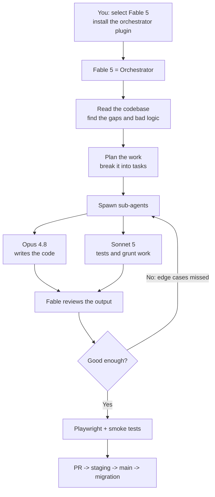
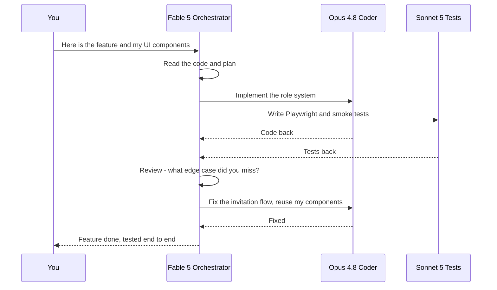

So Fable 5 is back.

It's been a few days since my last love letter — the one where I told you Fable 5 was the best model I'd ever put my hands on, and then watched the US government switch it off 48 hours later. For a while there we got nothing. No Fable, no Mythos, just a login page telling foreign nationals like me the frontier was closed. Then Anthropic worked something out with Washington — I don't know the exact terms of whatever deal got made with the White House — and on July 1 they put it back on the table for global users.

Here's the tweet that told me it was live again:

<blockquote class="twitter-tweet">
Read the Fable 5 blog post here: <a href="https://t.co/iQymY0jQvY">https://t.co/iQymY0jQvY</a>
&mdash; Claude (@claudeai) <a href="https://x.com/claudeai/status/2072402642836615273?ref_src=twsrc%5Etfw">July 1, 2026</a></blockquote>

I've been on it for days now, and holy hell. When it first came back I wasn't impressed — the usage was going through the roof and my results were all over the place. Then I learned the one trick that changes everything, and now I'm dreading July 7, the day it's supposed to get pulled from me again. Because in between, this became the best way I've ever worked.

Let me explain what actually changed, because the catch is real and the workaround is genuinely brilliant.

## TL;DR — the short version

- **What:** Anthropic re-enabled Claude Fable 5 (Mythos-class) for global users. But per their own announcement, **Fable 5 is not available for coding — it falls back to Opus 4.8** when you ask it to write code.
- **When:** Back for everyone on **July 1, 2026**. My understanding is it's set to be taken away again on **July 7**.
- **How I still ship with it:** I use an **orchestrator plugin**. Fable 5 doesn't write the code — it *runs the project*. It reads the codebase, plans the work, spawns Opus 4.8 and Sonnet 5 as sub-agents to do the coding and testing, then reviews their work and pushes back until it's right.
- **Result:** In one afternoon I fixed a completely broken role-based access system across a web app, a CLI, and a VS Code extension, and ported a Mac app to Windows — across three of my projects at once.
- **The catch:** It's expensive. Roughly **$5 per million input tokens and $15 per million output**, caching billed separately, and it's **not in any subscription yet** — API credits only.

## Quick answers (the what / when / how)

**What is the "orchestrator method"?**
It's using Fable 5 as the head of the project instead of as the coder. You install an orchestrator plugin, tell Fable it's in charge, hand it the feature you want, and let it plan, delegate to sub-agents, test, and review. It never writes production code itself — it directs the models that do.

**Why can't Fable 5 code directly?**
Because Anthropic's own announcement about restoring the model says so. If you ask Fable 5 to write code, it falls back to Opus 4.8. My read is this is part of the conditions attached to bringing it back — and coding was supposed to be its whole point, so at first this looked like a dealbreaker.

**So why is it still worth using?**
Because Fable 5 is unreal at *reading* code, planning, and catching problems other models miss. Point it at a repo and it finds the gaps, the dead code, the bad logic. That's the muscle the orchestrator method leans on.

**When did it come back, and how long do I have?**
Global access returned July 1, 2026. I expect to lose it again on July 7. So this whole post is written against a clock.

**What does it cost?**
About $5 per million input tokens and $15 per million output, with separate caching charges. It's not part of the $20 or $100 or $200 subscription tiers yet — you pay with API credits.

## The catch: Fable came back, but it's not allowed to code

Here's the thing nobody warned me about. When Fable 5 returned, I did what any developer would do — I opened it up and told it to build. And the results were rough. My usage spiked, and two or three prompts in, the whole thing was a mess. I was genuinely confused. This was the model I'd written two thousand words praising. What happened?

So I went to X and started digging. A few tweets from Theo, a few from other people, all pointing at the same thing — an "orchestrator" methodology. And then I went and actually read Anthropic's announcement about restoring Fable, and hit the line that explained everything:

> Fable 5 is not available for coding. It will fall back to Opus 4.8.

Read that again. The best coding model I'd ever used is back — and it's not allowed to write code. If Opus 4.8 is doing all the actual coding anyway, what's even the point of Fable 5?

The point is this: **Fable 5 is exceptional at reading code, planning, and spotting problems.** It just isn't the one holding the pen anymore. So you don't ask it to type. You put it in charge.

## What an orchestrator actually is

An orchestrator is the head that takes charge of the entire project and decides how things are going to go. It doesn't do the grunt work. It plans it, delegates it, checks it, and sends it back when it's wrong — like a senior engineer running a team of very fast juniors.

I installed the orchestrator plugin, selected Fable 5, and told it plainly: *you're in charge. Here are the features I want. Use this plugin as intended. Spin up as many sub-agents as you need, and take it from planning to execution to testing to smoke tests — end to end. I don't want to babysit it.*

Then I handed it the feature and walked away.

Here's the shape of it:

At the same time Fable came back, Anthropic shipped **Sonnet 5** — a very good, very capable model, just not on Fable's level. So my team looked like this: Fable 5 orchestrating, Opus 4.8 and Sonnet 5 doing the building and testing underneath it. Fable would hand them work, read what came back, and give them a grade — what they got right, what they got wrong, which edge cases they handled and which they quietly skipped. Then it would send it back for another pass.

That back-and-forth is the whole magic. Through a few rounds of it, they fully implemented the feature in about an hour or two. And it barely burned the tokens I expected it to.

I've been working the wrong way this whole time. These models have come far enough that Fable can identify gaps on its own, revise its own plan, and test an app end to end — as long as you give it the API keys or demo credentials to work with.

## Project one: the broken role system in envpilot.dev

Quick reminder of what [envpilot.dev](https://envpilot.dev) is: a platform I built to manage all your environment variables through the terminal, a VS Code extension, and a full web portal — so any team or organization can hold their variables securely. When someone leaves, you revoke their access and their reach into your production, staging, and deployment secrets disappears with them. Nothing leaks.

The role-based access control was one of the most important parts of the whole thing. And it was completely broken. I'd designed a solid structure long before Fable 5 existed, but the RBAC had rotted: **partially implemented on the website, and flat-out non-existent in the CLI and the VS Code extension.**

There were meant to be five roles — **Owner, Project Manager, Team Lead, Developer, Viewer** — because that's how an agile team works about 90% of the time. Each role gets access to a specific slice of the app. (One day I'll make this fully dynamic so an owner can define their own rules. For now, these are the hardcoded standard.) But the implementation had drifted: the owner role existed, the project section used one set of roles, the environment variables used a different set. A developer could touch the variables, a viewer could only read them — and none of it lined up. It was a mess I'd been avoiding for weeks, waiting for the day Fable came back to help me clear it.

So the moment it did, I didn't hold back. I opened four terminals — one in T3 Code, two in Ghostty — and started working three projects at once. envpilot.dev went first.

I told Fable the exact workflow and role structure I wanted and set it loose. This was in T3 Code, which is a fantastic tool. It figured out the plan, I told it to go, and it executed — then tested the whole thing end to end. I had it write Playwright tests *and* smoke tests so the app got checked properly, not by me clicking around manually. That's the part that kills me about working straight on Opus 4.8: with Opus I have to run tests by hand. Fable orchestrated it so Opus and Sonnet did the testing themselves, with Fable grading their work the whole way.

A couple more prompts fixed the last rough edges — the invitation section wasn't working, and the UI had that old habit these models can't shake: dummy, boxy, ugly components built from scratch. I already have themes and components I like and a vibe I want to keep, so I told it to use *those* and stop inventing. It listened. Then I reviewed the PR, tested locally, tested on staging, and shipped it to main where everyone's now using it. It even wrote the migrations — the old system's data model was wrong, the new one was correct — and I ran the migration straight from my admin panel. It detected every user and fixed their roles cleanly. The orchestration was tight, and it didn't eat nearly as many tokens as I braced for.

That was one part. The website. But envpilot lives in three places, so I wasn't done.

## Project two: the CLI and the `envpilot run` command

Once I'd merged the website fix and run the migration, I told Fable the code was in main and it was time to rework the CLI — starting with the one command I live in: `envpilot run`.

Here's what that command does, and why I care so much about it. Instead of your dev server pulling secrets from a local `.env` file, `envpilot run` **injects the environment variables straight into the running dev server at the right place, at the right time.** This matters more than ever in the AI era. Everybody's running AI tools now, and those tools happily read your memory and your files — including your `.env` — and keep your chat history around. That's exactly how API keys leak. `envpilot run` keeps the secrets out of any file an assistant can casually read. With thousands of projects across my org and my personal work, that command is load-bearing for me.

I also told Fable to audit the code while it was in there — dead code, complexity, UI bugs, whatever it could find. It caught a few real ones: the authentication was reorganizing itself in a way that broke things, some polling logic was off, and continuous injection was doing more work than it should. My backend is mostly Convex, and I'm still on the free tier — even with all my traffic I haven't crossed it, and I'd really like to keep it that way. Fable actually reasoned about *how* the polling worked and where it was costing me, then fixed it. CLI done, in its own PR.

## Project three: the VS Code extension (plus two new features)

Same playbook for the VS Code extension — another PR, same orchestrated execution — but this time I added two features I'd wanted for a while: **switching between multiple accounts, and switching between projects.** Picture it: you've got a personal account, your organization has its own account, and you're on another team too. Bouncing between two accounts or two projects is a genuine pain. Now it's one click.

And here's where the difference between the models got obvious. When I read the code Opus 4.8 had written, it was *beautiful* — and messy. It'll dump a huge amount of logic into one giant file and then forget that file exists. Fable looks at that same code and asks how to break it into small modular pieces that can be optimized later. It hunts for bad smells and needlessly complex logic.

My favorite tell is dependencies. Say you need a dialog box. Every Chromium browser — Chrome, Brave — and Firefox already ships perfectly good native dialogs. Opus will go install a dependency, import it, wire up its own thing, and hand you something uglier than the built-in. Fable checks what the browser already supports, finds the compatible native option, and uses the cleanest, smallest, correct one. If you actually need customization, *then* it'll tell you the default won't cut it and lay out your options. I don't know how Anthropic tuned this in, but that instinct alone fixed a real problem for me.

## Project four and five: Crisp goes to Windows

Same story played out on two more of my apps.

**Crisp** is a small video-editing app that detects things like language and phrases, pauses, cuts, and auto-framing to make editing easier — because for someone new who's never edited, all of that is a wall. I built it to knock that wall down. But I'd only built it for macOS: a Swift app with a Python engine under the hood. There was no Windows port anywhere.

So I gave Fable the macOS version, the Python engine, and one instruction: replicate this on Windows, feature for feature, one-to-one parity. In a couple of hours it did it. It ripped the Python core engine out of the Swift app and rebuilt it as the heart of a cross-platform Windows build, with the auto-detection and triggering intact. The first UI it made was bad — but the *functionality* was there, one-shot. Then I told it Windows is a native platform and I wanted the whole UI thrown out and rebuilt with native Windows tooling. What came back — the color scheme, the vibe, the onboarding — was spot on.

And then **Vitals**, my system monitor. If you've read the blog you know it: a menu-bar app for fans, RAM, temps, storage, widgets — Activity Monitor on steroids and a lot better looking. It was my very first Swift app, built with the older, code-capable version of Fable, and this session pushed it another level up.

## The honest cons

So those are the wins. But there's always a fallback, right? A model this good has to have a catch, and it does. I could go on about the little behavioral quirks, but the one that actually matters is **cost.**

These models are genuinely expensive — roughly **$5 per million input tokens and $15 per million output**, with a separate charge for caching on top. And none of it is in a subscription. I've seen Anthropic's DevRel say on X that there's a compute crisis going on: they *want* to put Fable in the subscription tiers, but not yet. For now it's API credits only. Maybe down the line Fable 5 becomes the default model in the subscription — and if you're paying $100 or $200 a month, honestly, it'd be worth it. There's nothing like it on the market.

There's a cheaper way to play it, too. Pair a $20 or $100 OpenAI subscription with Fable: let **Codex** do the actual coding, and let **Fable 5** (or any Mythos model) do the thinking, the planning, the review, and the bug-hunting. Theo's shown this exact split on X, and from how he talks about it, I think that's the future taking shape. Two models side by side — one writes, one thinks and revises and finds what's broken. That combination is so much better than either alone.

Because that's really the shift. We're at the point where **writing code isn't the hard part anymore.** Thinking outside the box, designing the system, scaling it — that's what matters now. The typing is solved. The architecture isn't.

## What's next

Today's the 4th of July; this goes up on the 5th. I've got a stack of things lined up, most of it on envpilot.dev: GitHub Actions, an account-transfer option, native Android and iOS apps, and a subscription model that's almost set but needs to be bulletproof. I want to add a networking system to Vitals. I want to use Fable 5 for the Windows port of Crisp — GPU support, CUDA, AMD — plus payment and licensing on Windows, and I need to fix the in-app Windows updater, which is completely broken right now.

There are so many edge cases and features I want to hit, and I'm sharing a Fable account with five or six other people, so my window is tight. But holy cow, I'm impressed.

Just know this: the moment the price and the API rates settle, this will not be a cheap model. There's no way around it. So if you think you can afford it — go for it. There's nothing else like it out there.

There *are* a lot of Chinese open-source models worth watching, though — like **GLM 5.2**, which I've been using extensively. Back when Fable was still pulled and GLM was all I had, I ran it hard in harnesses like OpenCode. I've got a pile of notes and a whole separate post coming on those models in a few days. Can't wait to share what I found.

Until then, nerds. 👋
