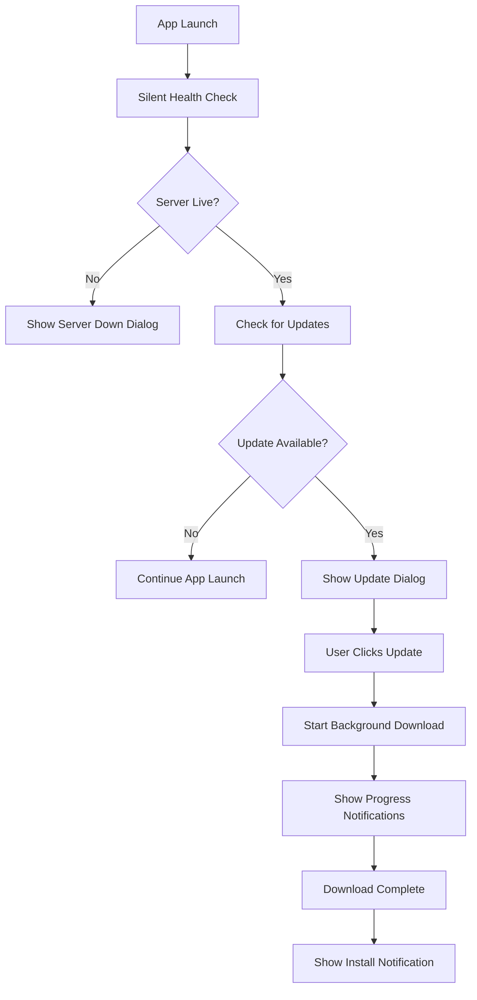

If you're a software engineer, you know about updates. It's the never-ending story. You write one line of _questionable_ code, then you "improve" it, and in doing so, probably introduce two new, more interesting problems. And just like that, you've summed up the entire exhilarating (and often exhausting) process of building and maintaining software. It's a rollercoaster, right?

But let's be real, there's a huge divide here, especially between web and mobile development. If you're entrenched in the web world – building on Vercel, Netlify, Cloudflare Pages, or even just good ol' traditional hosting – updating is, dare I say, **easy**. Merge to main, and poof! Your changes are live, often with sophisticated traffic control. It’s like magic, and frankly, I'm a little jealous.

Then there's the other side of the app fence. The mobile side. The **nightmare**. This is where many Android (and iOS) developers dread the 'update' button. We build an app, release it, and then... well, sometimes we just pretend it doesn't need updates. I've been there. I've built Flutter apps that are probably still rocking version 1.0 because the thought of wrestling with Google and Apple's app store review process feels less like deployment and more like an epic quest only a brave knight (or a very patient QA team) could undertake.

You might be thinking, "But wait, isn't that security-conscious? Why would you want to bypass that channel?" And to that, I'd respond: _you're missing the crucial bit_. Imagine this, and tell me if you've had a similar cold sweat moment: You run an e-commerce app. A critical bug surfaces – let's say, users can somehow apply a **90% discount** to their entire cart. Your heart rate spikes. You fix it in minutes. But then, to deploy that fix, you have to go through the app store review process, which could take a week. A _week_. In that week, your entire business could be hemorrhaging money, your inventory could be wiped out, and you, my friend, could be significantly poorer. This is the massive, capital-F, **F**\*king Problem that Google and Apple, with all their might, haven't quite solved yet.

This gaping chasm is precisely why products like [Shorebird](https://shorebird.dev/) and [React Native's Expo](https://expo.dev/) exist. They're here to save us from this particular flavor of existential dread, allowing us to push critical Dart or JavaScript code changes _while the app is live_, bypassing those lengthy store review queues. While I haven't personally deployed with them, I've watched Shorebird evolve from a young, promising package to an absolutely gorgeous, feature-rich service. The market is screaming for this, and Shorebird is listening!

So, why embark on this wild journey myself? Why not just use Shorebird or Expo? Well, sometimes you need granular control. Sometimes the specific backend requirements don't quite align. And sometimes, just sometimes, you want the sheer, unadulterated thrill (and masochistic pleasure) of building a complex system from scratch. Because let me tell you, it's not easy. There are so many edge cases, so many network gremlins, that trying to fit them all into a single blog post (or even a single app!) feels like trying to herd cats. This wasn't just building a feature; it was a deep dive into mobile deployment philosophy, a battle with unforeseen complexities, and ultimately, a hugely rewarding learning experience.

This isn't for deploying a massive, planet-scale app (for that, you should absolutely consider a dedicated service). This is about the journey of crafting a robust, server-based in-app update _system_ for my Flutter app, MS Bridge. It's a story of battling those gremlins, learning from every stumble, and emerging victorious.

So, grab your favorite energy drink (or calming tea, depending on your update anxiety levels), because we're about to recount how we took that "nightmare" and wrangled it into a custom, reliable solution. Let's begin!

## The Genesis: Why We Needed Our Own Update Knight

For MS Bridge, I needed more than just a standard app store update. I needed control, immediacy for critical fixes, and a system tailored to our specific backend. The idea of users running outdated versions, or worse, encountering a critical bug that couldn't be fixed without a week-long waiting game, just didn't sit right. My goal was ambitious: to forge a **production-ready update system** that could actually _work_ in the messy real world. We needed:

- **Stealthy server checks:** Knowing if our backend was alive without annoying users.
- **Automatic updates:** No user intervention, just a gentle nudge when needed.
- **Background downloads:** Freeing users from staring at progress bars.
- **Graceful handling:** Anticipating and dealing with _all_ the things that could go wrong.
- **A seamless experience:** Updates should feel natural, almost invisible.

This wasn't just a feature; it was a mission to bring web-like agility to a mobile app, albeit with a _lot_ more effort on our end.

## Charting the Course: The Architectural Decisions That Defined Our Journey

Every journey needs a map, and ours was no different. The decisions we made upfront shaped everything, often driven by past frustrations or clear requirements.

### Phase 1: The Invisible Sentinel – Silent Health Checks

```dart
// The silent sentinel: checking if our server is breathing, without anyone knowing.
static Future<bool> isSystemLive() async {
  try {
    final response = await http.get(
      Uri.parse('$_baseUrl/health'),
      headers: {
        'Content-Type': 'application/json',
        'x-api-key': UpdateConfig.msBridgeApiKey, // Our secret handshake
      },
    ).timeout(UpdateConfig.healthCheckTimeout); // We're patient, but not *that* patient.

    return response.statusCode == 200;
  } catch (e) {
    // If it throws, the server's probably asleep.
    return false;
  }
}
```

**The Discovery:** Early on, I realized the first thing we needed was to know if our update server was even _awake_. What's the point of checking for updates if the server is down? But the thought of a "Checking server status..." spinner on every app launch made me shudder. Users hate waiting. So, the decision was made: this check had to be **silent, utterly undetectable**. It became our app's invisible sentinel, a quick `GET /health` on startup. If it responds `200`, great! If not, we gracefully pivot, showing a polite "server unavailable" message instead of crashing the update flow later. This little piece of code became the foundation for a much smoother user experience.

### Phase 2: The Version Philosopher – Client-Side Comparison

```dart
static int _compareVersions(String version1, String version2) {
  try {
    final v1Parts = version1.split('.').map(int.parse).toList();
    final v2Parts = version2.split('.').map(int.parse).toList();

    // This part was crucial: handling versions like 1.0 vs 1.0.0
    while (v1Parts.length < v2Parts.length) {
      v1Parts.add(0);
    }
    while (v2Parts.length < v1Parts.length) {
      v2Parts.add(0);
    }

    for (int i = 0; i < v1Parts.length; i++) {
      if (v1Parts[i] > v2Parts[i]) return 1;
      if (v1Parts[i] < v2Parts[i]) return -1;
    }
    return 0; // The versions are identical
  } catch (e) {
    // Fallback if someone gives us "alpha-beta-gamma"
    return version1.compareTo(version2);
  }
}
```

**The Revelation:** I originally thought, "Just ask the server if there's a new version!" Simple, right? _Wrong._ What if a user had a pre-release internal build that was technically _newer_ than the latest public release the server knew about? Or what if someone used `1.0` and `1.0.0` interchangeably? Suddenly, relying solely on the server felt naive. The revelation was clear: **client-side semantic version comparison** was the way to go. This function became our version philosopher, meticulously comparing each segment. It prevents those awkward moments where the app confidently tells a user, "You need to update!" when they're already on a more advanced build. A true hero in disguise.

### Phase 3: The Freedom Fighter – Background Downloads

```dart
class BackgroundDownloadService {
  static Future<bool> downloadApk(
    BuildContext context,
    AppVersion version, {
    Function(double)? onProgress,
    Function(String)? onStatus,
  }) async {
    // Show an initial notification to signal progress
    await _showDownloadNotification();

    // Dio became our trusted companion for this task
    final response = await _dio!.download(
      downloadUrl,
      filePath,
      onReceiveProgress: (received, total) {
        final progress = received / total;
        _downloadProgress = progress;
        _updateDownloadNotification(progress); // Keeping the user informed
      },
    );

    // Ta-da! Download complete, now go install it.
    await _showCompleteNotification();
  }
}
```

**The Motivation:** We've all been trapped. Stuck staring at an "Updating..." screen, powerless, unable to use the app until it's done. It's user experience hell. My motivation was to free our users from this digital purgatory. I looked at various background downloader packages, but I needed fine-grained control over progress, error states, and, most importantly, notifications. `Dio` emerged as the champion. The decision was to close the update dialog _immediately_ upon user consent and push the download to the background, updating progress _only_ via system notifications. This keeps the app feeling responsive and puts the user firmly back in control. Updates should empower, not imprison!

## The Blueprint: Our System's Inner Workings

After these crucial architectural decisions, the system began to take shape. It wasn't just a jumble of features; it was a cohesive unit, designed to work in concert.

### The A-Team: Core Components

1. **`UpdateService`**: The quiet, diligent worker handling all the backend chatter.
2. **`UpdateManager`**: The brains of the operation, orchestrating the entire update dance.
3. **`BackgroundDownloadService`**: The brawn, handling the heavy lifting of APK downloads.
4. **`EnhancedUpdateDialog`**: Our app's friendly face for update prompts, sleek and on-brand.

### The Flow: Following the Breadcrumbs

To ensure everyone (including my future self) understood the process, I mapped out the data flow. It's simple, elegant, and avoids unnecessary detours.



## In the Trenches: Implementation Details and Hard-Won Lessons

With the blueprint in hand, it was time to get coding. This is where the rubber meets the road, and where I learned that even the most elegant architecture can hide a few surprises.

### Lesson 1: Configuration is King (and sanity-saver)

```dart
class UpdateConfig {
  static const String apiUrl = 'http://192.168.100.146:3000/api'; // My local dev IP – crucial for testing!
  static const String msBridgeApiKey = 'your-api-key-here'; // Please, don't use "your-api-key-here" in prod. Ever.
  static const Duration checkInterval = Duration(hours: 6); // A polite frequency, not nagging
  static const Duration healthCheckTimeout = Duration(seconds: 10);
  static const Duration updateCheckTimeout = Duration(seconds: 15);
}
```

**The Insight:** Centralizing all configuration in one `UpdateConfig` class might seem trivial, but it was a lifesaver. API URLs, keys, and especially those critical network timeouts lived here. It made switching between dev and prod a breeze and ensured consistent behavior across the app. A single source of truth for all update-related settings saved me from chasing down stray values in different files.

### Lesson 2: API Keys - Our Digital Passports

```dart
final headers = {
  'Content-Type': 'application/json',
  'x-api-key': UpdateConfig.msBridgeApiKey, // Gotta show the bouncer the right credentials
};
```

**The Realization:** Security isn't an afterthought; it's baked in. Every request to our update server had to be authenticated. Using `x-api-key` in the headers was a simple, effective way to ensure only our authorized app could talk to our server. It's like giving our app a digital passport – no passport, no entry. This centralized approach made future key rotation much simpler too.

### Lesson 3: Error Handling - Embracing the Chaos

```dart
if (response.statusCode == 200) {
  return UpdateCheckResult.fromJson(data);
} else {
  // Bugfender became my best friend here. Log EVERYTHING.
  FlutterBugfender.error('Update check failed with status: ${response.statusCode}');
  FlutterBugfender.error('Response body: ${response.body}');
  throw Exception('Update check failed with status: ${response.statusCode}'); // Still useful for immediate debug
}
```

**The Acceptance:** Things _will_ go wrong. Network hiccups, server errors, cosmic rays – you name it. Accepting this was the first step. My strategy was multi-pronged: comprehensive logging with tools like Bugfender (seriously, it's invaluable for production debugging), graceful fallbacks (don't crash the app, just inform the user), and user-friendly messages. Instead of exposing raw HTTP status codes, we translated them into something understandable. It’s about managing expectations and being empathetic to the user's plight.

## The War Stories: Tackling Those Pesky Edge Cases

This is where the true "journey" emerges – the frustrating, memorable moments when the update system decided to throw a curveball. Each one was a puzzle to solve, a lesson learned.

### The Overachiever Client: "I'm already updated!"

**The Challenge:** My own client test builds would sometimes be newer than what the server thought was the "latest." This led to confusing update prompts.
**The Fix:** That client-side semantic version comparison (`_compareVersions`) became crucial.

```dart
if (versionComparison > 0) { // If client's version is greater than server's latest
  updateAvailable = false;
  message = 'You have a newer version (${currentVersion.version}) than what\'s available on the server (${latestVersion.version}). You\'re up to date!';
}
```

It meant we could politely inform the user, "Hey, you're actually ahead of the curve!" instead of nagging them to "update" to an older version. Phew.

### The Mute Server: "Is anyone home?"

**The Challenge:** What if the server was just... gone? The health check was a start, but if the update check failed, we needed a clear path.
**The Fix:** Promptly inform the user and give them an out.

```dart
if (!isLive) { // Our silent sentinel reported back: no signs of life.
  _showServerDownDialog(context, () {
    SystemNavigator.pop(); // Sometimes, you just gotta gracefully exit.
  });
  return;
}
```

This avoids indefinite loading and frustration. A clear message, a graceful exit.

### The Phantom Connection: Network Timeouts

**The Challenge:** Network requests could hang indefinitely on a flaky connection.
**The Fix:** Explicit timeouts on _all_ network calls.

```dart
.timeout(UpdateConfig.healthCheckTimeout) // No staring contest with the router
```

No user wants to wait forever. Sensible timeouts prevent the app from freezing up, giving us control over the user experience even when the network is having a bad day.

### The Broken Download: When Bits Go Bad

**The Challenge:** Downloads aren't foolproof. They can fail mid-way.
**The Fix:** Robust error handling around the `Dio` download.

```dart
try {
  final success = await BackgroundDownloadService.downloadApk(context, version);
  if (!success) {
    CustomSnackBar.show(context, 'Download failed. Please try again.', isSuccess: false);
  }
} catch (e) {
  FlutterBugfender.error('Download error: $e'); // Log and inform!
}
```

When bits go bad, we log the details and provide a user-friendly message, giving them the option to retry. No one likes a mystery error.

### The Localhost Identity Crisis: "Who am I, really?"

**The Challenge:** Testing on a physical device connected to my dev machine. The app would try to download from `localhost:3000`, but `localhost` on the device isn't _my_ `localhost`. Facepalm moment.
**The Fix:** A quick client-side rewrite for dev.

```dart
// This little hack saved countless testing headaches.
String downloadUrl = version.downloadUrl;
if (downloadUrl.contains('localhost') || downloadUrl.contains('127.0.0.1')) {
  downloadUrl = downloadUrl.replaceAll('localhost', '192.168.100.146'); // My dev machine's actual IP
  downloadUrl = downloadUrl.replaceAll('127.0.0.1', '192.168.100.146');
}
```

This tiny bit of code bridged the gap between emulator/device and my development server, making testing immensely smoother. It’s the kind of specific problem only a dev in the trenches would truly appreciate.

## User Experience: The Invisible Touch

My guiding principle was simple: users shouldn't have to _think_ about updates. They should flow.

- **App Launch (Silent):** Ninja mode activated. Health check in the background. No spinners. Smooth as silk.
- **Update Available:** A polite, themed dialog. Clear version info, a simple changelog. One-click update. No confusing options.
- **Background Download:** Dialog gone. App usable. Progress in the notification shade. Done? Install prompt appears. Freedom!
- **Error Scenarios:** Clear, empathetic messages. No tech jargon. Just helpful guidance.

## Notifications: Our Friendly Digital Messengers

Notifications were critical for the background download – keeping users informed, not interrupted.

### The Progress Whisperer

```dart
final androidDetails = AndroidNotificationDetails(
  'download_channel',
  'Downloading Update',
  channelDescription: 'Shows download progress',
  importance: Importance.high,
  priority: Priority.high,
  autoCancel: false, // Keep it active until done
  icon: '@mipmap/launcher_icon', // Our actual app icon, not a default!
  showProgress: true,
  maxProgress: 100,
  progress: (progress * 100).round(),
);
```

This kept the user gently updated in the notification shade, without demanding their full attention. The branded icon? A small detail, but a huge win for professionalism.

### The Completion Signal

```dart
final androidDetails = AndroidNotificationDetails(
  'download_channel',
  'Download Complete',
  channelDescription: 'Shows when download is complete',
  importance: Importance.high,
  priority: Priority.high,
  autoCancel: true,
  icon: '@mipmap/launcher_icon',
  playSound: true,
  enableVibration: true,
  actions: [
    const AndroidNotificationAction(
      'install',
      'Install',
      showsUserInterface: true, // Crucial for launching the installer
    ),
  ],
);
```

Once complete, a clear notification with an immediate "Install" action. Simple, direct, effective.

## What This Journey Taught Me: The Hard-Won Wisdom

This whole endeavor wasn't just about building an update system; it was a masterclass in mobile development, problem-solving, and user empathy.

1. **User Experience is the Ultimate Metric:** If users hate your update process, they won't update. Make it invisible, make it seamless, make it _easy_.
2. **Edge Cases are the Real Bosses:** The happy path is easy. The true robustness comes from anticipating every weird scenario and having a plan for it. Each edge case felt like finding a secret boss battle.
3. **Log, Log, Log (but Wisely):** When things break in production, good logs are your only friends. Bugfender became invaluable.
4. **Security is Non-Negotiable:** From API keys to HTTPS, assume malicious intent and build defenses.
5. **Testing is Not a Phase, It's a Lifestyle:** You can't just deploy and pray. Manual testing, network testing, error injection – it's all part of the rigorous dance.

Looking back, the satisfaction of building this from the ground up for MS Bridge is immense. It took about **2-3 days** of focused effort, resulted in around **1,500+ lines of code** across **8 key files**, and tackled **over 10 significant edge cases**. It was a wild ride, but one that left me with a deeper understanding of what it takes to truly own the mobile update experience.

This wasn't just a project; it was a journey through the "update nightmare," and we emerged with a robust, custom solution. And for any of you out there contemplating your own update journey, remember: it's challenging, it's enlightening, and ultimately, it's incredibly rewarding. Now, go build something awesome!
