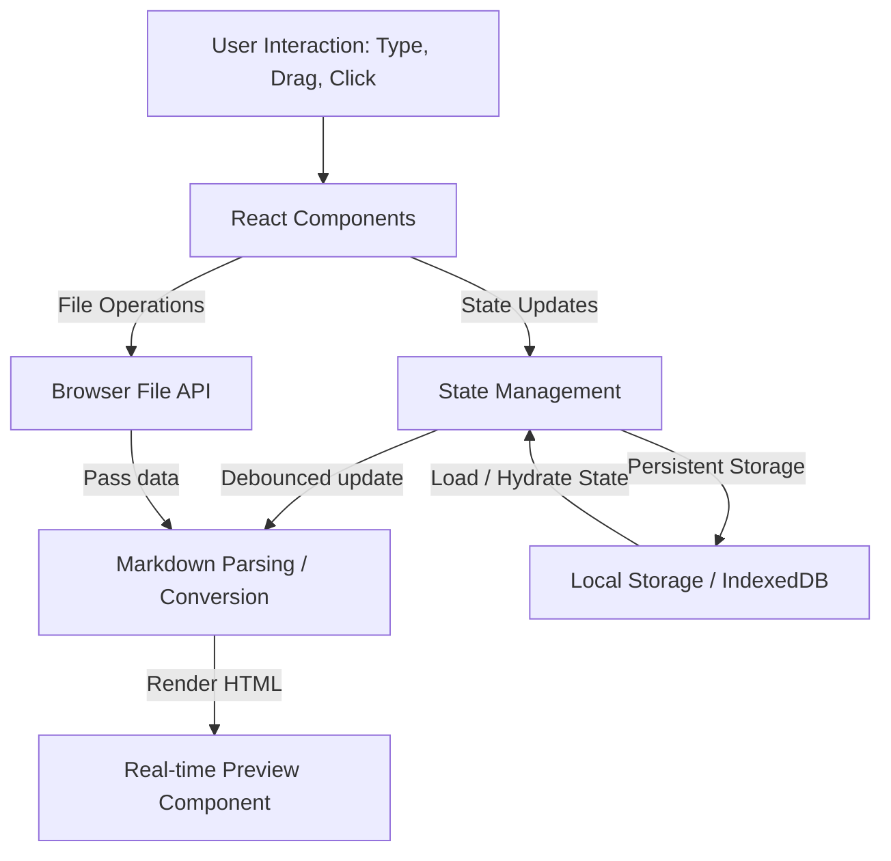
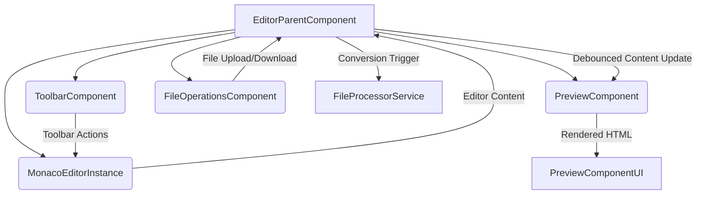
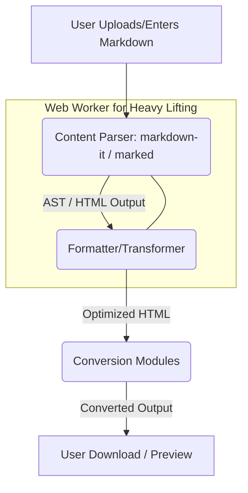
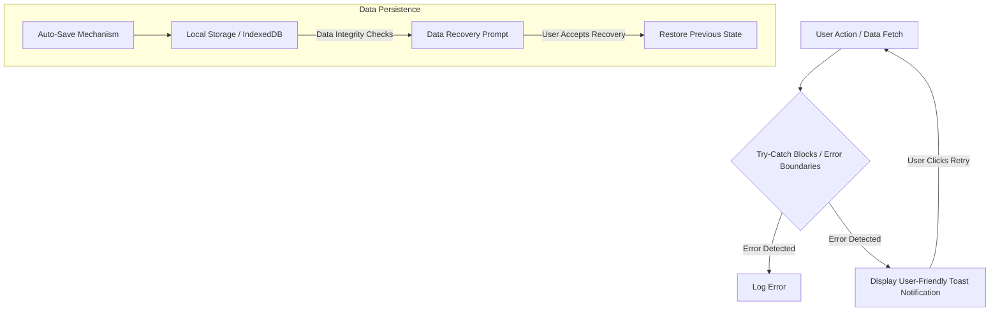

## The Markdown Tango: When Creativity Hits a Snag

You know that feeling, right? You're buzzing with an idea, ready to churn out some awesome documentation, a new blog post, or maybe just some organized notes. You reach for Markdown, because, well, it's elegant, simple, and universal. Or so we thought.

But then, the tango begins – and sometimes, it's a bit of a clumsy one.

- **The Preview Predicament:** You're writing, but you're constantly alt-tabbing to see if your headings actually look like headings, or if that bullet list decided to go rogue. Real-time? More like _real-pain_.
- **The Consistency Conundrum:** Markdown files rendered perfectly on your machine look... "different" on someone else's. It's like everyone's using a slightly different dialect of Markdown.
- **The Setup Shuffle:** Want a decent Markdown editor? Great! Now, spend an hour installing dependencies, tweaking configs, and fighting with themes. Who has time for that when inspiration strikes?
- **The "Aesthetic" Abyss:** Many tools feel like they're stuck in the early 2000s. Where's the modern UI? The dark mode that doesn't feel like an afterthought?
- **The Conversion Conundrum:** You've got your beautiful Markdown, but now you need it as HTML, PDF, or something else. Suddenly, you're hunting for converters that often break your formatting.

This, my friend, was the problem space we saw, a gaping void begging for a modern solution.

## MarkdownPro: Our Digital Canvas Unleashed!

And so, the idea for [MarkdownPro](https://markdown-pro-two.vercel.app/) was born! Imagine a web-based Markdown editor and converter that just… works. No fuss, no muss, just pure, unadulterated productivity wrapped in a sleek, responsive design.

We envisioned MarkdownPro as the Swiss Army knife for Markdown, cutting through those common frustrations with precision and elegance. It's about giving developers, writers, and anyone who loves Markdown a seamless experience from thought to polished output.

## Under the Hood: Our Tech Toolkit

Building MarkdownPro wasn't just about solving problems; it was about having _fun_ with our favorite tech! We grabbed our go-to tools to craft a robust, type-safe, and speedy application:

### The Frontend Foundation

- **React + TypeScript**: Because catching those sneaky bugs _before_ they hit production is a superpower! Type safety gives us that confidence.
- **Vite**: When you want development builds that compile faster than your coffee brews, Vite is your champion. Plus, optimized production builds? Yes, please!
- **TanStack Query**: For wrangling data like a pro. Think efficient caching and background updates that keep our UI snappy without us even trying.

### The Style Superpowers

- **Tailwind CSS**: Utility-first styling is a game-changer. Responsive design becomes a breeze, and our components look consistent without endless CSS files.
- **Shadcn/ui**: For those ready-to-rock, accessible, and beautiful UI components. Why reinvent the wheel when you can have a well-oiled one?
- **Theme Transitions**: Because a smooth light-to-dark mode switch isn't just eye candy; it's a delightful user experience!

### The Core Capabilities: Making it Happen

MarkdownPro's heart lies in its ability to bring your Markdown to life:

1. **Real-time Preview:** See your Markdown as you type, instantly. No more guessing games! We're talking split-screen bliss and full GitHub-flavored Markdown support.
2. **Dynamic Theme System:** Light, dark, or custom? MarkdownPro adapts to your mood. And yes, those transitions are buttery smooth, thanks to persistent preferences.
3. **Seamless File Operations:** Drag, drop, convert, download. Whether it's a quick note or a lengthy document, MarkdownPro handles it. Oh, and auto-save? You bet! Your masterpieces are safe.
4. **Modern UI/UX:** From responsive layouts that shine on any device to intuitive navigation and timely toast notifications, it's designed to be a joy to use.

## The Developer's Journey: From Code to Cloud

Our development workflow was all about efficiency and iteration, allowing us to rapidly prototype and refine features. And when it came to deployment, we wanted something equally effortless.

We chose **Vercel** for its magic touch: automatic HTTPS, global CDN for blazing-fast access, and deployments so instant they feel like magic. It's where MarkdownPro truly lives and breathes.

You can experience the live application yourself: [https://markdown-pro-two.vercel.app/](https://markdown-pro-two.vercel.app/)

## Peeking Under MarkdownPro's Hood: The Technical Deep Dive

Alright, fellow tech enthusiast, let's pull back the curtain and see how the bits and bytes dance together to make MarkdownPro sing!

### Project Blueprint: Where Everything Lives

Keeping a project organized is key to sanity, right? Our structure is pretty standard for a React app, making it easy to navigate and expand:

```
markdown-pro/
├── public/                 # Static assets
├── src/
│   ├── assets/             # Images, icons, fonts
│   │   ├── ui/             # Shadcn/ui components
│   │   └── common/         # Custom common components
│   ├── hooks/              # Custom React hooks
│   ├── lib/                # Utility functions, helpers
│   │   ├── api/            # API service calls (if any)
│   │   ├── converters/     # Markdown to other formats
│   │   ├── storage/        # Storage utilities
│   │   └── utils.ts        # General utilities
│   ├── pages/              # Main application views/routes
│   │   ├── Editor.tsx
│   │   └── Converter.tsx
│   ├── styles/             # Tailwind CSS entry, global styles
│   ├── contexts/           # React Context providers (e.g., ThemeContext)
│   ├── types/              # TypeScript custom types/interfaces
│   ├── App.tsx             # Main application component
│   ├── main.tsx            # Entry point
│   └── vite-env.d.ts       # Vite environment types
├── index.html              # Main HTML file
├── package.json            # Dependencies and scripts
├── tsconfig.json           # TypeScript configuration
├── postcss.config.js       # PostCSS configuration
├── tailwind.config.js      # Tailwind CSS configuration
└── ...
```

This clean structure allows us to scale and maintain our codebase with ease.

### The Data Symphony: How Information Flows

Our data flow is a well-orchestrated ballet, ensuring responsiveness and consistency:



From user input to parsed output, we've designed a path that keeps things flowing smoothly.

### Storage Strategy: No Data Left Behind!

We believe your content should be safe, whether it's a small draft or a colossal document. That's why MarkdownPro leverages a multi-pronged storage approach:

1. **Local Storage: The Quick Jot Pad**
   For settings, themes, and smaller drafts, `localStorage` is perfect. It's fast and persistent across sessions.

```typescript
// storageUtils.ts implementation for persistent data
interface StorageItem {
  content: string;
  lastModified: number;
  type: "draft" | "template";
}

export const saveToStorage = (key: string, data: StorageItem) => {
  try {
    localStorage.setItem(key, JSON.stringify(data));
  } catch (error) {
    // Fallback to IndexedDB if localStorage is full
    // This is a subtle but important detail for robustness!
    saveToIndexedDB(key, data);
  }
};
```

1. **IndexedDB: The Digital Vault for Giants**
   When you're dealing with potentially large Markdown files, `localStorage` can hit its limits. Enter `IndexedDB`, a robust, client-side NoSQL database ideal for storing substantial amounts of structured data.

```typescript
// IndexedDB implementation for larger files
import { openDB } from "idb"; // Using 'idb' wrapper for IndexedDB

const DB_NAME = "MarkdownProDB";
const STORE_NAME = "documents";

export const initDB = async () => {
  const db = await openDB(DB_NAME, 1, {
    upgrade(db) {
      // Create an object store for our documents
      db.createObjectStore(STORE_NAME);
    },
  });
  return db;
};

// ... (functions to save and retrieve from IndexedDB would follow)
```

This two-tiered approach ensures we're always choosing the right tool for the job.

### Component Choreography: The Editor's Dance

Our `Editor` component isn't just one monolithic block; it's a team of specialized performers working in harmony:



This modularity makes development a breeze and debugging a less daunting task.

### Theme System: A Symphony of Colors and Transitions

Who wants a boring workspace? Our theme system is built for beauty and fluidity. We use CSS variables, which makes runtime theme switching incredibly efficient:

```typescript
// Theme configuration and management
interface ThemeConfig {
  value: string;
  label: string;
  colors: {
    background: string;
    primary: string;
    text: string;
    // ... other color tokens
  };
  transitions?: {
    type: 'circular' | 'geometric' | 'liquid'; // Fancy animation types!
    duration: number;
  };
}

// Theme provider implementation
export const ThemeProvider = ({ children }: { children: React.ReactNode }) => {
  const [theme, setTheme] = useState<ThemeConfig>(defaultTheme);

  useEffect(() => {
    // Apply theme tokens to CSS variables
    // This is the magic! CSS variables allow for super smooth transitions.
    Object.entries(theme.colors).forEach(([key, value]) => {
      document.documentElement.style.setProperty(`--${key}`, value);
    });

    // We could also trigger special transition animations here if 'transitions' is defined
    // For example, by adding a class to <body> or a root element
    if (theme.transitions) {
      document.documentElement.setAttribute(
        'data-theme-transition',
        theme.transitions.type
      );
    } else {
      document.documentElement.removeAttribute('data-theme-transition');
    }

  }, [theme]);

  return (
    <ThemeContext.Provider value={{ theme, setTheme }}>
      {children}
    </ThemeContext.Provider>
  );
};
```

This setup allows for dynamic styling without constant re-renders or complex state logic. Just pure CSS magic!

### The File Processing Pipeline: From Markdown to Masterpiece

Converting Markdown to various formats is a core feature, and we've built a robust pipeline for it:



Using Web Workers for heavy parsing means our main thread stays free and responsive – no more frozen UIs during complex conversions!

### Performance: Because Speed Matters!

Nobody likes a slow app, especially a developer. We baked in performance optimizations from day one:

1. **Code Splitting:** Why load everything at once? We dynamically import components as needed, drastically reducing initial load times.

```typescript
  // Dynamic imports for route-based code splitting
  const Editor = lazy(() => import('@/pages/Editor'));
  const Converter = lazy(() => import('@/pages/Converter'));

  // Route configuration with Suspense for loading states
  <Routes>
    <Route
      path="/editor"
      element={
        <Suspense fallback={<LoadingSpinner />}>
          {/* Show a spinner while the component loads */}
          <Editor />
        </Suspense>
      }
    />
    <Route
      path="/converter"
      element={
        <Suspense fallback={<LoadingSpinner />}>
          <Converter />
        </Suspense>
      }
    />
  </Routes>
```

1. **Debounced Preview Updates:** Typing fast? MarkdownPro isn't frantically re-rendering with every single keypress. We debounce updates, waiting for a pause in typing before parsing. It's like telling the preview, "Hold your horses, let the user finish their thought!"

```typescript
// Debounced preview updates
import { debounce } from "lodash"; // A handy utility for debouncing

const usePreviewUpdate = (content: string) => {
  const [preview, setPreview] = useState("");

  useEffect(() => {
    const handler = debounce(async () => {
      // The actual heavy lifting (markdown parsing) is done here
      const html = await markdownToHtml(content);
      setPreview(html);
    }, 150); // Wait 150ms after the last keypress

    handler(); // Call handler immediately on content change
    return () => handler.cancel(); // Clean up the debounce timer
  }, [content]); // Re-run effect if content changes

  return preview;
};
```

This seemingly small detail makes a huge difference in the perceived responsiveness of the editor.

### Error Handling & Recovery: When Things Go Sideways

Even the best code can encounter unexpected issues. We've put systems in place to gracefully handle errors and keep the user experience smooth:



From network glitches to parsing failures, MarkdownPro aims to inform, recover, and keep your data safe.

### State Management: The Conductor of Our Orchestra

For MarkdownPro, a blend of state management techniques keeps everything in harmony:

1. **Document State:** For the editor content, metadata, and user settings, we rely on local React state (via `useState`/`useReducer`) and the Context API for sharing globally.

```typescript
interface DocumentState {
  content: string;
  metadata: {
    title: string;
    lastModified: Date;
    format: "markdown" | "html" | "pdf";
  };
  settings: {
    autoSave: boolean;
    previewEnabled: boolean;
    theme: string;
  };
}
// This state would typically be managed by a useContext hook or a reducer
// For example: const [document, setDocument] = useReducer(documentReducer, initialDocumentState);
```

1. **Query Management with React Query:** For data that needs caching, background re-fetching, and synchronization, `TanStack Query` (formerly React Query) is our go-to. It simplifies async data operations immensely.

```typescript
// Document fetching with React Query
import { useQuery } from "@tanstack/react-query";

const useDocument = (id: string) => {
  return useQuery({
    queryKey: ["document", id], // Unique key for this query
    queryFn: async () => {
      const doc = await loadFromStorage(id); // Our storage utility
      if (!doc) {
        throw new Error("Document not found"); // Handle not found case
      }
      return doc;
    },
    staleTime: 5 * 60 * 1000, // Data is considered "fresh" for 5 minutes
    // During staleTime, if user re-focuses, data won't re-fetch unnecessarily
    // After staleTime, data is refetched in background on re-focus
  });
};
```

This combination gives us fine-grained control and incredible performance for different data needs.

## The Road Ahead: What's Next for MarkdownPro?

We're just getting started! The future of MarkdownPro is brimming with exciting possibilities:

- **Collaboration Features:** Imagine real-time co-editing, sharing documents with comments and annotations. Markdown collaboration, unlocked!
- **Advanced Export Options:** More formats, custom templates for truly personalized outputs, and even batch processing for your entire Markdown library.
- **Deeper Integrations:** Git integration, seamless cloud storage sync, and even an API for developers to build on top of MarkdownPro.

## Conclusion: A Love Letter to Modern Web Dev

MarkdownPro isn't just an editor; it's a testament to the incredible power of modern web technologies. It showcases how a thoughtful blend of React, TypeScript, utility-first CSS, and intelligent state management can solve real-world problems and create truly delightful user experiences.

By obsessing over performance, user-friendliness, and future extensibility, we've crafted a tool that makes Markdown editing accessible, efficient, and dare I say, _fun_ for everyone. It's a project that truly embodies the spirit of building with joy!

**Ready to unleash your Markdown magic?** ✨

Try it yourself right now at [https://markdown-pro-two.vercel.app/](https://markdown-pro-two.vercel.app/) and let us know what you think! I'm always curious to hear from fellow builders.
