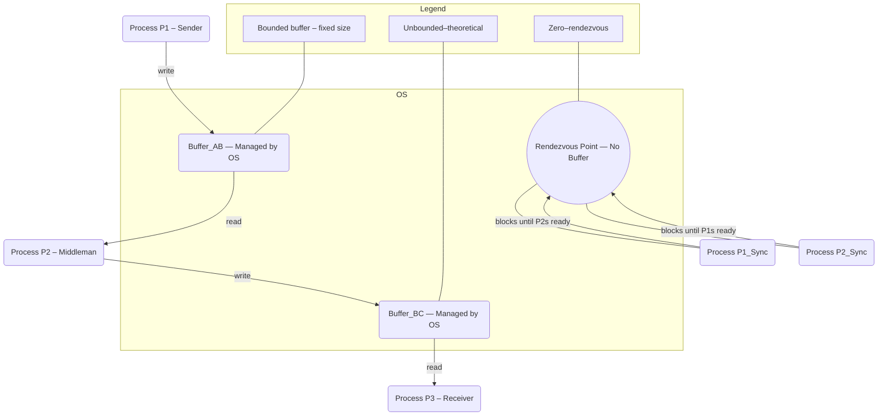
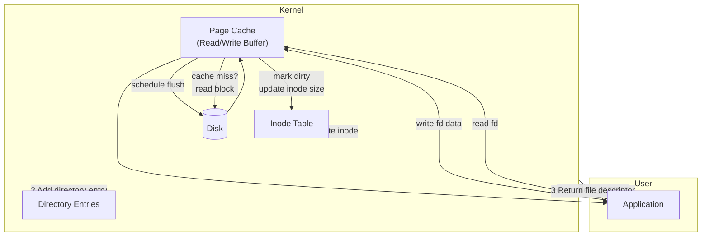
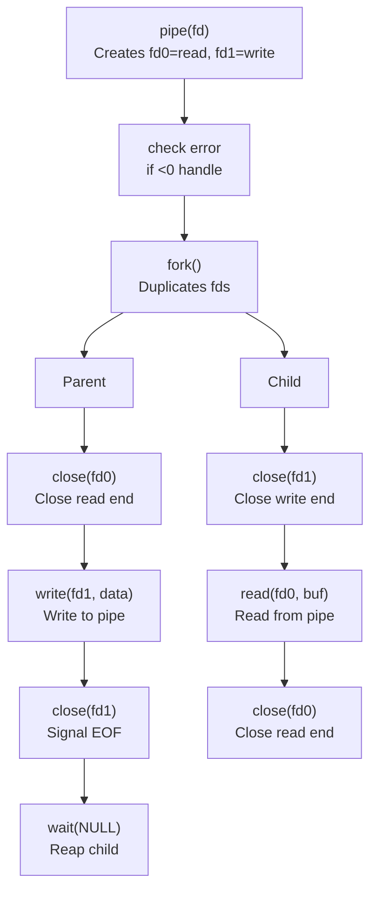

### 1. Direct Communication

**Definition:**
A systematic communication method where the sender and receiver explicitly name each other to establish a direct, dedicated communication link.

**How Communication is Done:**

*   **Explicit Naming:** The sending process must explicitly name the receiving process, and the receiving process must explicitly name the sending process.
    *   Example: `send(Process B, message)`, `receive(Process A, message)`
*   **Direct Link:** A link is established between *exactly two* communicating processes. This link is automatically created when processes try to communicate and typically exists only between that pair.
*   **Unidirectional or Bidirectional:** The link can be either one-way or two-way, depending on the implementation.

**Process Establishment (of the Communication Link):**
The communication link is established *implicitly* when one process attempts to `send` to another, or when a process is prepared to `receive` from a specific other process. There's no separate "connect" step just for the link in many OS IPC contexts, as the naming itself implies the connection.

*   **Network Context (e.g., Sockets):** If considering network communication (which can be seen as direct if IP addresses and ports are used to connect to a specific target), then establishing a process link involves:
    *   Server process creating a socket, binding it to a local IP address and **Port**, and listening.
    *   Client process creating a socket and explicitly connecting to the server's IP address and **Port**. This explicitly names the destination endpoint.

**Ports:**

*   In the purest definition of direct IPC within an OS, ports aren't always a primary conceptual element, as processes name each other directly.
*   However, in network communication (like TCP/IP sockets), **ports are fundamental** for direct communication. A process on a host is identified by its IP address *plus* a port number, forming a complete endpoint address for direct connection.

**Encryption:**

*   **Optional Overlay:** Encryption is *not* an inherent part of the direct communication *mechanism* itself.
*   It's a security layer that can be applied *on top* of the communication channel to protect the data being exchanged. Whether direct or indirect, communication can be encrypted for confidentiality and integrity (e.g., using TLS/SSL over a socket connection).

### 2. Indirect Communication

**Definition:**
A systematic communication method where processes communicate without explicitly naming each other, instead sending and receiving messages via an intermediary object, typically called a "mailbox" or "port."

**How Communication is Done:**

*   **Shared Mailbox/Port:** Processes communicate by sending messages to a specific mailbox (or port) and receiving messages from a specific mailbox (or port). They don't need to know the identity of the other communicating process.
*   **Decoupling:** Sender and receiver are decoupled; multiple processes can send to the same mailbox, and multiple processes can receive from the same mailbox.
*   **Mailbox Identification:** Each mailbox has a unique ID or name that processes use to address it.

**Process Establishment (of the Communication Link):**

*   **Mailbox Creation:** A process (or the OS) must first create a mailbox (or port).
*   **Process Association:** Processes wishing to communicate through that mailbox must then explicitly "open," "attach to," or "register" with that specific mailbox.
    *   Example: `send(Mailbox A, message)`, `receive(Mailbox A, message)`
*   The "link" here is conceptual, between the process and the mailbox, rather than between two specific processes.

**Ports:**

*   **Central Concept:** In indirect communication, the term **"port" is often synonymous with "mailbox"** (e.g., in microkernel architectures like Mach, which heavily use ports for IPC).
*   Ports/mailboxes act as queues or buffers where messages are temporarily stored until a receiving process retrieves them.

**Encryption:**

*   **Optional Overlay:** Similar to direct communication, encryption is *not* an inherent part of the indirect communication *mechanism*.
*   It is a security measure that can be implemented to protect messages as they are sent to or retrieved from the mailbox/port, ensuring that even if an unauthorized process accesses the mailbox, the message content remains confidential.
*   
Excellent, let's dive into the concepts of ownership, pipelines, and mailboxes, and then visualize it all with a diagram!


## **1. Concept of Ownership in Communication**

Ownership in communication mechanisms refers to which entity (a process, the OS, or both) is responsible for the creation, management, and destruction of the communication resource, and who has access rights to it.

*   **Direct Communication (e.g., Sockets, Pipes between parent/child):**
    *   **Link Ownership:** The communication *link itself* (the conceptual connection) is often implicitly managed by the OS but "owned" in a shared sense by the two participating processes. Neither process solely owns the *other end* of the connection.
    *   **Resource Ownership:** The underlying OS resources (e.g., file descriptors for pipes, socket descriptors for sockets) are owned by the *individual processes* that opened them. When a process closes its end, it releases its ownership of that specific resource.
    *   **Establishment:** Typically, one process "creates" or "listens" for a connection (e.g., a server socket), and another "connects" to it (e.g., a client socket). Both processes hold references to their respective ends of the communication channel.

*   **Indirect Communication (e.g., Mailboxes/Message Queues):**
    *   **Mailbox Ownership:** The mailbox or message queue itself is typically an **OS-managed resource**.
    *   **Creator Process:** Often, a specific process will *create* the mailbox. This creator process might be considered its initial "owner" in the sense that it initiated its existence and might have special permissions to set its properties or destroy it.
    *   **Access Ownership:** Once created, other processes can gain "access ownership" or "usage rights" by opening it or registering with it. Permissions (read, write) are crucial here, defining who can send to and receive from the mailbox.
    *   **Decoupling:** A key feature is the decoupling of the mailbox's existence from the lifetime of any single communicating process. The mailbox can persist even if the creating process terminates, as long as the OS maintains it.


## **2. Pipeline of Processes**

A "pipeline of processes" is a classic paradigm where the output of one process serves as the input for another, creating a sequential flow of data processing. This is a powerful concept for building modular and efficient systems.

*   **Concept:** Imagine an assembly line for data. Each process in the pipeline performs a specific task on the data it receives and then passes its result to the next process.
*   **How Communication is Done:**
    *   **Pipes:** Unnamed pipes (for related processes like parent-child) or named pipes (FIFOs, for unrelated processes) are the most common and intuitive systematic communication mechanism for pipelines in Unix-like systems.
    *   **Message Queues (Mailboxes):** Can also be used. Process A sends its output as a message to Mailbox M1. Process B receives from M1, processes it, and sends its output to Mailbox M2. Process C receives from M2, and so on.
    *   **Shared Memory/Files:** Less common for simple pipelines due to the overhead of explicit synchronization, but viable for complex scenarios.
*   **Benefits:**
    *   **Modularity:** Each process does one thing well.
    *   **Reusability:** Individual processes can be combined in different pipelines.
    *   **Concurrency:** Processes can execute concurrently, improving throughput. The "upstream" processes can produce data while "downstream" processes consume it.


## **3. Mailbox (Detailed)**

A mailbox (often synonymous with a message queue or port in some contexts) is a fundamental systematic communication mechanism that enables indirect process communication.

*   **Definition:** A kernel-managed data structure that acts as a buffer or queue for messages. It serves as an intermediary through which processes can send and receive messages without needing to know each other's identities.
*   **Core Functionality:**
    1.  **Buffering:** Stores messages sent by processes until they are retrieved by a receiving process. This decouples sender and receiver in time.
    2.  **Identification:** Each mailbox has a unique identifier (name or ID) that processes use to access it.
    3.  **Synchronization:** The OS handles synchronization implicitly.
        *   If a process tries to receive from an empty mailbox, it can either block (wait) or return immediately with an error, depending on the call.
        *   If a process tries to send to a full mailbox, it can either block or return an error.
    4.  **Capacity:** Mailboxes typically have a finite capacity (a maximum number of messages or total bytes).
    5.  **Access Control:** The OS usually provides mechanisms to control which processes have permission to send messages to a mailbox, and which can receive messages from it.
*   **Typical Operations:**
    *   `create_mailbox(name, permissions)`: Creates a new mailbox.
    *   `send_message(mailbox_id, message)`: Sends a message to the specified mailbox.
    *   `receive_message(mailbox_id)`: Retrieves a message from the specified mailbox.
    *   `destroy_mailbox(mailbox_id)`: Deallocates the mailbox.
*   **Analogy:** Think of a post office box (PO Box). Multiple people can drop letters into it, and anyone with the key can retrieve letters from it. The sender doesn't need to know who the receiver is, just the PO Box number.


### **Diagram: Communication in OS with Ownership, Mailboxes, and Pipelines**

```
                   ┌─────────────────────────────────────────┐
                   │          OPERATING SYSTEM (OS)          │
                   │ (Manages all communication resources)   │
                   └─────────────────────────────────────────┘
                                       │
                                       ▼
    ┌───────────────────────────────────────────────────────────────┐
    │                 SYSTEMATIC COMMUNICATION TYPES                │
    └───────────────────────────────────────────────────────────────┘
          │                                          │
          ▼                                          ▼
┌───────────────────┐                  ┌──────────────────────────┐
│  **1. DIRECT COMMUNICATION**  │                  │  **2. INDIRECT COMMUNICATION**   │
│   (P1 & P2 know each other)   │                  │   (Via Mailbox / Port)           │
└───────────────────┘                  └──────────────────────────┘
          │                                          │
          │                                          ▼
          │                            ┌───────────────────────────┐
          │                            │      **MAILBOX M1**       │
          │                            │ (OS-Managed Resource)     │
          │                            │    - Buffer for Messages  │
          │                            │    - Unique ID/Name       │
          │                            │    - Access Permissions   │
          │                            └───────────────────────────┘
          │                                          ▲
          │                                          │
          │                                          │
┌─────────▼─────────┐             ┌──────────────────┼─────────────────┐
│                   │             │                  │                 │
│ **PROCESS P1**    │             │ **PROCESS A**    │ **PROCESS B**   │
│ - Owns its end of │             │ - Sends to M1    │ - Receives from M1│
│   Link L1         │◀───Link L1──▶│                  │ - May be creator│
│ - Sends/Receives  │             │   (User Process) │   of M1         │
│   (User Process)  │             └──────────────────┼─────────────────┘
└───────────────────┘                                │
   ^       (Optional Encryption applied over Link L1)│
   │                                                 │
   │          ┌──────────────────────────────────────┘
   │          │
   │          ▼
   │  **Concept of Ownership:**
   │  - Link L1: Shared by P1 & P2. OS provides mechanisms.
   │  - Mailbox M1: OS-managed. Process B (or OS) might be creator/primary owner,
   │                but A has usage rights (permissions).

                                       ▼
         ┌───────────────────────────────────────────────────────────┐
         │                  **3. PROCESS PIPELINE**                  │
         │     (Using Indirect Communication - e.g., Mailboxes)      │
         └───────────────────────────────────────────────────────────┘
                   │                                     │
                   ▼                                     ▼
     ┌───────────┐                 ┌───────────┐                 ┌───────────┐
     │           │ (Output)        │           │ (Output)        │           │
     │ **P_SOURCE**│───────────────▶│ **P_FILTER**│───────────────▶│ **P_SINK**  │
     │   (Writes   │ Mailbox_A     │   (Reads    │ Mailbox_B     │   (Reads    │
     │  to Mailbox_A)│◀───────────────▶│  from Mailbox_A,│◀───────────────▶│  from Mailbox_B)│
     │           │   (Input)       │  Writes to  │   (Input)       │           │
     └───────────┘                 │  Mailbox_B) │                 └───────────┘
                                   └───────────┘
     **Pipeline Flow:**
     P_SOURCE generates data -> sends to Mailbox_A.
     P_FILTER receives from Mailbox_A, processes data, -> sends to Mailbox_B.
     P_SINK receives from Mailbox_B, processes final data.

     **Ownership in Pipeline:**
     - Mailbox_A & Mailbox_B: OS-managed. P_SOURCE owns write-access to Mailbox_A,
       P_FILTER owns read-access to Mailbox_A and write-access to Mailbox_B, etc.
     - Each process in the pipeline operates independently on its input/output mailboxes.
```

## Drawback of Mailbox

Okay, here are the main drawbacks of using mailboxes for inter-process communication:

1.  **Overhead of Message Copying:** Messages must be copied from the sender's address space to the kernel's buffer (the mailbox), and then from the kernel's buffer to the receiver's address space. This incurs performance overhead, especially for large messages.
2.  **Limited Capacity:** Mailboxes typically have a finite size (either in the number of messages or total bytes). If a mailbox becomes full, sending processes may block or fail, leading to potential bottlenecks or message loss if not handled carefully.
3.  **No Direct Data Sharing:** Unlike shared memory, mailboxes don't allow processes to directly share complex data structures in memory. Each message is a distinct copy, which can be inefficient for highly structured or frequently updated data.
4.  **Performance Can Be Lower:** Due to the copying overhead and kernel involvement for each message, mailboxes are generally slower than shared memory for high-throughput or low-latency communication.
5.  **Complexity of Message Formats:** Processes need to agree on message formats and parsing rules, adding a layer of complexity to application design.
6.  **Potential for Deadlock/Livelock:** If processes are not designed carefully (e.g., a sender waits indefinitely for space in a full mailbox while the receiver also waits indefinitely for another resource), deadlocks or livelocks can occur.


Alright, let's break down buffering in process communication and those different capacity models!

---

### **Buffering in Process Communication**

**Definition:**
Buffering in process communication refers to the use of temporary storage (a buffer) to hold messages or data being exchanged between a sending process and a receiving process. This buffer is typically managed by the Operating System (often in kernel space).

**Purpose:**
The primary goal of buffering is to **decouple the sender and receiver in time**, allowing them to operate at different speeds or to continue execution even if the other party isn't immediately ready.

*   **Sender doesn't block immediately:** A sender can place data into the buffer and continue its work without waiting for the receiver to be ready to pick it up.
*   **Receiver doesn't block immediately:** A receiver can retrieve data from the buffer when it's ready, without waiting for a sender to produce new data (if data is already buffered).
*   **Speed Mismatch Handling:** It helps smooth out performance differences between processes, acting as a temporary reservoir.


## **Buffer Capacity Models**

The behavior of inter-process communication (IPC) mechanisms often depends critically on the capacity of the buffer used.

### **1. Zero Capacity Buffering (No Buffering / Rendezvous)**

*   **Definition:** This model implies that there is **no buffer at all**, or effectively a buffer of size zero.
*   **How Communication is Done:**
    *   Communication is strictly **synchronous**.
    *   The sending process *must* block until the receiving process is ready to receive the message.
    *   Conversely, the receiving process *must* block until the sending process is ready to send a message.
    *   It's a "rendezvous" point: both processes must meet at the communication point simultaneously for the transfer to occur.
*   **Characteristics:**
    *   **Strong Synchronization:** Provides the tightest possible synchronization between sender and receiver.
    *   **No Message Loss:** Since there's no buffer to overflow, messages are never dropped due to buffer capacity.
    *   **High Latency Potential:** Either process can be blocked for an unpredictable amount of time waiting for the other.
*   **Example:** Often seen in specific types of synchronous message passing, or in the initial handshake of certain direct communication protocols.

### **2. Bounded Capacity Buffering**

*   **Definition:** The buffer has a **fixed, finite size** (e.g., N messages, or a specific number of bytes). This is the most common and practical buffering model for IPC mechanisms like pipes and message queues (mailboxes).
*   **How Communication is Done:**
    *   **Sender Behavior:**
        *   If the buffer is *not full*, the sender places the message into the buffer and continues execution immediately (asynchronous send).
        *   If the buffer *is full*, the sender typically blocks until space becomes available (i.e., a receiver takes a message), or it might return an error depending on the API.
    *   **Receiver Behavior:**
        *   If the buffer is *not empty*, the receiver takes a message from the buffer and continues execution.
        *   If the buffer *is empty*, the receiver typically blocks until a message arrives, or it might return an error.
*   **Characteristics:**
    *   **Partial Decoupling:** Senders and receivers are decoupled to the extent of the buffer's size. They don't always have to be ready at the same time.
    *   **Resource Constraint:** The buffer size is a system resource that needs to be managed.
    *   **Potential for Blocking:** Senders can still block if the buffer fills up.
    *   **No Message Loss (under normal operation):** Messages are not lost due to buffer overflow unless the sender chooses to non-blockingly discard messages when full.
*   **Examples:** Linux pipes, message queues (mailboxes), TCP socket buffers.

### **3. Unbounded Capacity Buffering**

*   **Definition:** The buffer is theoretically of **infinite size** and can hold an unlimited number of messages.
*   **How Communication is Done:**
    *   **Sender Behavior:** The sending process *never blocks* due to a full buffer. It always places its message into the buffer and continues execution immediately (fully asynchronous send).
    *   **Receiver Behavior:**
        *   If the buffer is *not empty*, the receiver takes a message and continues.
        *   If the buffer *is empty*, the receiver typically blocks until a message arrives, or it might return an error.
*   **Characteristics:**
    *   **Maximum Decoupling:** Provides the highest degree of temporal decoupling between sender and receiver. The sender is never held back by the receiver's speed.
    *   **Theoretical Ideal (in practice):** Truly infinite buffers are not possible in real computer systems due to finite memory.
    *   **Resource Exhaustion Risk:** In a practical implementation, an "unbounded" buffer would grow dynamically, eventually consuming all available system memory if the sender consistently outpaces the receiver, leading to system instability or crashes.
*   **Example:** Conceptually useful for designing highly decoupled systems, but practically implemented with large (bounded) dynamic buffers that are monitored, or with mechanisms that apply backpressure or discard old messages if they approach limits.
*   
## Bufer Working 


###  File I/O & Buffering: The OS's Speed Trick

The OS uses RAM (buffers/cache) to manage the speed difference between fast CPU/memory and slower storage devices.

#### 1. Buffering in File I/O
*   **Core Idea**: Data temporarily held in RAM to optimize disk reads/writes.
*   **Read Buffer (Page Cache)**:
    *   **Cache Hit**: If data is already in RAM, it's returned instantly. Speedy!
    *   **Cache Miss**: If not, the OS reads from disk, stores it in the cache, then delivers it. Next time, it's a hit!
*   **Write Buffer (Write-Behind)**:
    *   Data is written to the page cache and marked "dirty."
    *   The OS immediately acknowledges the write (super fast from the app's perspective).
    *   "Dirty" pages are then asynchronously written to disk in bulk, reducing many small I/O operations into fewer, larger ones.
*   **Benefits**:
    *   Batches small I/O requests into efficient, larger transfers.
    *   Effectively "hides" slow disk latency from applications.
    *   Enables smart features like read-ahead (prefetching data the app might need soon).
*   **Drawbacks**:
    *   **Data at Risk**: If the system crashes *before* dirty pages are flushed to disk, that data is lost. (Think of that unsaved document dread!).
    *   **Memory Usage**: Requires a portion of RAM for the cache.

#### 2. File Creation Steps
When you ask the OS to create a file:

1.  **System Call (`open(path, O_CREAT|O_WRONLY,...)`)**:
    *   OS first verifies permissions on the parent directory.
    *   A new **inode** is allocated (this is where metadata like permissions, timestamps, and pointers to actual data blocks live).
    *   A **directory entry** is created, linking your human-readable filename to the new inode.
    *   The file size is initialized to zero; no actual data blocks are allocated yet.
    *   A **file descriptor (fd)** is returned to your application, acting as a handle to this new file.
2.  **First Write(s)**:
    *   Data is initially copied into the **write buffer (page cache)**.
    *   The inode's size and timestamps are updated (in memory).
    *   These "dirty" pages are then scheduled for an asynchronous write-back to the physical disk.

#### 3. Diagram Flow Summary (Mermaid Explained)
*   `open()`: Initiates the process, allocating an inode and directory entry, then hands back an `fd`.
*   `write()`: Your app writes data, which lands in the page cache first, marking it dirty, and updating the inode's metadata in memory.
*   `flush`: The OS periodically moves these "dirty" pages from the cache to the actual disk.
*   `read()`: Checks the page cache first; if the data isn't there (a miss), it reads the block from disk, populates the cache, then sends the data to your app.



## Unpacking Parent-Child Communication with UNIX Pipes

Imagine our **Parent** process wants to send a message to its future **Child**. Here’s how they set up and use their private "post office" via pipes:



Here's the play-by-play, guided by your diagram:

1.  **`A["pipe(fd)"]` - The Initial Setup**:
    *   Before `fork()`, the `Parent` process calls `pipe(fd)`. This is like creating a secret tunnel within the kernel.
    *   The `fd` array now holds two special numbers (file descriptors): `fd[0]` is the entrance to *read* from the tunnel, and `fd[1]` is the exit to *write* into it. Crucially, this pipe is **unidirectional** – data only flows from `fd[1]` to `fd[0]`.

2.  **`C["fork()"]` - Duplicating the Channel**:
    *   Next, the `Parent` calls `fork()`. This is where the magic really happens for inter-process communication!
    *   `fork()` creates an exact clone of the `Parent` – our `Child` process. Importantly, **both** processes now inherit their own copies of `fd[0]` and `fd[1]`, all pointing to the *same* underlying kernel pipe. It's like both parent and child suddenly have keys to the same secret tunnel.

3.  **Streamlining the Communication (Parent's Role)**:
    *   **`P1["close(fd0)"]` - Parent Closes its Read End**: The `Parent` decides it only wants to *write* to the child. So, to keep things clean and prevent potential deadlocks, it immediately `close(fd[0])` – its own read end of the pipe. If the parent kept `fd[0]` open and tried to read from it while the child was reading, things could get sticky!
    *   **`P2["write(fd1, data)"]` - Parent Sends the Message**: Now, the `Parent` confidently `write()`s its data using `fd[1]`. This data flows into the kernel's pipe buffer.
    *   **`P3["close(fd1)"]` - Parent Signals End-of-Message**: Once the `Parent` is done writing, it `close(fd[1])`. This is *crucial*! Closing the write end signals to the `Child` (the reader) that there will be no more data coming. When the `Child` tries to `read()` from an empty pipe where all write ends are closed, `read()` will return `0`, indicating End-Of-File (EOF).
    *   **`P4["wait(NULL)"]` - Parent Waits for Child**: Finally, the `Parent` calls `wait(NULL)` to pause its own execution until its `Child` finishes. This reaps the child's resources and ensures proper process cleanup.

4.  **Receiving the Message (Child's Role)**:
    *   **`C1["close(fd1)"]` - Child Closes its Write End**: Similarly, the `Child` knows it only needs to *read* from the `Parent`. So, it immediately `close(fd[1])` – its own write end. This prevents it from accidentally writing to the pipe (which it shouldn't) and, more importantly, ensures that when the `Parent` closes *its* write end, it's the *only* writer closing the last writer, correctly signaling EOF.
    *   **`C2["read(fd0, buf)"]` - Child Listens**: The `Child` then `read()`s from `fd[0]`. It will happily pull data byte-by-byte (or in chunks) from the kernel buffer until it hits that EOF signal.
    *   **`C3["close(fd0)"]` - Child Finishes Up**: Once the `Child` has read all the data and received EOF, it closes its `fd[0]`, releasing its end of the pipe.

In essence, `pipe()` sets up the channel, `fork()` gives both processes access, and then careful closing of unused file descriptors (`fd[0]` for the writer, `fd[1]` for the reader) defines the *direction* and ensures proper **EOF signaling**, allowing for smooth, one-way communication!

It's a neat ballet of system calls, right? The `close()` calls are perhaps the most vital step after `fork()` to prevent headaches! What do you think, does this clear up the diagram's flow for two processes talking?