## Synchronization

Synchronization in OS is the mechanism that ensures orderly execution of concurrent processes or threads so that shared resources (like memory, files, or variables) are accessed in a consistent, predictable, and deadlock-free manner.

## Process in Shared Memory (OS Context)

**Shared Memory** is an **inter-process communication (IPC) mechanism** where multiple processes can **access the same region of memory**.

A **process in shared memory** refers to a process that **communicates and exchanges data by reading from and writing to a memory segment that is accessible by multiple processes**.

### How it works (step by step):

1. **Creating Shared Memory:**\
   One process creates a shared memory segment (via system calls like `shmget` in UNIX/Linux).
2. **Attaching Shared Memory:**\
   Both (or more) processes **attach** this memory segment to their address space.
3. **Communication via Shared Memory:**\
   Now, they can **read and write directly** to this memory instead of sending messages.
   * Example: Process A writes data to shared memory.
   * Process B reads the same data from shared memory.
4. **Detachment and Removal:**\
   After use, processes detach the memory, and finally, the OS can deallocate it.

### Benefit:

* **Fastest IPC method** because it avoids kernel overhead of system calls once memory mapping is done.

### Challenge:

* Needs **synchronization** (using semaphores, mutexes, etc.), otherwise you get **race conditions** when multiple processes read/write at the same time.

Ohh, this is **the core headache of concurrency** in operating systems 🤯 — but let’s untangle it step by step.

## The Problem

When **multiple processes** are performing the **same task** and try to **access shared memory simultaneously**, three key issues can arise:

1. **Race Conditions**
   * Happens when the output depends on the **order/timing** of execution.
   * Example: Two processes try to increase the same counter in shared memory.
     * Process A reads → 5
     * Process B reads → 5
     * Both increment → 6 (instead of 7). ⚠️
2. **Data Inconsistency**
   * Because multiple processes are writing to the same location at the same time.
3. **CPU and Time Wastage**
   * If not controlled, processes may "busy-wait" (constantly checking) for access.
   * This wastes CPU cycles.

## 🔹 How OS Handles This — Synchronization

The OS provides **synchronization mechanisms** to enforce **mutual exclusion** (only *one* process can access the shared resource at a time).

### Common Solutions:

1. **Mutex (Mutual Exclusion lock)**
   * Only one process can lock the shared resource at a time.
   * Think of it like a *key*: if someone has the key, others must wait.
2. **Semaphore**
   * A signaling mechanism that can control access for single or multiple processes.
   * Binary Semaphore → works like a mutex.
   * Counting Semaphore → allows limited concurrent access.
3. **Monitors (High-Level)**
   * Higher abstraction (in languages like Java, synchronized methods).
4. **Spinlocks / Busy Waiting vs. Blocking**
   * To avoid wasting time:
     * Instead of checking (spinlock), OS often **puts waiting processes to sleep** until resource is free → prevents CPU **time wastage**.

## 🔹 Example Scenario: Shared Counter Problem

Imagine **multiple processes updating a shared counter** in memory.

### ❌ Without Synchronization: (Race condition)

* Process A reads counter = 10
* Process B reads counter = 10
* A increments → writes 11
* B increments → writes 11
* Final value = **11** (wrong, should be 12).

### ✅ With Synchronization (using a Mutex):

* Process A locks → reads 10 → increments → writes 11 → unlocks.
* Process B waits.
* After unlock, B locks → reads 11 → increments → writes 12 → unlocks.
* Final value = **12** (correct ✅).

## 🔹 How this saves **time & resources**

* Instead of processes constantly fighting for memory:
  * **Mutex/Semaphore tells them when they can safely access.**
  * Others are put to **sleep state** (not wasting CPU cycles).
  * Wakes up only when it’s their turn → efficient.

## 🔹 Quick (Simplified) C Pseudocode Example

```c
#include <semaphore.h>
#include <pthread.h>
#include <stdio.h>

int shared_counter = 0;   // Shared memory
sem_t mutex;

void* increment(void* arg) {
    for(int i = 0; i < 1000; i++) {
        sem_wait(&mutex);   // Lock
        shared_counter++;   // Critical Section
        sem_post(&mutex);   // Unlock
    }
    return NULL;
}

int main() {
    pthread_t t1, t2;
    sem_init(&mutex, 0, 1); // Binary semaphore

    pthread_create(&t1, NULL, increment, NULL);
    pthread_create(&t2, NULL, increment, NULL);
    pthread_join(t1, NULL);
    pthread_join(t2, NULL);

    printf("Final counter = %d\n", shared_counter);
    sem_destroy(&mutex);
    return 0;
}
```

## Diagram Display

### Race Condition — No Synchronization

In the **first diagram**, all three processes (P1, P2, P3) are working on the same **shared memory** at the same time:

* **Step A:**
  * P1 reads shared memory value = 10
  * Right after, P2 also reads = 10
  * P3 also reads = 10
* **Step B:**
  * P1 increments (writes back 11)
  * P2 also increments (but it had also read 10 earlier!) → writes 11
  * P3 also increments (same read) → writes 11 too
* **Final Result:**
  * Instead of the correct final value = 13
  * We get **11** (incorrect).

⚡️ **Why wrong?** Because all processes used the **old value** they read earlier and overwrote each other’s updates. This is the **classic race condition**: the “winner” is whoever writes last, not whoever is logically correct.


### With Synchronization (Using Mutex/Semaphore)

In the **second diagram**, processes can’t jump into shared memory whenever they want. They must first ask a **Mutex (lock) or Semaphore (signal)** for permission.

* **Step A: (Process 1)**
  * P1 requests lock → lock is free → granted ✅
  * Reads memory = 10 → increments → writes = 11
  * Releases lock 🔓
* **Step B: (Process 2)**
  * P2 tries to request lock → but waits 🔒 because P1 is still inside
  * When P1 unlocks, P2 acquires lock
  * Reads memory = 11 → increments → writes = 12
  * Releases lock 🔓
* **Step C: (Process 3)**
  * Similarly, P3 acquires lock after P2 is done
  * Reads memory = 12 → increments → writes 13
  * Releases lock 🔓
* **Final Result:**
  * Correct value = 13
  * Each process “saw” the updated value of the shared memory.

⚡️ **Why correct?** Because only **one process at a time** is allowed in the **critical section** (the update operation).

```mermaid
sequenceDiagram
    participant P1 as Process 1
    participant P2 as Process 2
    participant P3 as Process 3
    participant M as Mutex/Semaphore
    participant SM as Shared Memory

    Note over P1,P3: Processes must acquire lock before accessing shared memory
    
    P1->>M: Request Lock
    M-->>P1: Lock Granted
    P1->>SM: Read value = 10
    P1->>SM: Write value = 11
    P1->>M: Release Lock

    P2->>M: Request Lock
    M-->>P2: Lock Granted
    P2->>SM: Read value = 11
    P2->>SM: Write value = 12
    P2->>M: Release Lock

    P3->>M: Request Lock
    M-->>P3: Lock Granted
    P3->>SM: Read value = 12
    P3->>SM: Write value = 13
    P3->>M: Release Lock

    Note over SM: Final value = 13 (Correct 👍)
    Note over P1,P3: ✅ Synchronization ensures correctness and avoids waste
```



### 🔑 Memory Hooks (So You Don’t Forget 🚀)

Let’s lock this concept into your brain with a few tricks:

1. **Race Condition = Chaos**\
   Imagine **3 chefs cooking in 1 small pan at once** → food spills, results wrong.
2. **Synchronization = Orderly Queue**\
   Same 3 chefs, but with **one kitchen key**. Only one can cook, finish, give the key → next one cooks correctly.
3. **Critical Section = The Kitchen**\
   The **place where only one person should be inside**. That’s shared memory ➡ critical section.
4. **Mutex = The Kitchen Key 🔑**\
   Without the key, you can’t enter. Ensures one-at-a-time execution.
5. **Outcome**
   * Without lock → last writer wins → wrong.
   * With lock → everyone updates in turn → correct.

So the formula to remember:\
**Shared Memory + Multiple Processes without Lock = Race Condition 🚨**\
**Shared Memory + Synchronization (Mutex/Semaphore) = Correct & Efficient ✅**
