## Synchronization

Synchronization in OS is the mechanism that ensures orderly execution of concurrent processes or threads so that shared resources (like memory, files, or variables) are accessed in a consistent, predictable, and deadlock-free manner.

## Process in Shared Memory (OS Context)

**Shared Memory** is an **inter-process communication (IPC) mechanism** where multiple processes can **access the same region of memory**.

A **process in shared memory** refers to a process that **communicates and exchanges data by reading from and writing to a memory segment that is accessible by multiple processes**.

### How it works (step by step):

1. **Creating Shared Memory:**\
   One process creates a shared memory segment (via system calls like `shmget` in UNIX/Linux).
2. **Attaching Shared Memory:**\
   Both (or more) processes **attach** this memory segment to their address space.
3. **Communication via Shared Memory:**\
   Now, they can **read and write directly** to this memory instead of sending messages.
   * Example: Process A writes data to shared memory.
   * Process B reads the same data from shared memory.
4. **Detachment and Removal:**\
   After use, processes detach the memory, and finally, the OS can deallocate it.

### Benefit:

* **Fastest IPC method** because it avoids kernel overhead of system calls once memory mapping is done.

### Challenge:

* Needs **synchronization** (using semaphores, mutexes, etc.), otherwise you get **race conditions** when multiple processes read/write at the same time.

Ohh, this is **the core headache of concurrency** in operating systems 🤯 — but let’s untangle it step by step.

## The Problem

When **multiple processes** are performing the **same task** and try to **access shared memory simultaneously**, three key issues can arise:

1. **Race Conditions**
   * Happens when the output depends on the **order/timing** of execution.
   * Example: Two processes try to increase the same counter in shared memory.
     * Process A reads → 5
     * Process B reads → 5
     * Both increment → 6 (instead of 7). ⚠️
2. **Data Inconsistency**
   * Because multiple processes are writing to the same location at the same time.
3. **CPU and Time Wastage**
   * If not controlled, processes may "busy-wait" (constantly checking) for access.
   * This wastes CPU cycles.

## 🔹 How OS Handles This — Synchronization

The OS provides **synchronization mechanisms** to enforce **mutual exclusion** (only *one* process can access the shared resource at a time).

### Common Solutions:

1. **Mutex (Mutual Exclusion lock)**
   * Only one process can lock the shared resource at a time.
   * Think of it like a *key*: if someone has the key, others must wait.
2. **Semaphore**
   * A signaling mechanism that can control access for single or multiple processes.
   * Binary Semaphore → works like a mutex.
   * Counting Semaphore → allows limited concurrent access.
3. **Monitors (High-Level)**
   * Higher abstraction (in languages like Java, synchronized methods).
4. **Spinlocks / Busy Waiting vs. Blocking**
   * To avoid wasting time:
     * Instead of checking (spinlock), OS often **puts waiting processes to sleep** until resource is free → prevents CPU **time wastage**.

## 🔹 Example Scenario: Shared Counter Problem

Imagine **multiple processes updating a shared counter** in memory.

### ❌ Without Synchronization: (Race condition)

* Process A reads counter = 10
* Process B reads counter = 10
* A increments → writes 11
* B increments → writes 11
* Final value = **11** (wrong, should be 12).

### ✅ With Synchronization (using a Mutex):

* Process A locks → reads 10 → increments → writes 11 → unlocks.
* Process B waits.
* After unlock, B locks → reads 11 → increments → writes 12 → unlocks.
* Final value = **12** (correct ✅).

## 🔹 How this saves **time & resources**

* Instead of processes constantly fighting for memory:
  * **Mutex/Semaphore tells them when they can safely access.**
  * Others are put to **sleep state** (not wasting CPU cycles).
  * Wakes up only when it’s their turn → efficient.

## 🔹 Quick (Simplified) C Pseudocode Example

```c
#include <semaphore.h>
#include <pthread.h>
#include <stdio.h>

int shared_counter = 0;   // Shared memory
sem_t mutex;

void* increment(void* arg) {
    for(int i = 0; i < 1000; i++) {
        sem_wait(&mutex);   // Lock
        shared_counter++;   // Critical Section
        sem_post(&mutex);   // Unlock
    }
    return NULL;
}

int main() {
    pthread_t t1, t2;
    sem_init(&mutex, 0, 1); // Binary semaphore

    pthread_create(&t1, NULL, increment, NULL);
    pthread_create(&t2, NULL, increment, NULL);
    pthread_join(t1, NULL);
    pthread_join(t2, NULL);

    printf("Final counter = %d\n", shared_counter);
    sem_destroy(&mutex);
    return 0;
}
```

## Diagram Display

### Race Condition — No Synchronization

In the **first diagram**, all three processes (P1, P2, P3) are working on the same **shared memory** at the same time:

* **Step A:**
  * P1 reads shared memory value = 10
  * Right after, P2 also reads = 10
  * P3 also reads = 10
* **Step B:**
  * P1 increments (writes back 11)
  * P2 also increments (but it had also read 10 earlier!) → writes 11
  * P3 also increments (same read) → writes 11 too
* **Final Result:**
  * Instead of the correct final value = 13
  * We get **11** (incorrect).

⚡️ **Why wrong?** Because all processes used the **old value** they read earlier and overwrote each other’s updates. This is the **classic race condition**: the “winner” is whoever writes last, not whoever is logically correct.


### With Synchronization (Using Mutex/Semaphore)

In the **second diagram**, processes can’t jump into shared memory whenever they want. They must first ask a **Mutex (lock) or Semaphore (signal)** for permission.

* **Step A: (Process 1)**
  * P1 requests lock → lock is free → granted ✅
  * Reads memory = 10 → increments → writes = 11
  * Releases lock 🔓
* **Step B: (Process 2)**
  * P2 tries to request lock → but waits 🔒 because P1 is still inside
  * When P1 unlocks, P2 acquires lock
  * Reads memory = 11 → increments → writes = 12
  * Releases lock 🔓
* **Step C: (Process 3)**
  * Similarly, P3 acquires lock after P2 is done
  * Reads memory = 12 → increments → writes 13
  * Releases lock 🔓
* **Final Result:**
  * Correct value = 13
  * Each process “saw” the updated value of the shared memory.

⚡️ **Why correct?** Because only **one process at a time** is allowed in the **critical section** (the update operation).

```mermaid
sequenceDiagram
    participant P1 as Process 1
    participant P2 as Process 2
    participant P3 as Process 3
    participant M as Mutex/Semaphore
    participant SM as Shared Memory

    Note over P1,P3: Processes must acquire lock before accessing shared memory
    
    P1->>M: Request Lock
    M-->>P1: Lock Granted
    P1->>SM: Read value = 10
    P1->>SM: Write value = 11
    P1->>M: Release Lock

    P2->>M: Request Lock
    M-->>P2: Lock Granted
    P2->>SM: Read value = 11
    P2->>SM: Write value = 12
    P2->>M: Release Lock

    P3->>M: Request Lock
    M-->>P3: Lock Granted
    P3->>SM: Read value = 12
    P3->>SM: Write value = 13
    P3->>M: Release Lock

    Note over SM: Final value = 13 (Correct 👍)
    Note over P1,P3: ✅ Synchronization ensures correctness and avoids waste
```



### 🔑 Memory Hooks (So You Don’t Forget 🚀)

Let’s lock this concept into your brain with a few tricks:

1. **Race Condition = Chaos**\
   Imagine **3 chefs cooking in 1 small pan at once** → food spills, results wrong.
2. **Synchronization = Orderly Queue**\
   Same 3 chefs, but with **one kitchen key**. Only one can cook, finish, give the key → next one cooks correctly.
3. **Critical Section = The Kitchen**\
   The **place where only one person should be inside**. That’s shared memory ➡ critical section.
4. **Mutex = The Kitchen Key 🔑**\
   Without the key, you can’t enter. Ensures one-at-a-time execution.
5. **Outcome**
   * Without lock → last writer wins → wrong.
   * With lock → everyone updates in turn → correct.

So the formula to remember:\
**Shared Memory + Multiple Processes without Lock = Race Condition 🚨**\
**Shared Memory + Synchronization (Mutex/Semaphore) = Correct & Efficient ✅**

## 🔹 The Problem (Producer–Consumer with Counter)

You have **two types of processes**:

1. **Producer(s):** Generate data and put it into a shared buffer.
   * Example: A bakery producing loaves of bread.
2. **Consumer(s):** Take data from the shared buffer and use it.
   * Example: Customers buying the loaves.

The **buffer (queue)** is of **limited size** (not infinite → hence **bounded buffer**).

### The Challenges:

* **Race Condition:**\
  Producers and consumers both update the **shared buffer counter** (number of items in the buffer). Without synchronization:
  * Producer might overwrite data if buffer is full.
  * Consumer might try to consume when buffer is empty.
  * Multiple processes might read/update counter at the same time → inconsistent value.
* **Wasted Resources:**\
  If consumers check the buffer when it’s empty, or producers try when it’s full, they waste CPU cycles (busy waiting).

## 🔹 Understanding the Counter Problem

The **counter** here represents:

* The **number of items currently in the buffer**.

### Example:

* Buffer size = 5.
* Initial counter = 0 (empty).
* Producer generates → counter++
* Consumer uses → counter--

### Without Synchronization:

If two producers call `counter++` **simultaneously**, both might read the old value:

* Counter = 3
* Producer 1 reads 3, increments to 4 (not yet saved)
* Producer 2 also reads 3, increments to 4
* Both write 4 → but it should have been 5.\
  ⚠️ Wrong counter = **race condition**.

## 🔹 The Solution: Synchronization with Semaphores

We solve this with **three controls**:

1. **Empty Semaphore**
   * Counts how many empty slots in the buffer.
   * Ensures producer stops if buffer is full.
2. **Full Semaphore**
   * Counts how many filled slots.
   * Ensures consumer stops if buffer is empty.
3. **Mutex (binary lock)**
   * Prevents race condition when updating buffer and counter.

## 🔹 Pseudocode (Classic Solution)

**Producer:**

```c
wait(empty);    // Check: is buffer full? If yes, wait
wait(mutex);    // Lock buffer
   // Critical Section:
   add item to buffer
   counter++;
signal(mutex);  // Unlock buffer
signal(full);   // Increase count of filled slots
```

**Consumer:**

```c
wait(full);     // Check: is buffer empty? If yes, wait
wait(mutex);    // Lock buffer
   // Critical Section:
   remove item from buffer
   counter--;
signal(mutex);  // Unlock buffer
signal(empty);  // Increase count of empty slots
```

## 🔹 The OS Problem Formulation

* **The Problem:**\
  How to allow producers and consumers to work *in parallel* without corrupting the shared buffer counter or accessing invalid states (overflow or underflow).
* **Main Risks Without Sync:**
  * **Producer overwrites data** when buffer is already full.
  * **Consumer reads garbage** when buffer is empty.
  * **Counter corrupted** (incorrect values).
* **The Solution:**\
  Semaphores & Mutex ensure **orderly access** → correct counter values and buffer usage.

## 🔹 Real-World Memory Hack 🎓

* Think of a **parking lot with 5 spaces** (buffer size = 5).
  * **Cars = Producers** (add cars).
  * **Drivers leaving = Consumers** (remove cars).
  * **Counter = number of cars in the lot**.
* Without regulation: 2 drivers enter at same time → counter might say 1 car, but really there are 2 → parking chaos!
* With semaphore/mutex: Gatekeeper regulates entry/exit 🚦 → count always correct.

✅ **Final Takeaway:**\
The **Producer–Consumer Problem** with a counter highlights the dangers of **race conditions** in shared memory. Synchronization (mutex + semaphores) solves this by **blocking producers when full** and **blocking consumers when empty**, while ensuring the **counter is updated safely**.

## Producer–Consumer Problem (❌ Without Synchronization)

```mermaid
sequenceDiagram
    participant Producer as Producer
    participant Consumer as Consumer
    participant Counter as Shared Counter (Buffer Count)

    Note over Producer,Consumer: No locks → race condition

    Producer->>Counter: Reads count = 3
    Consumer->>Counter: Reads count = 3

    Producer->>Counter: Writes count = 4
    Consumer->>Counter: Writes count = 2

    Note over Counter: Final value could be wrong ⚠️ (not consistent)
    Note over Producer,Consumer: ❌ Race condition, buffer data corrupted
```



### ⚠️ Explanation:

* Producer reads **3**, increments → writes 4.
* At the same time, Consumer also reads **3**, decrements → writes 2.
* Final counter depends on *who writes last* (2 or 4)…
* But the correct should have been **3** (since one item added, one consumed → balance out).
* This is the **race condition** in Producer–Consumer.

## Solution With Synchronization (✅ Mutex + Semaphores)

```mermaid
sequenceDiagram
    participant Producer as Producer
    participant SemEmpty as Semaphore (Empty slots)
    participant SemFull as Semaphore (Full slots)
    participant Mutex as Mutex (Lock)
    participant Buffer as Shared Buffer/Counter
    participant Consumer as Consumer

    Note over Producer,Consumer: Synchronization ensures correctness ✅

    Producer->>SemEmpty: wait(empty) (Check: buffer space available?)
    SemEmpty-->>Producer: Slot available
    Producer->>Mutex: wait(mutex) (Lock buffer)
    Mutex-->>Producer: Lock Granted
    Producer->>Buffer: Add item, counter++
    Producer->>Mutex: signal(mutex) (Unlock buffer)
    Producer->>SemFull: signal(full) (Increase filled slots)

    Consumer->>SemFull: wait(full) (Check: buffer has item?)
    SemFull-->>Consumer: Data available
    Consumer->>Mutex: wait(mutex) (Lock buffer)
    Mutex-->>Consumer: Lock Granted
    Consumer->>Buffer: Remove item, counter--
    Consumer->>Mutex: signal(mutex) (Unlock buffer)
    Consumer->>SemEmpty: signal(empty) (Increase free slots)
```



## 📝 Detailed Walkthrough (Solution)

1. **Producer Flow:**
   * First checks `empty` semaphore (empty slots). If buffer is full → it waits.
   * Locks the buffer using `mutex`.
   * Adds item → increments counter safely.
   * Unlocks buffer (other processes can enter now).
   * Signals `full` that there’s one more item available.
2. **Consumer Flow:**
   * First checks `full` semaphore (any items inside?). If empty → it waits.
   * Locks the buffer using `mutex`.
   * Removes item → decrements counter safely.
   * Unlocks after done.
   * Signals `empty` that there’s one more free slot available.
3. **Counter’s Safety:**
   * Only one process (Producer OR Consumer) can touch it at a time → **no race condition**.
   * Both Producer and Consumer are put to sleep if resource isn’t available → **no busy CPU wastage**.

## 🔹 First — What is a Race Condition?

* A **race condition** happens when **two or more threads/processes** access a **shared resource (like shared memory, counter, buffer, etc.) at the same time**, and the **final result depends on the order of execution**.
* The OS can’t guarantee which thread will finish first → *chaotic outcome*.

Think of **two people updating the same Google Doc offline**, then syncing back → conflicting results.

## 🔹 How to Get Out of a Race Condition (Solutions)

The key is **synchronization**. Methods to fix race conditions:

1. **Mutex (Mutual Exclusion lock)**
   * Only one thread at a time enters the critical section.
2. **Semaphores**
   * Manage access to resources (counting or binary).
3. **Monitors (in Java etc.)**
   * High-level synchronization mechanism → synchronized methods/blocks.
4. **Atomic Operations**
   * Certain CPUs/OS provide atomic increment/decrement (`atomic_inc`, `std::atomic` in C++).
5. **Avoid Shared State**
   * Design threads so they don’t share variables whenever possible (functional / immutability approach).

## 🔹 Effect of Race Conditions on Threads

### 🟢 Main Thread

* If your **main thread** faces a race condition with children threads (like updating a shared variable), the **entire program result can be corrupted**.
* Example in C/Java:
  * Main thread spawns worker threads to compute partial sums.
  * All threads update a single `total`.
  * Without locking → wrong total printed by main thread.

So → the **main thread depends on correct synchronization** from child threads to produce valid results.

### 🟢 User-Level Threads (ULTs)

* In **user-level threads**, scheduling is done in **user space** (not by the OS kernel).
* If a user-level thread hits a race condition:
  * The **user-space thread library** must enforce synchronization.
  * If one thread blocks on I/O, sometimes the whole process may block (since kernel doesn’t know threads exist unless it’s M:N model).
* Race conditions at ULT level → can corrupt shared program data structures and starve the scheduler.

👉 **Effect**: More severe because kernel cannot “save you” — it just thinks it’s a single process. Synchronization must be handled at **user level**.

### 🟢 Kernel-Level Threads (KLTs)

* Here, the OS kernel is aware of all threads.
* If a kernel-level thread hits a race condition:
  * The OS may *partially help* with preemptive scheduling (e.g., thread preemption with locks).
  * But **data inconsistency still occurs** if you don’t use proper primitives (mutex/semaphores).
* Good thing → one thread blocking doesn’t block the whole process (since OS schedules other kernel threads).

👉 **Effect**: Errors remain local, but synchronization is still needed to prevent corruption.

## 🔹 Summary Table

| **Aspect**              | **Without Sync (Race Condition)**                                             | **With Sync**                                   |
| ----------------------- | ----------------------------------------------------------------------------- | ----------------------------------------------- |
| **Main Thread**         | Gets wrong results from child threads                                         | Collects correct results                        |
| **User-level Thread**   | Race causes full process corruption (all threads share 1 kernel thread state) | User-space lib ensures correctness (mutex, sem) |
| **Kernel-level Thread** | Data corruption between kernel threads; OS can’t help automatically           | Mutex/semaphores protect shared state           |
