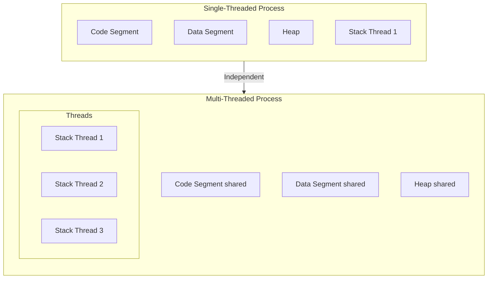
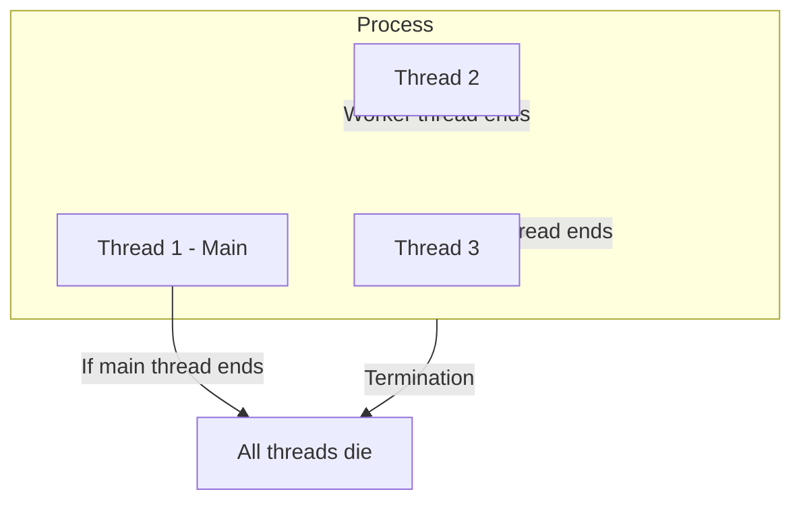
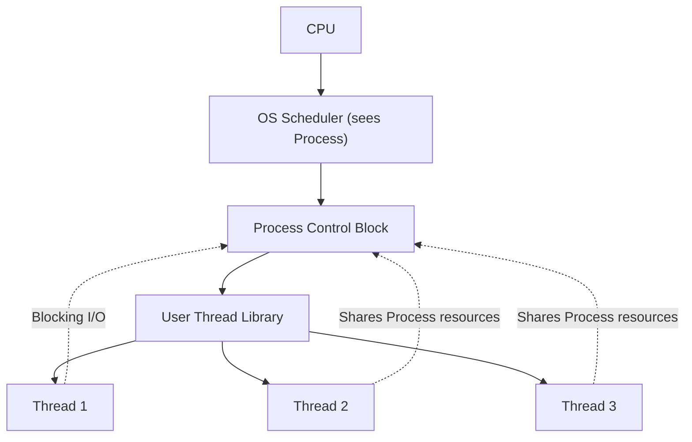
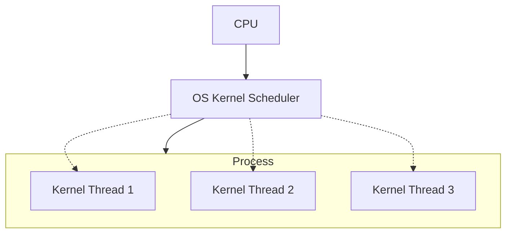

# 🔹 Process vs Thread

### **Process**

* A **process** is an independent program in execution.
* Each process has its own **memory space** (heap, stack, data, code segments).
* Processes **do not share global variables** by default (unless you use shared memory, pipes, sockets, etc.).
* Context switching between processes is **heavy**, because the OS must save/restore memory maps.

### **Thread**

* A **thread** is a lightweight unit of execution **inside a process**.
* All threads in a process share the **same memory space** (code, heap, global variables).
* But each thread has its own **stack** (local variables and function calls).
* Context switching between threads is **lighter**, since memory is shared.

# 🔹 Global Variables in Threads vs Processes

### **In Processes**

* If you define a global variable in one process, **other processes cannot access it directly**.
* Example:

```c
  int counter = 0; // global

  int main() {
      if (fork() == 0) {
          // Child process
          counter++;
          printf("Child: %d\n", counter);
      } else {
          // Parent process
          counter++;
          printf("Parent: %d\n", counter);
      }
  }
```

Output: Both child and parent have **separate copies** of `counter`.

### **In Threads**

* All threads in the same process **share global variables**.
* Example:

```c
  int counter = 0; // global

  void* thread_func(void* arg) {
      counter++;
      printf("Thread: %d\n", counter);
      return NULL;
  }

  int main() {
      pthread_t t1, t2;
      pthread_create(&t1, NULL, thread_func, NULL);
      pthread_create(&t2, NULL, thread_func, NULL);
      pthread_join(t1, NULL);
      pthread_join(t2, NULL);
  }
```

⚠️ Here both threads share `counter`, so:

* Without synchronization → **race conditions** may occur.
* With locks (mutex/semaphore) → safe increments.

# 🔹 Diagram

### **1. Processes (Separate Memory)**

```
+------------------+      +------------------+
| Process A        |      | Process B        |
|                  |      |                  |
| Global Var = 5   |      | Global Var = 5   |   <-- Separate copies
| Heap             |      | Heap             |
| Stack            |      | Stack            |
| Code             |      | Code             |
+------------------+      +------------------+
```

* Even if both declare the same global variable, they are **not shared**.

### **2. Threads (Shared Memory)**

```
+--------------------------------------------+
| Process                                    |
|                                            |
| Global Var = 5   <-----------------------+ |
| Heap             (Shared across threads) | |
| Code                                      | |
|                                            |
|  +------------+   +------------+           |
|  | Thread 1   |   | Thread 2   |           |
|  | Stack      |   | Stack      |           |
|  +------------+   +------------+           |
+--------------------------------------------+
```

* Global variables are **shared**, but each thread has its **own stack**.

# 🔹 Key Differences

| Feature          | Processes                             | Threads                              |
| ---------------- | ------------------------------------- | ------------------------------------ |
| Memory space     | Independent                           | Shared                               |
| Global variables | Separate                              | Shared                               |
| Overhead         | High (context switch)                 | Low                                  |
| Communication    | IPC needed (pipes, sockets, etc.)     | Direct via shared memory             |
| Fault tolerance  | Safer (one crash doesn’t kill others) | Riskier (one crash can kill process) |

# 🔹 Issues with Global Variables in Threads

1. **Race Conditions** – two threads updating at the same time → inconsistent data.
   * Example: `counter++` is **not atomic**.
2. **Synchronization Needed** – use mutexes, semaphores, or atomic operations.
3. **Deadlocks** – improper locking order can freeze threads.
4. **Scalability Problems** – too many threads sharing global state → contention.

## 🔹 Benefits of Threads

1. **Resource Sharing**
   * All threads of a process share code, data, and files.
   * Easier communication compared to inter-process communication (IPC).
2. **Responsiveness**
   * If one thread is blocked (e.g., waiting for I/O), others can continue execution.
   * Example: In a web browser, one thread renders the page while another downloads images.
3. **Faster Context Switching**
   * Switching between threads is lighter than switching between processes since memory and resources are shared.
4. **Economical**
   * Creating and managing threads requires fewer system resources than processes.
5. **Better Utilization of Multiprocessor Architectures**
   * Threads can run in parallel on multiple CPU cores → higher throughput.
6. **Scalability**
   * Threads allow applications (like servers, databases, simulations) to handle many tasks at once efficiently.

***

## 🔹 Types of Threads

### 1. **User-Level Threads (ULTs)**

* Managed by **user-level libraries**, not the OS kernel.
* OS sees only the main process, not individual threads.
* **Advantages:**
  * Fast to create, switch, and schedule (no kernel involvement).
  * Can be implemented on any OS (even if the OS doesn’t support threads).
* **Disadvantages:**
  * If one thread makes a blocking system call → entire process is blocked.
  * Cannot take advantage of multiprocessor systems (kernel only schedules the process as one unit).

### 2. **Kernel-Level Threads (KLTs)**

* Managed directly by the **operating system kernel**.
* OS schedules and manages threads individually.
* **Advantages:**
  * True parallelism on multiprocessor systems.
  * If one thread blocks, others in the same process can continue.
* **Disadvantages:**
  * Slower to create and manage (kernel overhead).
  * More memory and resources required.

### 3. **Hybrid Threads**

* Combine **user-level** and **kernel-level** threads.
* User-level library creates and manages threads, but they are mapped onto kernel threads.
* Example models:
  * **Many-to-One:** Many user threads mapped to one kernel thread.
  * **One-to-One:** Each user thread maps to a kernel thread (used in modern OS like Windows, Linux).
  * **Many-to-Many:** Many user threads mapped to many kernel threads (flexible, but complex).
* **Advantages:**
  * Balances efficiency and parallelism.
  * Better performance for large-scale applications.

***

## 🔹 How Threads Work in the OS

1. **Thread Creation**
   * The OS (or a user-level library) allocates a stack and control block for each thread.
2. **Scheduling**
   * **User-level threads:** Scheduler is part of the thread library.
   * **Kernel-level threads:** Scheduler is part of the OS kernel.
   * **Hybrid:** Both user library and kernel cooperate.
3. **Context Switching**
   * Saves and restores the thread’s registers, stack pointer, and program counter.
   * Faster than process context switch since memory is shared.
4. **Synchronization**
   * Since threads share global variables and memory, OS provides synchronization primitives:
     * **Mutexes**
     * **Semaphores**
     * **Monitors**
     * **Spinlocks**
   * Prevents race conditions and ensures consistency.
5. **Communication**
   * Easier compared to processes (no need for IPC).
   * Threads communicate through shared memory (global variables, heap).
6. **Execution on Multiprocessors**
   * Kernel-level and hybrid threads can be scheduled on different CPUs → true parallelism.
   * OS thread scheduler balances load across cores.

## 🔹 Diagram Idea (Types of Threads)

```
User-Level Threads (ULTs)
+-------------------+
| Process           |
|   Thread 1        |   Managed by user library
|   Thread 2        |   OS sees only one process
+-------------------+

Kernel-Level Threads (KLTs)
+-------------------+
| Process           |
|   Thread 1 (OS)   |   Managed by kernel
|   Thread 2 (OS)   |   OS schedules independently
+-------------------+

Hybrid Threads
+-------------------+
| Process           |
|   User Thread 1   -> Kernel Thread A
|   User Thread 2   -> Kernel Thread B
+-------------------+
```

## Diagram

This is the diagram that is show casing everything



## 🔹 Process Suspension

* **Suspension** = process is put into a **waiting state** (paused), but not destroyed.
* Reasons:
  1. **I/O wait** (waiting for disk, network, etc.)
  2. **Resource request** (waiting for memory, lock, semaphore)
  3. **User/system request** (admin pauses a process)
  4. **Parent process suspension** (child often suspended with it)
* Suspended process stays in **main memory** or can be swapped to disk.

## 🔹 Thread Suspension

* A **thread** inside a process can also be suspended:
  * E.g., waiting for I/O or waiting for a lock (mutex).
* Since **threads share memory**, suspension of one thread does **not** suspend the whole process (other threads keep running).
* ⚠️ Exception: If the **main thread** (the one that created others) suspends itself, the OS may block the entire process.

## 🔹 Process Termination

* When a process terminates:
  * All **threads** inside it are also terminated automatically.
  * OS reclaims resources: memory, files, I/O, descriptors.
* Types:
  1. **Normal termination** – process finishes execution.
  2. **Error termination** – program crashes, illegal instruction, divide by zero, etc.
  3. **Killed by another process** – e.g., `kill -9` in Linux.
  4. **Parent termination** – may cause child termination (depends on OS).

## 🔹 Thread Termination

* A **thread** terminates when:
  1. It finishes its task (normal exit).
  2. It is explicitly killed (e.g., `pthread_cancel` in POSIX).
  3. The process itself terminates → all threads inside die.
* Thread termination may cause:
  * **Resource cleanup** (stack freed, registers released).
  * **Impact on process**: if it’s the main thread, the **entire process ends** unless other threads are detached.

## 🔹 Linking Between Suspension & Termination

1. **Process ↔ Threads**
   * Suspending a process = all threads inside are suspended.
   * Terminating a process = all threads inside are terminated.
2. **Thread ↔ Process**
   * Suspending a thread = only that thread is paused (others may still run).
   * Terminating the main thread can end the whole process.

## 🔹 Tree Structure (Multi-Threaded Process)

Think of a **process tree** like a family:

```
Process (Parent)
│
├── Thread 1 (Main thread)
│   ├── Thread 2 (Worker)
│   └── Thread 3 (Worker)
```

* If **Process dies** → all threads are killed.
* If **Thread 1 dies** (and it’s the main thread) → process usually dies → all other threads die too.
* If **Thread 2 or 3 dies** → only that branch ends, process continues.

## 🔹 Diagram (Mermaid)

Here’s a diagram for clarity:



## 🔹 Example Scenarios

### Example 1: Web Browser

* **Process**: Browser main process.
* **Threads**:
  * UI thread → renders interface.
  * Network thread → downloads files.
  * Tab threads → run web pages.
* If the **browser process** crashes → all tabs & downloads stop.
* If one **tab thread** crashes → only that tab stops, browser continues.

### Example 2: Word Processor

* **Process**: MS Word.
* **Threads**:
  * Main thread → handles user input.
  * Auto-save thread → saves file every 5 min.
  * Spell-check thread → checks text in background.
* If process is **suspended** (e.g., OS swaps it out) → all threads paused.
* If the **auto-save thread** dies → program still works, but no backup saves.

## 🧵 User-Level Threads (ULTs)

### 🔹 What They Are

* **Managed in user space** (library level), not by the OS kernel.
* The **OS sees only the process** — it doesn’t know threads exist inside it.
* Threading library (like **pthreads**, **green threads**, or Java threads) does scheduling & switching.

## 🔹 How They Work

1. **OS → Process**
   * The OS scheduler gives **CPU time** to the whole process.
   * It does **not** know about internal threads.
2. **Process → Threads**
   * Inside the process, a **thread library** (user-level) decides which thread runs.
   * Context switching between threads is done by the **library**, not the OS.
3. **Execution Flow**

```
   Hardware (CPU) → OS Kernel → Process → Thread Library → Thread Execution
```

## 🔹 Advantages of ULTs

* **Fast switching**: No kernel involvement → just library calls.
* **Portable**: Same library works across OSes.
* **Custom scheduling**: Process can implement its own policies (priority, round robin, etc.).

## 🔹 Issues / Limitations

1. **Blocking Problem** ⚠️
   * If one ULT makes a **blocking system call** (e.g., `read()` on disk), the **entire process blocks**.
   * Why? Because the OS only sees **one process**, not multiple threads.
   * → All threads inside are paused.
2. **No true parallelism** 🚫
   * On a multicore CPU, the OS schedules the **whole process** onto one core at a time.
   * So threads cannot run on multiple cores simultaneously.
3. **Resource allocation blind spot**
   * The OS allocates resources (CPU time, memory) **per process**, not per thread.
   * Threads have to **share** what the process gets.

## 🔹 Resource Allocation to ULTs

* **Memory**: All ULTs share code, data, heap. Each has its **own stack**.
* **CPU time**: The OS gives a time slice to the **process**. The thread library divides it among threads.
* **I/O**: OS handles I/O at process level, so one blocking call can freeze everything.

## 🔹 Flow Diagram (ULT Execution)



## 🔹 Example: Web Server with ULTs

* Suppose a web server process runs **100 user-level threads** for client connections.
* OS only sees **1 process**.
* If one thread does a blocking `read()` → OS pauses the whole process → all 100 clients freeze.

Perfect, this is the natural next step after **User-Level Threads**. Let’s dive into **Kernel-Level Threads (KLTs)** and contrast them with ULTs so the picture is complete.

## 🧵 Kernel-Level Threads (KLTs)

### 🔹 What They Are

* **Managed directly by the OS kernel**.
* OS scheduler sees **each thread** as an independent schedulable entity.
* Examples: Windows threads, Linux `pthread` (when mapped to kernel), Solaris threads.

### 🔹 How They Work (Flow)

1. **Hardware → OS Kernel**
   * CPU runs an instruction, traps to kernel for scheduling.
2. **OS Kernel → Threads**
   * Kernel thread table stores **registers, state, stack pointer** for each thread.
   * OS scheduler picks **which thread** (not just which process) runs next.
3. **Threads → Process**
   * Threads still belong to a process (share its address space, code, heap).
   * But they can be scheduled independently across CPUs.

📌 Execution Path:

```
Hardware (CPU) → OS Kernel Scheduler → Thread (inside Process)
```

### 🔹 Advantages of KLTs

1. **True Parallelism** 🖥️
   * Multiple threads of the same process can run **simultaneously on multiple cores**.
   * Example: Browser rendering one tab while downloading in another.
2. **Non-blocking behavior** 🚦
   * If one thread makes a **blocking system call**, the OS can still schedule another thread from the same process.
3. **Fine-grained scheduling**
   * OS decides priority, time-slicing, and load balancing across CPUs.

### 🔹 Disadvantages of KLTs

1. **Higher overhead** ⚠️
   * Switching between kernel threads requires **mode switch (user ↔ kernel)**.
   * More expensive than ULT context switching (which happens in user space).
2. **OS dependency**
   * Implementation depends on OS support → less portable than ULTs.
3. **Complex management**
   * Requires kernel data structures, synchronization, and more bookkeeping.

### 🔹 Resource Allocation

* **Memory**: Shared among threads, but each thread has its **own stack & registers** stored in the kernel.
* **CPU time**: Kernel scheduler assigns time to **individual threads**.
* **I/O**: One thread can block on I/O while others in the same process continue running.

## 🔹 Diagram (Kernel-Level Threads)



### 🔹 Example: Database Server

* **Process**: MySQL server.
* **Threads**:
  * Query thread (handling SQL request).
  * I/O thread (reading from disk).
  * Background cleanup thread.
* If query thread blocks → OS can still run I/O thread.
* On a multicore machine, queries can run **truly in parallel**.

### 🔹 ULT vs KLT Quick Table

| Feature           | User-Level Threads (ULT)             | Kernel-Level Threads (KLT)             |
| ----------------- | ------------------------------------ | -------------------------------------- |
| Managed by        | User-level library                   | OS kernel                              |
| Visibility to OS  | OS sees only process                 | OS sees each thread                    |
| Context switch    | Very fast (no kernel call)           | Slower (requires kernel involvement)   |
| Blocking syscalls | Blocks whole process                 | Only blocks the calling thread         |
| Parallelism       | Not true parallelism (one core only) | True parallelism across multiple cores |
| Portability       | High (library only)                  | Low (OS-specific support needed)       |
