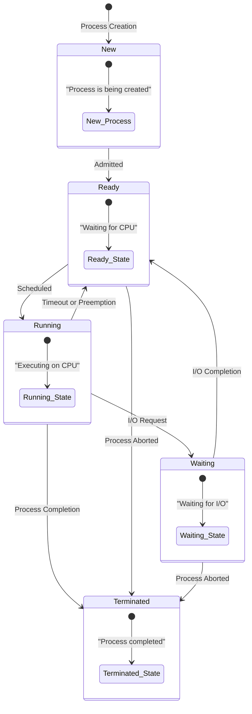
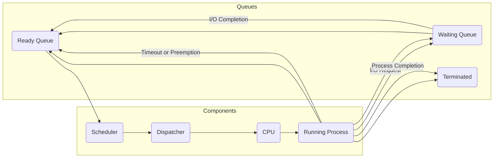
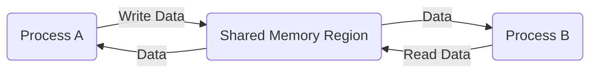
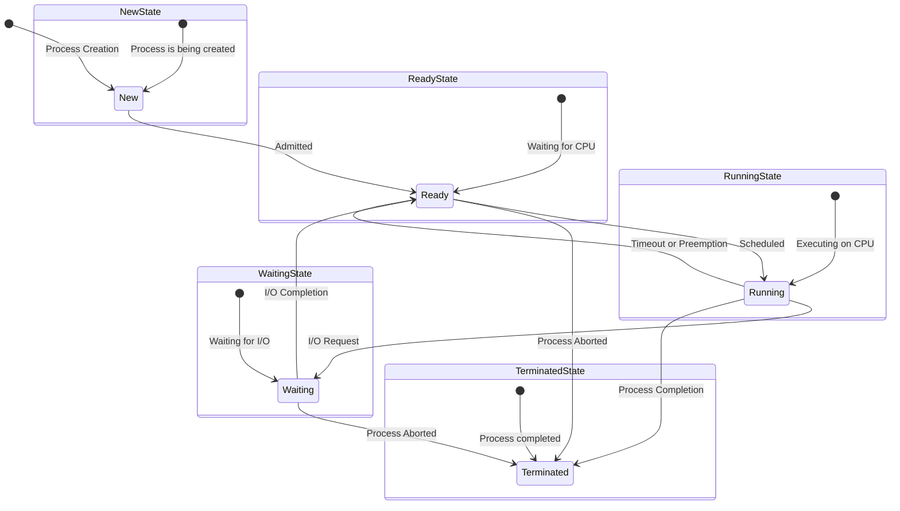
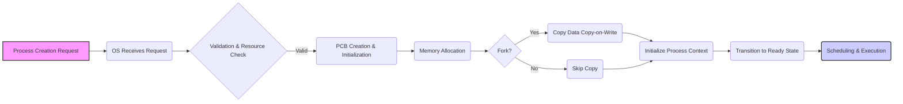
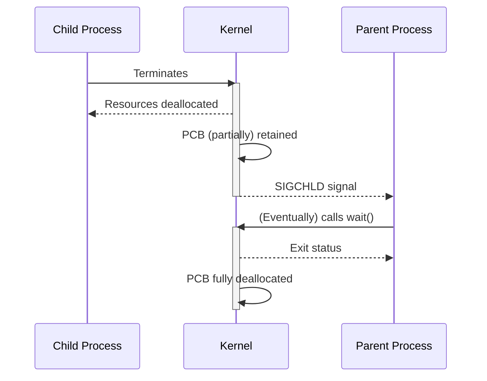

## Process Control Block (PCB)

The **Process Control Block (PCB)** serves as a comprehensive data structure
maintained by the operating system for each active process. It contains all
the necessary information about the process, essentially acting as its unique
identifier and control center. The PCB holds three main categories of
information: process identification data, processor state information, and
process control information. Process identification data includes the Process
ID (PID), Parent Process ID, and User ID. The PID is a unique identifier
assigned to each process by the operating system, allowing it to be
distinguished from all other processes. The Parent Process ID indicates the
process that created the current process, forming a hierarchical
relationship. The User ID identifies the user associated with the process,
enabling the operating system to enforce security and access control policies.

Processor state information encompasses the Program Counter (PC), CPU
registers, and Program Status Word (PSW). The Program Counter holds the
address of the next instruction that the process will execute. CPU registers
store data and intermediate results used by the process during execution,
while the Program Status Word contains condition codes and mode bits that
describe the current state of the processor.

Process control information includes the process state (new, ready, running,
waiting, terminated), scheduling priority, accounting information, and I/O
status. The process state indicates the current activity of the process. The
scheduling priority determines the order in which processes are selected for
execution. Accounting information tracks CPU time and execution time, while
I/O status details open files and allocated devices.

## Timeout

A **timeout** is a mechanism implemented to prevent processes or system calls
from indefinitely waiting for an event or resource. It enforces a maximum
time limit for a particular operation to complete. If the operation exceeds
the allotted time, a timeout event is triggered, causing the operating system
to intervene and take appropriate action. Timeouts are used in various
scenarios, including process scheduling, deadlock handling, and network
communication.

In process scheduling, a process may be assigned a specific time quantum,
representing the duration for which it can execute before potentially being
preempted. If the process does not complete its execution within the time
quantum, a timeout occurs, and the operating system saves the process's state
and moves it back to the ready queue. This ensures fair distribution of CPU
time and prevents any single process from monopolizing the processor.

In deadlock handling, timeouts can be used to break potential deadlocks. When
multiple processes are blocked indefinitely, waiting for each other to release
resources, a timeout can be set for each process. If a process remains blocked
for an extended period, the timeout will trigger, allowing the operating
system to interrupt the process, release its resources, and potentially
resolve the deadlock situation.

In networking, timeouts are essential for reliable communication. When sending
data over a network, the sender expects an acknowledgment from the receiver
within a certain timeframe. If the acknowledgment is not received within the
timeout period, the sender assumes that the data was lost and retransmits it.
This ensures that data is eventually delivered, even in the presence of
network congestion or failures.

## Inter-Process Communication (IPC)

**Inter-Process Communication (IPC)** enables processes to communicate,
coordinate, and synchronize with each other. This is essential for building
complex applications consisting of multiple interacting processes. There are
two main models: Message Passing and Shared Memory. In message passing,
processes send and receive messages to exchange data. This method is
particularly useful in distributed systems where processes may reside on
different machines.

Shared memory involves creating a region of memory that multiple processes can
access. This enables processes to share data directly, leading to faster
communication compared to message passing. However, shared memory requires
careful synchronization to prevent data corruption or race conditions.

## Dispatcher

The **dispatcher** is the OS module that **gives control of the CPU to the
process selected by the scheduler**.

### Responsibilities:

- Performs **context switching**
- Switches to **user mode**
- Jumps to the correct instruction in the process

## Scheduler

The **scheduler** decides _which process runs when_.

### Types of Scheduling:

1.  **Long-term Scheduler**
    - Controls admission of jobs into the system.
    - Decides which jobs enter the ready queue.
    - Runs less frequently.

2.  **Medium-term Scheduler**
    - Temporarily suspends/resumes processes.
    - Improves mix of I/O-bound and CPU-bound processes.

3.  **Short-term Scheduler (CPU Scheduler)**
    - Decides which process in the ready queue gets CPU next.
    - Runs very frequently (milliseconds).

## Executing Timeout

When a process **exceeds its allocated CPU time quantum**, the OS:

1.  Issues a **timeout interrupt**.
2.  Saves the process state in PCB.
3.  Moves the process back to the **ready queue**.
4.  Dispatcher loads the next process.

## Scheduling Basics

Scheduling is about **maximizing CPU utilization and minimizing waiting time**.

### Scheduling Criteria:

- **CPU Utilization** → keep CPU busy
- **Throughput** → number of processes completed per unit time
- **Turnaround Time** → completion time - arrival time
- **Waiting Time** → time spent in ready queue
- **Response Time** → time from request to first response
- **Fairness** → no starvation

### Common Scheduling Algorithms:

1.  **First Come First Serve (FCFS)** – simple, but can cause the convoy
    effect.
2.  **Shortest Job Next (SJN/SJF)** – optimal for average waiting time, but
    needs job length prediction.
3.  **Priority Scheduling** – processes with higher priority run first (risk of
    starvation).
4.  **Round Robin (RR)** – each process gets a fixed time quantum, good for
    time-sharing.
5.  **Multilevel Queue Scheduling** – different queues for different process
    types.
6.  **Multilevel Feedback Queue** – processes can move between queues
    (adaptive).

## Process State Transition Diagram

This diagram illustrates the lifecycle of a process, showcasing the different
states a process can be in and the transitions between these states.



## Process Scheduling Queue Diagram

This diagram shows how different processes are organized in queues based on
their state, and how the scheduler and dispatcher interact to manage these
queues.



## Inter-Process Communication Diagram (Shared Memory)

This diagram illustrates how shared memory is used for inter-process
communication.



These diagrams should give you a visual representation of the topics you're
studying, which can greatly aid in your understanding and retention.

## Two Process Model Sufficient

Here is the thing, this model is not good because there is way too much process
switching, and with a timeout, this can lead to much worse problems, and with
content switch from one process to another mode, then it requires more memory
and more work.

Plus thing is that one process needs to be completed, then we will work on the
third model as well.

And because of this limit, we came across Five State Model

## The Five-State Process Model

The **five-state process model** is a way of representing the different stages
a process goes through from its creation to its termination. It's a simplified
abstraction, but it captures the essential phases and transitions a process
experiences. These states are:

1.  **New**
2.  **Ready**
3.  **Running**
4.  **Waiting (Blocked)**
5.  **Terminated**

Here's a detailed breakdown of each state and the transitions between them:

## 1. New State

- **Description**: The process is being created but has not yet been admitted
  into the system. Resources are being allocated, and initial setup is being
  performed.
- **Activities**:
  - Process creation and initialization.
  - Allocation of necessary resources (memory, file handles, etc.).
  - Loading the program code into memory.
- **Transition**:
  - **New → Ready**: Once the OS deems the process ready for execution
    (sufficient resources are allocated), it transitions to the Ready state.
    This transition is usually managed by the long-term scheduler (also
    known as the admission controller).

## 2. Ready State

- **Description**: The process is ready to execute but is waiting for its
  turn to be scheduled by the CPU. It's in the ready queue, competing with
  other processes for CPU time.
- **Activities**:
  - Waiting in the ready queue for CPU time.
  - No actual execution happening; the process is just queued up.
- **Transitions**:
  - **Ready → Running**: When the scheduler selects this process, the
    dispatcher assigns the CPU to it, and the process enters the Running
    state.
  - **Ready → Terminated**: In some scenarios, the process might be
    terminated due to system reasons (e.g., insufficient resources, process
    aborted by user).

## 3. Running State

- **Description**: The process is currently executing on the CPU.
  Instructions are being processed, and the process is actively performing
  its intended tasks.
- **Activities**:
  - Executing instructions and performing computations.
  - Accessing memory and system resources.
- **Transitions**:
  - **Running → Waiting**: The process may need to wait for an event, such
    as I/O completion, a lock acquisition, or a message. It then
    transitions to the Waiting state.
  - **Running → Ready**: If the process's time quantum expires (in
    time-sharing systems) or a higher-priority process becomes ready, the
    process is preempted and moves back to the Ready state.
  - **Running → Terminated**: When the process completes its execution or
    is terminated due to an error, it enters the Terminated state.

## 4. Waiting (Blocked) State

- **Description**: The process is waiting for an external event to occur
  (e.g., I/O operation completion, receipt of a signal, or availability of a
  resource). The process is blocked and cannot proceed until the event
  occurs.
- **Activities**:
  - Waiting for an event to occur.
  - Process is suspended and not eligible for CPU time.
- **Transitions**:
  - **Waiting → Ready**: When the event the process was waiting for occurs
    (e.g., I/O completes), the process moves to the Ready state.

## 5. Terminated State

- **Description**: The process has completed its execution or has been
  terminated. It's no longer active and is waiting for its resources to be
  deallocated by the OS.
- **Activities**:
  - Releasing resources allocated to the process.
  - Performing any necessary cleanup operations.
- **Transition**:
  - There are generally no transitions out of the Terminated state. The
    process is eventually removed from the system.

## The Process State Diagram

A process state diagram is the graphical representation of the process states
and their transitions.



## Key Considerations

- **Scheduler's Role**: The scheduler (primarily the short-term or CPU
  scheduler) determines which process moves from the Ready state to the
  Running state.
- **Dispatcher's Role**: The dispatcher is responsible for the actual
  context switch: saving the state of the current process and loading the
  state of the next process.
- **Resource Management**: The OS manages resources to prevent starvation
  (where a process is indefinitely denied necessary resources).

By understanding the five-state process model, you gain a clearer insight into
how operating systems manage and schedule processes.

## Process Creation:

Process creation is a fundamental operation in any operating system. It involves numerous steps to ensure the new process is properly set up and ready to execute. Here's a comprehensive, detailed walkthrough:

## 1. Process Creation Request

- **Initiation**:
  - A request to create a new process can originate from various sources:
    - **User action**: A user starts a program (e.g., by clicking an icon or typing a command).
    - **System initialization**: During system boot, the OS may start essential processes.
    - **Running process**: A process may create child processes (e.g., a web server spawning multiple processes to handle client requests).
    - **Scheduled job**: A scheduled task (e.g., cron job) can initiate process creation.
- **System Call**:
  - The request translates into a system call, usually `fork()` followed by `exec()` (in Unix-like systems) or `CreateProcess()` (in Windows). These system calls signal the OS to create a new process.

## 2. OS Receives the Request

- **Validation**:
  - The OS verifies the request for validity, checking if:
    - The user has the necessary permissions to create a new process.
    - The system has sufficient resources (memory, CPU, etc.) to support the new process.
- **Resource Check**:
  - The OS determines the resources required by the process (based on the program being executed) and ensures they are available.

## 3. Process Control Block (PCB) Creation

- **Memory Allocation**:
  - The OS allocates memory for the new process's PCB. This block will store all the essential information about the process.
- **Initialization**:
  - The PCB is initialized with:
    - **Process ID (PID)**: A unique identifier assigned to the new process.
    - **Process State**: Initially set to 'New'.
    - **Priority**: Assigning a default or calculated priority.
    - **Accounting Information**: Initial values for CPU time used, execution time, etc.
    - **Memory Pointers**: Pointers to memory regions allocated to the process.
    - **Security Information**: User ID and permissions.

## 4. Memory Allocation for the Process

- **Address Space Setup**:
  - The OS allocates memory regions for the process's address space, which includes:
    - **Code (Text) Segment**: Stores the executable instructions of the program.
    - **Data Segment**: Stores global and static variables.
    - **Heap Segment**: Dynamically allocated memory during runtime.
  - **Stack Segment**: Used for function calls and local variables.
- **Loading Executable**:
  - The program's executable file is loaded into the allocated memory (specifically the code segment).

## 5. Copying Necessary Data (for `fork()`)

- **Forking (if applicable)**:
  - If the process is being created via `fork()`, the OS performs a copy-on-write operation. This process involves both a parent and a child process:
    - **Parent Process**: The process that initiates the `fork()` system call to create a new process.
    - **Child Process**: The new process created as a result of the `fork()` system call.
    - **Copy-on-Write**: Instead of immediately copying all the parent's memory, the OS creates a shared mapping. When either the parent or child attempts to modify a shared page, a new copy of that page is created for the modifying process.
  - **Roles and Relationships**:
    - **PID**: The child process receives a new, unique Process ID (PID).
    - **PPID**: The child process's Parent Process ID (PPID) is set to the PID of the parent process.
    - **Memory**: Initially, the child process shares the memory space with the parent process (via copy-on-write). Over time, as either process modifies memory, they get their own copies.
    - **Execution**: After the `fork()` call, both the parent and child processes continue execution. The `fork()` call returns the PID of the child process to the parent, and it returns 0 to the child process.
  - This step is skipped if the process is created using `CreateProcess()` or similar mechanisms that don't involve forking.

## 6. Initialization of Process Context

- **CPU Registers**:
  - The CPU registers are initialized with appropriate values. This includes:
    - **Program Counter (PC)**: Set to the entry point of the program (typically the `main()` function).
    - **Stack Pointer (SP)**: Initialized to point to the top of the stack segment.
    - **Other Registers**: Set to initial default values or copied from the parent process (in the case of forking).
- **I/O Setup**:
  - Standard input, standard output, and standard error streams are set up. By default, these are usually connected to the console.

## 7. Transition to Ready State

- **Queueing**:
  - The process is moved from the 'New' state to the 'Ready' state.
  - The PCB is added to the ready queue, waiting for its turn to be scheduled on the CPU.

## 8. Scheduling and Execution

- **Scheduler Selection**:
  - The scheduler selects a process from the ready queue to run based on scheduling algorithms (e.g., First-Come, First-Served, Shortest Job Next, Priority Scheduling, Round Robin).
- **Dispatching**:
  - The dispatcher takes the selected process and performs a context switch:
    - **Context Switch**: Saving the state of the currently running process (if any) and loading the state of the new process.
  - The CPU is now executing instructions from the new process.

## Diagram: Process Creation Flow



## Important Considerations

- **Error Handling**: Throughout the process, the OS must handle errors gracefully (e.g., insufficient memory, invalid executable).
- **Security**: Security measures are applied to prevent malicious code from compromising the system.
- **Resource Limits**: The OS enforces resource limits to prevent processes from consuming excessive resources.

By understanding these steps, you gain a comprehensive view of what happens behind the scenes when a new process is created. This knowledge is crucial for advanced topics in operating systems, such as process management, concurrency, and security.

## Process Creating Code

```c++
#include <stdio.h>
#include <stdlib.h>
#include <sys/types.h>
#include <sys/wait.h>
#include <unistd.h>

int main() {
  pid_t pid;

  // Print a message before forking
  printf("Before forking: This is printed once.\n");

  // Create a child process
  pid = fork();

  if (pid == -1) {
    // Error occurred
    perror("Fork failed");
    return 1;
  } else if (pid == 0) {
    // Child process
    printf("Child process: PID = %d, Parent PID = %d\n", getpid(), getppid());
    // Perform some work in the child process
    for (int i = 0; i < 5; i++) {
      printf("Child process: Counter = %d\n", i);
      sleep(1); // Sleep for 1 second
    }
    printf("Child process: Exiting\n");
    exit(0); // Exit child process
  } else {
    // Parent process
    printf("Parent process: PID = %d, Child PID = %d\n", getpid(), pid);
    // Wait for the child to finish
    wait(NULL); // Wait for any child process to terminate
    printf("Parent process: Child process completed\n");
    printf("Parent process: Exiting\n");
  }

  return 0;
}
```

Okay, Abdul, let's talk about **zombie processes** – the undead of the operating system world! They're a common topic in OS discussions and understanding them is crucial for good system administration.

# Zombie Processes: The Undead of the OS

A **zombie process**, also known as a **defunct process**, is a process that has completed execution but still has an entry in the process table. It has terminated, but its process descriptor (PCB) remains to allow the parent process to read its exit status.

## Why Do Zombie Processes Exist?

The existence of zombie processes is a necessary part of process management in operating systems. When a process terminates, it sends a signal (specifically, `SIGCHLD` on Unix-like systems) to its parent process. The parent process is then expected to use the `wait()` system call to read the exit status of the child process (e.g., whether it terminated normally or with an error code).

The kernel keeps the zombie process's PCB until the parent process calls `wait()` to retrieve this exit status. This mechanism ensures that the parent process knows how the child process terminated.

## How Are Zombie Processes Created?

1.  **Process Termination**: A child process finishes its execution.
2.  **Signal Sent**: The child process sends a `SIGCHLD` signal to its parent.
3.  **PCB Retention**: The kernel retains the child process's PCB with a minimal amount of information (process ID, exit status, resource usage).
4.  **Parent Neglect**: If the parent process does not call `wait()` to retrieve the exit status, the child process remains a zombie.

## Characteristics of Zombie Processes

- **Inactive**: Zombie processes are not running or consuming any CPU time.
- **Minimal Resources**: They occupy very little memory, mainly just the PCB.
- **Visible**: They can be seen in process listings (e.g., using `ps` command on Unix-like systems) with a state of `Z` or ` defunct`.

## Problems Caused by Zombie Processes

1.  **PID Exhaustion**: Each zombie process occupies a PID. If too many zombie processes accumulate, the system might run out of available PIDs, preventing new processes from being created.
2.  **Resource Leakage**: Although zombie processes themselves consume minimal resources, the accumulation of many zombie processes can prevent the re-use of PIDs and may indirectly cause resource-related issues.

## How to Handle Zombie Processes

1.  **Proper Parent Process Management**: The primary solution is to ensure that parent processes call `wait()` (or `waitpid()`) to retrieve the exit status of their child processes.
2.  **Signal Handling**: Parent processes can set up a signal handler for `SIGCHLD` to automatically call `wait()` when a child process terminates.
3.  **Orphaning**: If a parent process terminates before its children, the orphaned children are adopted by the `init` process (PID 1). The `init` process periodically calls `wait()` to clean up any zombie children.
4.  **Killing the Parent**: As a last resort, if zombie processes are causing severe problems and the parent process is unresponsive, killing the parent process can force the zombie processes to be re-parented to `init`, which should then clean them up.
5.  **Restarting the Daemon**: If parent process is daemon it will keep creating a zombie process until the limit exceed the operating system, then you may need to restart the program.

## Example (C Code - Creating a Zombie Process)

```c
#include <stdio.h>
#include <stdlib.h>
#include <sys/types.h>
#include <unistd.h>

int main() {
  pid_t pid;

  // Create a child process
  pid = fork();

  if (pid == -1) {
    perror("Fork failed");
    return 1;
  } else if (pid == 0) {
    // Child process: Immediately exit
    printf("Child process (PID %d) exiting\n", getpid());
    exit(0);
  } else {
    // Parent process: Sleep for a while without calling wait()
    printf("Parent process (PID %d) sleeping...\n", getpid());
    sleep(60); // Sleep for 60 seconds
    printf("Parent process (PID %d) done sleeping\n", getpid());
  }

  return 0;
}
```

**You can find the complied code bu [clicking here](/blog_code/process_creation)**

In this example:

- The child process exits immediately.
- The parent process sleeps for 60 seconds _without_ calling `wait()`. This creates a zombie process that you can observe using the `ps` command during the parent's sleep time.

## Diagram: Zombie Process Lifecycle



## Few Questions

### 1. Parent Dies Before Child

- **Scenario**: What happens to a child process if its parent process terminates first?

- **Answer**: In most operating systems, when a parent process dies before its child processes, the child processes become **orphaned**. The orphaned processes are then "adopted" by a special system process, typically the `init` process (PID 1) or a systemd equivalent.

- **Init Process's Role**:
  - The `init` process is designed to clean up orphaned processes.
  - It does this by periodically calling `wait()` or `waitpid()` on its child processes, thus reaping any zombie processes and preventing them from accumulating indefinitely.

- **Impact on Child Process**:
  - The child process continues to run as normal. It's only the parent-child relationship that changes.
  - When the child process eventually terminates, the `init` process will receive the `SIGCHLD` signal and clean up the process entry.

### 2. Child Not Dead and Memory Usage

- **Scenario**: If the parent process terminates while the child process is still running, what about memory usage and other system resources held by the child?

- **Answer**:
  - **Memory**: The child process continues to use the memory and other resources (file descriptors, network connections, etc.) that were allocated to it. These resources are not automatically released when the parent process dies. The child process operates independently, and its resource usage is managed by the kernel as long as the child process is alive.
  - **Cleanup**: Once the child process terminates, the OS reclaims all the resources that were allocated to it, regardless of whether the original parent process is still alive.

### 3. Parent Alive But Doesn't Expect Child to End

- **Scenario**: If the parent process is alive but doesn't expect the child process to end its task (i.e., the parent doesn't call `wait()`), can the child process still be adopted by the OS?

- **Answer**: No, the child process cannot be adopted by the `init` process while the original parent process is still alive.
  - **Zombie State**: When the child process terminates, it becomes a zombie process. It will remain in the zombie state until the parent process calls `wait()` to collect its exit status.
  - **No Adoption**: The `init` process only adopts orphaned processes (i.e., processes whose parent has already terminated).
  - **Parent Responsibility**: As long as the parent process is alive, it's the parent's responsibility to handle the terminated child process and collect its exit status.

### Summary:

- **Orphaned Children**: If a parent process dies, the `init` process adopts the orphaned children, ensuring they are eventually cleaned up.
- **Resource Management**: Child processes continue to use allocated resources, even if the parent dies.
- **Zombie Cleanup**: If the parent is alive but neglects to call `wait()`, the child becomes a zombie and remains until the parent reaps it.
- Zombie Process doesn't have resource leak on memory or the CPU; the only leak it has is the operating system cannot give the PID to another process until the parent process calls the wait command.

### Why an OS Can't Assign a Task to a Zombie Process (Refined):

1.  **Terminated Process**:
    - A zombie process is a process that has already **completed its execution**.
    - It's in a state where it no longer executes code.

2.  **Purpose is to Report Exit Status**:
    - The sole purpose of a zombie process is to retain its process ID (PID) and exit status (the reason for termination) so that its parent process can retrieve this information.

3.  **No Execution Context**:
    - Zombie processes do not have an active execution context (CPU registers, program counter, etc.).
    - The OS cannot resume execution or assign new tasks to a process without an active execution context.

4.  **Parent Process's Role**:
    - The parent process is responsible for calling `wait()` or `waitpid()` to retrieve the zombie process's exit status and release its entry from the process table.
    - As long as the parent process exists (and hasn't called `wait()`), the zombie process must remain to provide the exit status.

5.  **Parent Process Does Not Determine Task Assignment**:
    - _Even if_ the parent process were to continue running (and not call `wait()`), the zombie process _still_ could not be assigned a new task.
    - The task assignment to any process is solely controlled by the OS, and it cannot assign tasks to a process that has terminated.

6.  **Cannot Assign Any Task to a Dead Process regardless of if the parent process is alive and active**
    - A terminated child is meant to be reaped by the parent and not by an external agent like the OS.

### Analogy:

Think of a project that has been completed.

1.  **Zombie Process**: The completed project's file.
2.  **Exit Status**: The final report/outcome of the project.
3.  **No Code to Execute**: the student cannot excute in it or does assignment in it.
4.  **Manager/Student waiting is required**: The lecturer (or the manager) that assigned the project is waiting to know what the final result will be before archive and forget about the file(task).

### In Conclusion:

The key point is that, regardless of the state or actions of the parent process, the zombie process itself is in a terminated state and cannot be assigned any new tasks by the OS.

Zombine Process code is compiled can be found by [clicking here](/blog_code/zombine_process)

and that is end of the notes.. See you in the next Lecture
