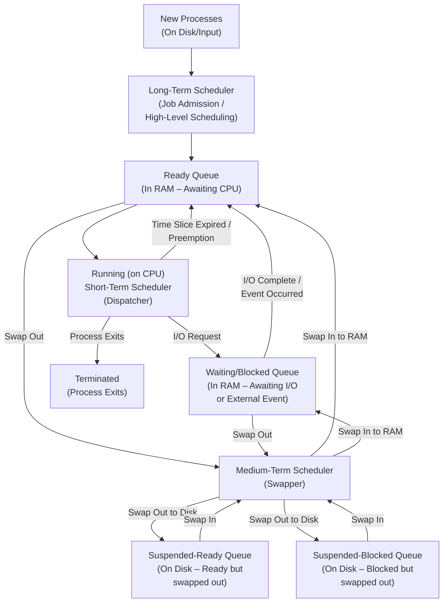
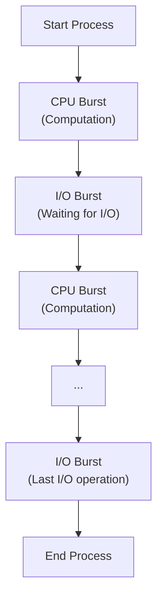
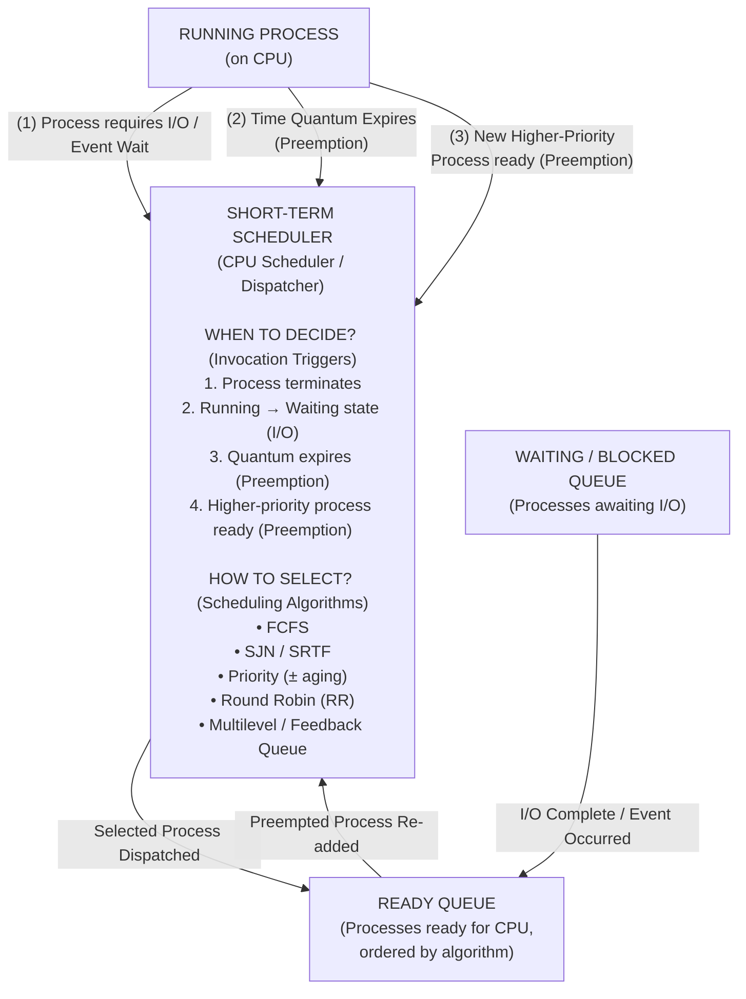

### The Grand Challenge: Juggling Tasks Efficiently

**Imagine this:** You've got a dozen browser tabs open, music streaming, your IDE compiling a large project, and a background sync happening – all at the same time. How does your computer handle this seemingly simultaneous chaos without missing a beat? It's not magic, it's meticulous orchestration.

In our previous lecture, we explored how an Operating System (OS) brings processes to life, allocates resources, and places them into the **ready queue**, eagerly awaiting their turn. But here's the million-dollar question: _From that ready queue, how does the OS decide which process gets the CPU next?_

This isn't a random draw! The answer lies in **Process Scheduling**, a fundamental aspect of operating systems that determines:

- Which process runs.
- When it runs.
- For how long it runs.

The goal? To maximize CPU utilization, provide a fair share of resources, minimize response times for interactive applications, and ensure a smooth, responsive user experience. It's about turning a multitude of waiting processes into a seamlessly executing symphony.

### Factors Guiding the Scheduler's Hand

The decision of which process "goes on top" is influenced by a complex interplay of various factors. Think of them as the OS's internal rulebook for prioritizing tasks:

1.  **Process Priority:** Some tasks are simply more critical than others. A system process ensuring OS stability often takes precedence over a background download.
2.  **Resource Requirements (Usage):** Is the process **CPU-bound** (demanding heavy computation) or **I/O-bound** (spending most of its time waiting for input/output, like reading from disk or network)? This often influences how much CPU time it should get.
3.  **Execution Time/Nature:** Is it a short, interactive task needing a quick response, or a long batch job that can run in the background?
4.  **Deadlines:** In real-time systems, some processes have strict deadlines that _must_ be met (e.g., controlling an industrial robot or playing audio without glitches).
5.  **Memory Constraints:** The availability of physical memory can impact which processes can even enter the ready state.
6.  **Process Type:** Is it a foreground application you're actively using, or a background service?
7.  **System Policy:** Overall OS objectives, like maximizing throughput or minimizing latency, also guide scheduling decisions.

These factors, and many more, are continuously evaluated to define which process gains access to the precious CPU resources.

### Three Levels of Scheduling: A Multi-Tiered Approach

When a process is first created and admitted into the system, it doesn't immediately contend for the CPU. Instead, it embarks on a journey managed by different levels of schedulers, each with a distinct responsibility. This multi-tiered approach helps manage the system's resources effectively:

1.  **Long-Term Scheduler (Job Scheduler):**
    - **Role:** This scheduler decides _which_ jobs or processes are admitted into the system for processing. It's like the bouncer at the club, controlling who gets in from the "new" state to the "ready" queue.
    - **Impact:** It primarily controls the **degree of multiprogramming** – the number of processes residing in memory at any given time. A good long-term scheduler ensures a balanced mix of I/O-bound and CPU-bound processes to optimize system performance.
    - **Frequency:** Invoked infrequently, typically when a new batch job arrives or system load allows.

2.  **Medium-Term Scheduler (Swapper):**
    - **Role:** This scheduler is all about managing memory and "swapping" processes. If the degree of multiprogramming needs to be reduced (e.g., memory is low), it can remove a process from memory (swapping it out to disk). Later, it can swap the process back into memory.
    - **Impact:** Crucial for virtual memory systems. It helps manage available physical memory, allowing the system to handle more processes than it could if all had to be resident in RAM simultaneously.
    - **Frequency:** Invoked more frequently than the long-term scheduler, especially in systems experiencing memory pressure.

3.  **Short-Term Scheduler (CPU Scheduler / Dispatcher):**
    - **Role:** This is the most critical and frequently invoked scheduler. It decides _which process_ from the **ready queue** will be allocated the CPU **next**. It then "dispatches" that process to run.
    - **Impact:** Directly controls the CPU's immediate utilization and responsiveness. Its decisions happen in milliseconds or microseconds.
    - **Frequency:** Invoked very frequently, typically every time a process terminates, switches to a waiting state, or when an interrupt occurs (e.g., a timer interrupt for time-sharing).

So, when a process initially comes in, its "initial requirements" are assessed by the Long-Term Scheduler to determine if it can even enter the system. Once admitted, it moves between the ready, running, and waiting states, often managed by the Medium-Term Scheduler for memory and always by the Short-Term Scheduler for CPU allocation. This intricate dance ensures that the OS remains responsive, efficient, and fair to all processes vying for attention.

## Diagram

## Key Points

- Every one following the rules
- These are responsiable for making the time table for each process.
- If something goes south then that process will get block and then become a zombine Process

Excellent point! The CPU-I/O Burst Cycle is a fundamental concept for understanding _why_ process scheduling is so critical and how different processes behave. Let's integrate it smoothly into your lecture.

I'll place this section just after "Factors Guiding the Scheduler's Hand" or even specifically under the "Resource Requirements (Usage)" factor, as it directly explains that. I'll make it a new subheading for clarity.

### The Rhythmic Dance of Processes: The CPU-I/O Burst Cycle

To truly understand how schedulers make decisions, we must look at the intrinsic behavior of processes themselves. A process rarely uses the CPU continuously from start to finish. Instead, it typically alternates between two phases:

- **CPU Burst:** A period of time when the process is actively using the CPU for computation (e.g., performing calculations, executing instructions, manipulating data).
- **I/O Burst:** A period of time when the process is waiting for an I/O operation to complete (e.g., reading from disk, writing to a network socket, waiting for user input, sending data to a printer). During this time, the CPU can be allocated to another process.

This alternating pattern is known as the **CPU-I/O Burst Cycle**. It's the inherent rhythm of most processes.

#### Why does this cycle matter for scheduling?

Understanding the CPU-I/O Burst Cycle is paramount for effective scheduling because it allows the OS to categorize processes and make smarter allocation decisions:

1.  **CPU-Bound Processes:** These processes have very long CPU bursts and relatively short I/O bursts. They spend most of their time crunching numbers and less time waiting for I/O. Examples include complex scientific calculations, video rendering, or large data analysis.
    - _Scheduler's Dilemma:_ If a CPU-bound process gets the CPU, it might hold it for a long time, potentially starving other processes.
2.  **I/O-Bound Processes:** These processes have many short CPU bursts and long I/O bursts. They spend a lot of time waiting for I/O operations to complete, requiring the CPU only briefly between these waits. Examples include text editors, web browsers (waiting for network, disk I/O), or database queries.
    - _Scheduler's Opportunity:_ When an I/O-bound process requests I/O, the CPU becomes free almost immediately, presenting an opportunity to switch to another process. Giving these processes the CPU quickly (even if for a short time) can significantly improve responsiveness.

A good process scheduler tries to maintain a healthy mix of both CPU-bound and I/O-bound processes in the ready queue. This ensures that the CPU is rarely idle: while one process is waiting for I/O, another can be utilizing the CPU. This balance is key to maximizing CPU utilization and providing a responsive user experience – especially for us developers, who jump between compiling, coding, and waiting for network requests!

### The Short-Term Scheduler: The CPU's Master Dispatcher

If the Long-Term Scheduler is the bouncer and the Medium-Term Scheduler is the bouncer's resourceful assistant managing the coat check (memory!), then the **Short-Term Scheduler (STS)** – also known as the **CPU Scheduler** or **Dispatcher** – is the rapid-fire traffic controller directly assigning lanes on the main highway (the CPU).

Its single, highly critical job is to select **which process from the ready queue gets to run on the CPU _next_**. This decision happens with incredible frequency, often in milliseconds or even microseconds, making it the most active and crucial scheduler for system responsiveness.

### The Decision Model: When and How the OS Chooses

The "Decision Model" for the Short-Term Scheduler essentially covers two main questions:

1.  **When** does it decide to pick a new process?
2.  **How** does it pick that process?

#### 1. When to Decide? (Preemption vs. Non-Preemption)

The timing of the STS's decisions fundamentally defines the nature of the operating system:

- **Non-Preemptive Scheduling:**
  - **The Rule:** Once a process starts running on the CPU, it holds onto it until it either **completes its execution** (terminates) or **voluntarily gives up the CPU** (e.g., it needs to perform an I/O operation and moves to the waiting state).
  - **Analogy:** Imagine a shared bathroom where once someone goes in, they stay until they're done or decide they're done. No one can kick them out.
  - **Pros:** Simpler to implement, lower overhead (no need for complex context switching in the middle of a process's burst).
  - **Cons:** Can lead to poor responsiveness. A long-running CPU-bound process can "starve" all other processes, including interactive ones. Not suitable for modern general-purpose operating systems where user experience demands quick feedback.
  - **Triggers for STS:** Process terminates, or process moves from Running to Waiting state.

- **Preemptive Scheduling:**
  - **The Rule:** A running process can be **interrupted** and forced to relinquish the CPU, even if it hasn't completed its CPU burst or requested I/O. The OS has the power to "preempt" a process.
  - **Analogy:** Our shared bathroom now has a timer, or a higher-priority person can knock and demand entry.
  - **Pros:** Essential for time-sharing systems (like your everyday OS!), providing good responsiveness and fairness. Prevents any single process from hogging the CPU.
  - **Cons:** More complex to implement, higher overhead due to frequent context switching.
  - **Triggers for STS:**
    - A process terminates.
    - A process switches from Running to Waiting (e.g., I/O request).
    - A process switches from Running to Ready (e.g., its allotted **time slice** or **quantum** expires). This is key for Round Robin!
    - A process switches from Waiting to Ready (e.g., an I/O operation completes, and now a higher-priority process is ready to run).

Modern operating systems primarily use **preemptive scheduling** to ensure a smooth, interactive, and responsive user experience. You wouldn't want your browser freezing because your compiler is in a long CPU burst, right?

#### 2. How to Select? (Scheduling Algorithms)

Once the STS is triggered to make a decision (due to one of the above events), it then consults its internal "rulebook" – the **scheduling algorithm** – to pick the next lucky process from the Ready Queue. The choice of algorithm profoundly impacts system performance, fairness, and responsiveness.

Here's a glimpse into the diverse strategies the STS employs:

- **First-Come, First-Served (FCFS):**
  - **Concept:** The simplest approach. The process that requested the CPU first gets it first, just like a queue at a grocery store.
  - **Think of it like:** Your `npm install` command running to completion before you can run `npm start`, even if `npm start` is quick.
  - **Pros:** Easy to understand and implement.
  - **Cons:** Can lead to a "convoy effect" where a long CPU-bound process at the front delays everything behind it, even small, interactive tasks. Bad for average waiting time.

- **Shortest-Job-Next (SJN) / Shortest-Remaining-Time-First (SRTF):**
  - **Concept:** Always chooses the process with the smallest _next CPU burst_ (SJN for non-preemptive) or the smallest _remaining_ CPU time (SRTF for preemptive).
  - **Think of it like:** Your build system prioritizing the microservice with the quickest compile time, allowing for faster overall delivery.
  - **Pros:** Provably optimal for minimizing average waiting time.
  - **Cons:** Requires knowing or accurately predicting the length of the next CPU burst, which is often impossible in practice. Also, longer jobs can suffer from starvation.

- **Priority Scheduling:**
  - **Concept:** Each process is assigned a priority number (either internally by the OS or externally by the user/system administrator). The CPU is allocated to the process with the highest priority.
  - **Think of it like:** Your IDE (high priority) getting CPU time over a background cloud sync (low priority).
  - **Pros:** Can prioritize critical system tasks or user-facing applications.
  - **Cons:** Low-priority processes can suffer from indefinite blocking or "starvation" if a continuous stream of high-priority processes keeps arriving. **Aging** (gradually increasing the priority of processes that wait for a long time) is often used to combat starvation.

- **Round Robin (RR):**
  - **Concept:** Designed for time-sharing systems. Each process gets a small unit of CPU time, called a **time quantum** or **time slice** (typically 10-100 milliseconds). When the quantum expires, the process is preempted and added to the end of the ready queue.
  - **Think of it like:** Your browser tabs, where each one gets a quick turn, making it _feel_ like they're all running simultaneously.
  - **Pros:** Fair, provides good response time for interactive processes, and effectively handles a mix of CPU-bound and I/O-bound tasks.
  - **Cons:** Performance heavily depends on the size of the time quantum. Too large, and it behaves like FCFS; too small, and overhead from context switching becomes significant.

These algorithms are the "brains" of the Short-Term Scheduler, carefully balancing competing demands to keep the system humming efficiently and responsively. It's a continuous, dynamic negotiation for CPU access!

### Diagram

You're asking about some really crucial metrics and concepts, Abdul Rafay! As a developer, you know that performance isn't just about raw speed, but also about the _responsiveness_ and _efficiency_ of the underlying systems. These terms are all about precisely measuring that.

Let's break down **Dispatch Latency** and then define those important time markers.

---

### Dispatch Latency: The Unavoidable Delay

When the Short-Term Scheduler (STS) finally picks a process from the Ready Queue, it's not instantly on the CPU. There's a small, but critical, delay. This delay is known as **Dispatch Latency**.

**Dispatch Latency** is the time it takes for the CPU scheduler to stop one process and start running another. More precisely, it's the duration from the moment the operating system decides to run a new process until that new process actually begins executing its first instruction on the CPU.

**Think of it like this:** Imagine you're a stage manager (`Short-Term Scheduler`) and you've decided which actor (`process`) is next to go on stage (`CPU`). Dispatch latency is the time it takes for:

1.  The previous actor to clear the stage.
2.  The stage crew to quickly set up for the new actor.
3.  The new actor to actually step onto the stage and start their lines.

#### How it's "Done" (Components of Dispatch Latency):

Dispatch latency isn't a single atomic action; it's a sequence of necessary steps performed by the OS:

1.  **Context Switching:** This is the most significant part. If a process was previously running, its current state (CPU registers, program counter, stack pointer, etc.) must be saved so it can resume execution later. Then, the saved state of the _newly selected process_ must be loaded into the CPU's registers. This is fundamental to multitasking!
2.  **Mode Switching:** The CPU usually operates in two modes: kernel mode (for OS operations) and user mode (for application code). The dispatcher operates in kernel mode. After selecting and preparing the new process, the OS must switch the CPU back to user mode for the process to run its application code.
3.  **Jumping to the User Program:** Finally, the CPU's program counter is loaded with the address of the first instruction of the new process, and execution officially begins.

Each of these steps takes a tiny amount of time, adding up to the total dispatch latency. Minimizing dispatch latency is a key goal for OS designers, as frequent context switches (especially in preemptive, time-sharing systems like yours!) can introduce noticeable overhead.

Now, let's clarify those time-related terms:

- **Arrival Time:**
  - This is the specific **moment in time when a process enters the Ready Queue** for the first time, becoming eligible for CPU execution.
  - _Analogy:_ When you submit your `flutter run` command and the OS puts your app in the queue of things to eventually compile and execute.

- **Dispatch Time (or Dispatch Point):**
  - This is the specific **moment in time when the CPU is actually allocated to a process**, and it begins its execution on the CPU.
  - It's the _end_ of the dispatch latency period for that particular process.
  - _Analogy:_ The exact second your compiled Flutter app actually launches on the simulator or device, rather than just being ready to launch.

- **Switching Time (Context Switch Time):**
  - This specifically refers to the **duration** of the **Context Switching** component within the broader dispatch latency. It's the time overhead required by the OS to save the state of the currently running process and load the state of the next process.
  - _Analogy:_ The few precious seconds the stage crew takes to clear the previous actor's props and set up for the new one. This is pure overhead; no actual "work" is being done for _any_ application during this time.

- **Service Time (Execution Time / CPU Burst Time):**
  - This is the **total amount of CPU time a process _requires_ for its execution**. This doesn't include any time spent waiting for I/O or waiting in the Ready Queue. It's the sum of all its CPU bursts.
  - _Analogy:_ The total amount of time your `npm run build` command actually spends crunching code on the CPU, ignoring the time it might wait for disk I/O or other resources.

## Scheduling Issues

Ah, "Scheduling Issues" – this is where the theoretical elegance of scheduling algorithms meets the messy reality of diverse processes and finite resources! Even the most sophisticated OS schedulers face challenges that can impact system performance, stability, and user experience.

Scheduling issues are problems or undesirable outcomes that arise during the process of managing and allocating CPU time to various processes. They highlight the inherent trade-offs involved in trying to optimize multiple, often conflicting, goals (like maximizing throughput _and_ minimizing response time _and_ ensuring fairness).

Here are some of the most common scheduling issues:

### 1. Starvation (Indefinite Blocking)

This is perhaps the most classic scheduling problem.

- **What it is:** A situation where a process is ready to run but never gets scheduled onto the CPU because other processes continually take precedence. It's perpetually stuck in the ready queue, waiting indefinitely.
- **Why it happens:**
  - **Priority Scheduling:** If there's a constant stream of higher-priority processes, a low-priority process might never get a turn.
  - **SJN/SRTF:** A very long process could starve if many short processes keep arriving, always taking precedence.
- **Impact:** The process never completes its work, leading to perceived system unresponsiveness or application failure.
- **Mitigation:**
  - **Aging:** Gradually increasing the priority of processes that have waited in the ready queue for a long time. This prevents them from being indefinitely starved.
  - **Fair-Share Scheduling:** Ensuring each user or group of processes gets a proportional share of the CPU over time.

### 2. High Overhead from Context Switching

While necessary for multitasking, context switching isn't free.

- **What it is:** The time taken to save the state of one process and load the state of another (the "switching time" we just discussed). This time is pure overhead – no useful work is done for any application during this period.
- **Why it happens:**
  - **Preemptive Scheduling:** Frequent preemption (e.g., in Round Robin with a very small time quantum) means more context switches.
  - **Many processes/threads:** A system with a high degree of multiprogramming, especially if they are frequently switching between CPU and I/O.
- **Impact:** If the time quantum is too small, or context switches are too frequent, the system can spend more time switching than actually executing user code, leading to reduced overall throughput and perceived slowdowns.

### 3. Unfairness

While related to starvation, unfairness is a broader concept where processes don't receive an equitable share of the CPU, even if they eventually complete.

- **What it is:** Some processes consistently get preferential treatment or disproportionately less access to the CPU compared to others, based on factors other than explicit priority (e.g., their arrival time or CPU burst characteristics).
- **Why it happens:** Some algorithms inherently favor certain types of processes (e.g., FCFS can favor CPU-bound jobs at the expense of I/O-bound jobs if a long job arrives first).
- **Impact:** Some applications or users might experience consistently worse performance or responsiveness.

### 4. Priority Inversion

A tricky issue specifically in priority-based preemptive scheduling, especially in real-time systems.

- **What it is:** A low-priority process indirectly blocks a high-priority process from running, effectively "inverting" their priorities. This often happens when a low-priority process holds a resource (like a lock or mutex) that a high-priority process needs. The high-priority process then has to wait for the low-priority one to finish its critical section.
- **Why it happens:** A high-priority process wants a resource, but a low-priority process currently holds it. If a medium-priority process then becomes ready, it can preempt the low-priority process, meaning the low-priority process _never_ releases the resource, and the high-priority process remains blocked.
- **Impact:** Critical high-priority tasks can miss deadlines or experience unexpected delays, leading to system instability, especially in embedded or real-time systems (famously happened with the Mars Pathfinder mission!).
- **Mitigation:**
  - **Priority Inheritance:** Temporarily boosting the priority of the low-priority process holding the needed resource to that of the highest-priority process waiting for it.
  - **Priority Ceilings:** Assigning a temporary priority ceiling to a resource, meaning any process using it runs at a priority at least as high as the highest possible priority of any process that might use that resource.

### 5. Deadlock (Indirectly Related to Scheduling)

While primarily a resource allocation issue, scheduling decisions can sometimes influence the conditions that lead to deadlocks or make them more difficult to resolve.

- **What it is:** A set of processes are all blocked, each waiting for a resource that is held by another process in the same set, leading to a circular wait.
- **Why it happens:** Concurrently executing processes compete for limited resources, and the scheduling decisions might allow the conditions for deadlock (mutual exclusion, hold and wait, no preemption, circular wait) to arise.
- **Impact:** The involved processes permanently halt, freezing parts of the system or requiring a reboot.

### 6. Suboptimal Performance Metrics

Sometimes, the issue isn't a "failure" but simply a less-than-ideal outcome when measuring the system's performance.

- **Low Throughput:** The number of processes completed per unit of time is lower than desired.
- **High Turnaround Time:** The total time from process arrival to completion is too long.
- **High Waiting Time:** Processes spend too much time in the ready queue.
- **High Response Time:** The time from a request being submitted until the first response is produced is too long, making the system feel sluggish to the user.

These issues highlight that CPU scheduling is a constant balancing act. OS designers must choose algorithms and implement strategies that minimize these problems while still meeting the system's overall performance goals. As developers, understanding these challenges helps us write more efficient, less resource-hungry code that plays nicely within the OS's carefully orchestrated environment!
