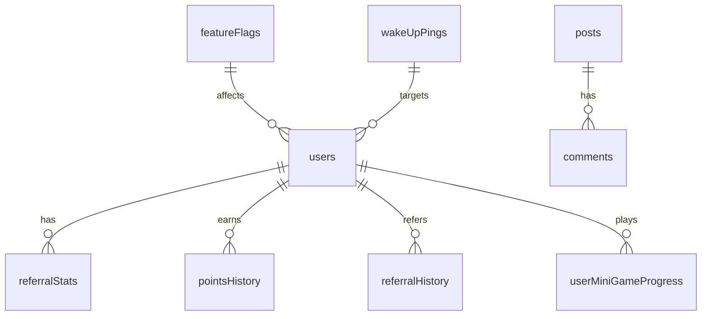

import ImageSlider from "../../components/ReactComponent/blog/enhancements/image-slider/image-slider";

## Project Overview

**TudoNum** is a revolutionary multi-service platform that unifies various service categories under one comprehensive ecosystem. It's designed as a "super app" that connects users with service providers across multiple industries while incorporating a sophisticated affiliate marketing system.

### Core Purpose

TudoNum serves as a unified platform that eliminates the need for multiple apps by providing access to services across:

- **Transportation** (Taxi, Logistics)
- **Food & Groceries** (Food delivery, Grocery shopping)
- **Healthcare** (Doctor consultations, Health services)
- **Real Estate** (Buying, selling, renting properties)
- **Entertainment** (Gaming, Entertainment services)
- **Beauty & Wellness** (Salons, spas, personal care)
- **Professional Services** (Consulting, Legal, Freelancing)
- **Education** (Tutoring, Courses)
- **Marketplace** (Classified ads, E-commerce)
- **Home Services** (Maintenance, Construction)

## Technology Stack

### **Frontend Framework**

- **Next.js 15.2.4** - React-based full-stack framework
- **React 19** - Latest React with concurrent features
- **TypeScript 5.8.3** - Type-safe development
- **Tailwind CSS 3.4.17** - Utility-first CSS framework

### **Backend & Database**

- **Convex** - Real-time backend platform with automatic scaling
- **Clerk** - Authentication and user management
- **Vercel** - Deployment and hosting platform

### **UI/UX Components**

- **Radix UI** - Accessible, unstyled UI primitives
- **Framer Motion** - Advanced animations and transitions
- **Lucide React** - Beautiful icon library
- **Sonner** - Toast notifications
- **React Hook Form** - Form management
- **TipTap** - Rich text editor for blog content

### **Data Visualization & Charts**

- **Chart.js** - Interactive charts
- **React Chart.js 2** - React wrapper for Chart.js
- **Recharts** - Composable charting library

### **Additional Libraries**

- **QR Code generation** - For referral system
- **PDF generation** - For reports and exports
- **Excel export** - For data analysis
- **Country selection** - International support
- **Date handling** - Date-fns for time operations

## Design System

### **Modern UI/UX Approach**

- **Gradient backgrounds** with animated effects
- **Responsive design** optimized for all devices
- **Dark/Light theme** support
- **Smooth animations** using Framer Motion
- **Accessibility-first** design with Radix UI
- **Mobile-first** responsive approach

### **Visual Identity**

- **Clean, modern aesthetic** with gradient accents
- **Consistent color scheme** with blue primary colors
- **Professional typography** with proper hierarchy
- **Interactive elements** with hover effects and micro-animations

## Core Features

### **1. Multi-Service Platform**

- **Unified Dashboard** - Single interface for all services
- **Service Categories** - 18+ different service types
- **Smart Booking** - Intelligent service matching
- **Real-time Updates** - Live status tracking

### **2. Advanced Affiliate System**

- **10-Level Network** - L10 to L1 affiliate structure
- **Lifetime Commissions** - Ongoing earnings from network
- **Multiple Referral Methods**:
  - Unique referral codes
  - Shareable referral links
  - QR code generation
  - Direct sharing
- **Points System** - Gamified earning structure
- **Performance Analytics** - Detailed referral tracking

### **3. User Management**

- **Role-based Access** - User and Admin roles
- **Profile Completion** - Guided onboarding
- **Activity Tracking** - User engagement monitoring
- **Wake-up Pings** - Re-engagement system for inactive users

### **4. Admin Dashboard**

- **Comprehensive Analytics** - User and platform metrics
- **Blog Management** - Content creation and editing
- **Feature Flags** - A/B testing and feature control
- **Points Configuration** - Reward system management
- **User Management** - Admin controls and oversight
- **Mini-Games** - Gamification management

### **5. Blog System**

- **Rich Text Editor** - TipTap-powered content creation
- **SEO Optimization** - Meta tags and structured data
- **Tag Management** - Content categorization
- **Search Functionality** - Full-text search capabilities
- **Responsive Design** - Mobile-optimized reading

## Architecture

### **Database Schema (Convex)**

### **Key Tables**

- **users** - Core user data and referral information
- **pointsConfig** - Configurable reward system
- **levelThresholds** - Affiliate level requirements
- **referralStats** - Performance analytics
- **posts** - Blog content management
- **featureFlags** - Feature control system
- **miniGames** - Gamification elements

### **API Structure**

- **RESTful APIs** - Standard HTTP endpoints
- **Real-time Queries** - Live data updates via Convex
- **Webhook Integration** - Clerk authentication events
- **File Storage** - Image and document management

## Performance & Optimization

### **Performance Features**

- **React Compiler** - Automatic optimization
- **Image Optimization** - Next.js image handling
- **Code Splitting** - Lazy loading of components
- **Caching Strategy** - Intelligent cache management
- **Bundle Optimization** - Tree shaking and minification

### **Monitoring & Analytics**

- **Vercel Analytics** - Performance monitoring
- **Error Tracking** - Comprehensive error handling
- **User Analytics** - Engagement metrics
- **Performance Metrics** - Core Web Vitals tracking

## Security & Privacy

### **Authentication**

- **Clerk Integration** - Enterprise-grade auth
- **Role-based Access** - Secure permission system
- **Webhook Verification** - Secure event handling
- **Environment Variables** - Secure configuration

### **Data Protection**

- **Type Safety** - TypeScript throughout
- **Input Validation** - Form and API validation
- **SQL Injection Prevention** - Convex query safety
- **XSS Protection** - Content sanitization

## Internationalization

### **Global Reach**

- **Multi-language Support** - International user base
- **Country Selection** - Geographic targeting
- **Currency Support** - Multi-currency transactions
- **Time Zone Handling** - Global time management

## Mobile Experience

### **Mobile Optimization**

- **Responsive Design** - All screen sizes
- **Touch-friendly Interface** - Mobile-first interactions
- **Progressive Web App** - App-like experience
- **Offline Capabilities** - Service worker support

## Gamification Elements

### **Engagement Features**

- **Points System** - Reward-based engagement
- **Level Progression** - Achievement system
- **Mini-Games** - Interactive challenges
- **Leaderboards** - Competitive elements
- **Achievement Badges** - Recognition system

## Business Model

### **Revenue Streams**

1. **Service Commission** - Percentage from service providers
2. **Affiliate Network** - Multi-level marketing structure
3. **Premium Features** - Enhanced user experiences
4. **Advertising** - Targeted marketing opportunities

### **Growth Strategy**

- **Viral Referral System** - Organic user acquisition
- **Service Provider Network** - Expanding service categories
- **Geographic Expansion** - Multi-city deployment
- **Feature Development** - Continuous platform enhancement

## 🔮 Future Roadmap

### **Planned Features**

- **AI-Powered Matching** - Smart service recommendations
- **Blockchain Integration** - Decentralized payments
- **AR/VR Experiences** - Immersive service previews
- **IoT Integration** - Smart device connectivity
- **Advanced Analytics** - Predictive insights

### **Expansion Plans**

- **International Markets** - Global platform expansion
- **Enterprise Solutions** - B2B service offerings
- **API Marketplace** - Third-party integrations
- **Mobile Apps** - Native iOS/Android applications

## Development Workflow

### **Development Tools**

- **Git Version Control** - Collaborative development
- **TypeScript** - Type-safe development
- **ESLint** - Code quality enforcement
- **Prettier** - Code formatting
- **Husky** - Git hooks for quality assurance

### **Deployment Pipeline**

- **Vercel Integration** - Automatic deployments
- **Environment Management** - Staging and production
- **Performance Monitoring** - Real-time metrics
- **Error Tracking** - Proactive issue resolution

## Success Metrics

### **Key Performance Indicators**

- **User Acquisition** - Sign-up rates and growth
- **Engagement** - Daily/monthly active users
- **Retention** - User lifetime value
- **Revenue** - Platform earnings and growth
- **Network Effects** - Referral system effectiveness

## Project Vision

TudoNum represents the future of service platforms - a unified ecosystem that connects users with quality services while empowering individuals through an innovative affiliate system. By combining multiple service categories under one roof, TudoNum eliminates the friction of managing multiple apps while creating opportunities for users to earn through referrals.

The platform's sophisticated technology stack, comprehensive feature set, and scalable architecture position it as a leading solution in the rapidly evolving digital services market. With its focus on user experience, performance, and growth, TudoNum is poised to become a dominant player in the global service economy.

## User Interface

<ImageSlider
  images={[
    "https://7huqjqx8yo.ufs.sh/f/TViMykBJnLIJB9wYPTjkNsEnJOSh8x7UI9j3yaW2cmo1ft5p",
    "https://7huqjqx8yo.ufs.sh/f/TViMykBJnLIJYdIpQhMBpumy7J2TkiHEr1zoCSvZaef4URwI",
    "https://7huqjqx8yo.ufs.sh/f/TViMykBJnLIJOk1Z0p8kbVhcyQEigAvaB3fqpPwWD0CRnm81",
    "https://7huqjqx8yo.ufs.sh/f/TViMykBJnLIJ8Rmc9ltmYFqJTthG6XHUrp5nyDRAkMsBZ4v3",
    "https://7huqjqx8yo.ufs.sh/f/TViMykBJnLIJiL0FaZm04c8pb2PCWMuNRxzyw39BeGHY1I7F",
    "https://7huqjqx8yo.ufs.sh/f/TViMykBJnLIJNUlsaCTci8L7tVGxkecjRQf65gBKA0FPvhro",
    "https://7huqjqx8yo.ufs.sh/f/TViMykBJnLIJLOqtD3GODv8zKEuQRClSiYAsbdfeG73ThV1q",
    "https://7huqjqx8yo.ufs.sh/f/TViMykBJnLIJYYloN8MBpumy7J2TkiHEr1zoCSvZaef4URwI",
    "https://7huqjqx8yo.ufs.sh/f/TViMykBJnLIJ2D21gSzNlCFs7RaDUjr1gkAhYuLmT9ZtyS0w",
    "https://7huqjqx8yo.ufs.sh/f/TViMykBJnLIJD4UyhIYCwMPbVrdEixLKuT4A2s8a1Ieh9DqX",
    "https://7huqjqx8yo.ufs.sh/f/TViMykBJnLIJUOIGYw9xZdb0IOL1s3KJqktcxwpW9faXP2mu",
    "https://7huqjqx8yo.ufs.sh/f/TViMykBJnLIJ1GA169ndGSeJU7Linmr2fx6NbADtpOXg3jRF",
    "https://7huqjqx8yo.ufs.sh/f/TViMykBJnLIJTVVuuXcJnLIJBWPvUF7zO3g50aD6HtkNEXpR",
    "https://7huqjqx8yo.ufs.sh/f/TViMykBJnLIJIRgBWmkaiSjy4bUrO0hVeJp2ALZGDX3nCIl8",
    "https://7huqjqx8yo.ufs.sh/f/TViMykBJnLIJYgojtjMBpumy7J2TkiHEr1zoCSvZaef4URwI",
    "https://7huqjqx8yo.ufs.sh/f/TViMykBJnLIJO5YJPXV8kbVhcyQEigAvaB3fqpPwWD0CRnm8",
    "https://7huqjqx8yo.ufs.sh/f/TViMykBJnLIJJNaJRUsDFGxVNZ0APiXuhYl5d6fE9OsC1WgT",
    "https://7huqjqx8yo.ufs.sh/f/TViMykBJnLIJQEKjBlGFgn1yhkSGRDC7A9coMEHbvUd3Kfpe",
    "https://7huqjqx8yo.ufs.sh/f/TViMykBJnLIJQEKjBlGFgn1yhkSGRDC7A9coMEHbvUd3Kfpe",
    "https://7huqjqx8yo.ufs.sh/f/TViMykBJnLIJp33jwH2QsCOg48t1Zz3xrcLob7NTujUWYXdP",
    "https://7huqjqx8yo.ufs.sh/f/TViMykBJnLIJDIl1uCwMPbVrdEixLKuT4A2s8a1Ieh9DqXSB",
    "https://7huqjqx8yo.ufs.sh/f/TViMykBJnLIJz7hmMtjB7pQ0TRPA9NYOdUsXcZvWxnjer5yg",
  ]}
  client:load
  layout="modern"
/>
