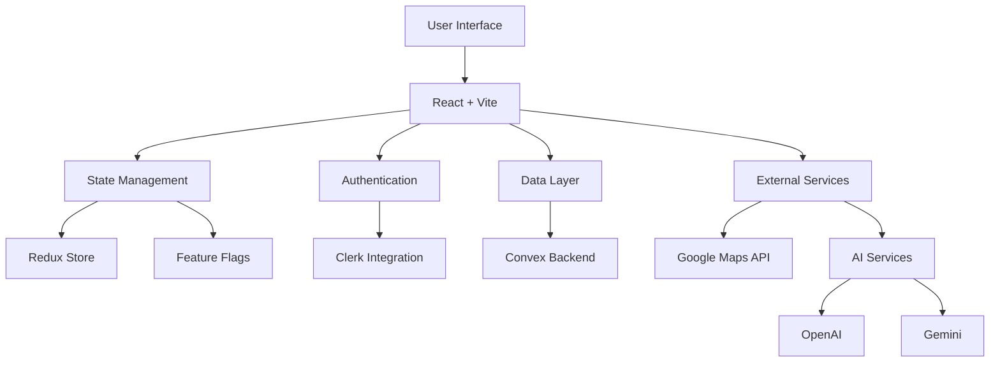

import ImageSlider from "../../components/ReactComponent/blog/enhancements/image-slider/image-slider";

## Project Overview

Lead Finder is a sophisticated SaaS platform designed to revolutionize how professionals discover and connect with business leads. Built with modern web technologies, it offers a seamless one-tab solution for finding, managing, and reaching out to potential business contacts.

## Key Features

- **Automated Lead Discovery**: Intelligent scraping and aggregation of business leads from various sources
- **AI-Powered Communication**: Integrated with Gemini & OpenAI for smart email generation
- **Gmail Integration**: Direct email communication within the platform
- **Lead Management**: Full CRUD operations for leads and email communications
- **Data Export**: Export leads to Excel/CSV format
- **Dark/Light Mode**: Customizable UI with multiple accent colors
- **Tiered Access**: Free and Pro ($8/month) subscription plans

## Technical Implementation

### Architecture Highlights

- **Frontend**: Built with React + Vite for optimal performance and development experience
- **Styling**: Tailwind CSS + Shadcn UI for a modern, responsive design
- **Authentication**: Secure user management through Clerk
- **Backend**: Scalable data management with Convex
- **State Management**: Redux for predictable state updates
- **Deployment**: Hosted on Vercel for reliable performance

## User Interface

<ImageSlider
  images={[
    "/BlogImages/leadfinder/Lead-Finder-(7).webp",
    "/BlogImages/leadfinder/Lead-Finder-(8).webp",
    "/BlogImages/leadfinder/Lead-Finder-(1).webp",
    "/BlogImages/leadfinder/Lead-Finder-(2).webp",
    "/BlogImages/leadfinder/Lead-Finder-(3).webp",
    "/BlogImages/leadfinder/Lead-Finder-(4).webp",
    "/BlogImages/leadfinder/Lead-Finder-(5).webp",
    "/BlogImages/leadfinder/Lead-Finder-(6).webp",
    "/BlogImages/leadfinder/Lead-Finder-(9).webp",
    "/BlogImages/leadfinder/Lead-Finder-(10).webp",
    "/BlogImages/leadfinder/Lead-Finder-(11).webp",
    "/BlogImages/leadfinder/Lead-Finder-(12).webp",
    "/BlogImages/leadfinder/Lead-Finder-(13).webp",
  ]}
  client:load
  layout="modern"
/>

## Future Development

The project roadmap includes:

1. **Enhanced Lead Sources**:

   - LinkedIn integration
   - Facebook lead lookup
   - Google search results scraping

2. **Platform Improvements**:

   - Expanded admin dashboard
   - Additional AI models and prompts
   - Comprehensive logging system

3. **Infrastructure**:
   - Codebase optimization
   - Enhanced documentation
   - Monitoring and error handling improvements

## Technical Challenges

One of the main challenges was balancing API costs with functionality:

- Managing Google Maps API usage
- Optimizing AI service calls (OpenAI + Gemini)
- Implementing efficient data caching
- Handling cross-environment data migrations

Despite starting as a simple one-page application, Lead Finder evolved into a full-featured SaaS platform with over 20,000 lines of TypeScript/JavaScript code, demonstrating the power of iterative development and careful architectural decisions.
