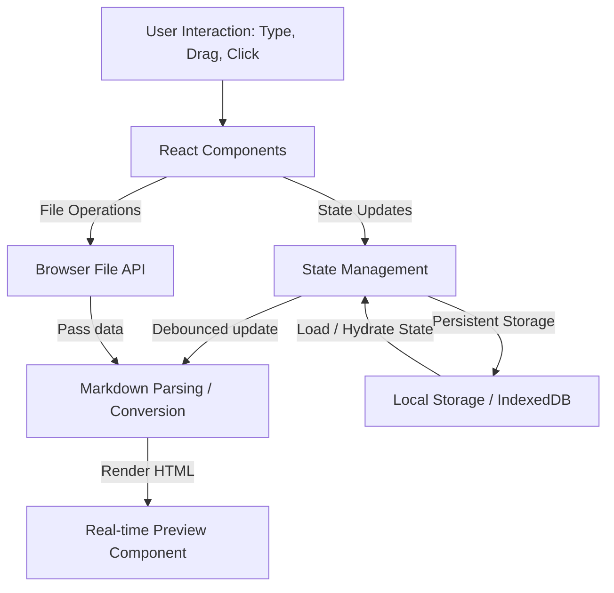
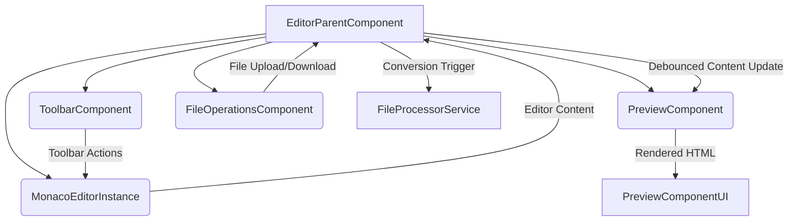
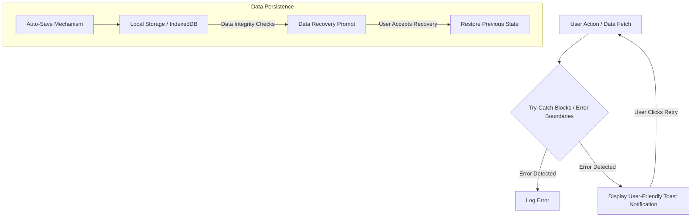

import ImageSlider from "../../components/ReactComponent/blog/enhancements/image-slider/image-slider";

## Project Overview

MarkdownPro is a modern, web-based Markdown editor and converter that combines powerful features with a sleek, user-friendly interface. Built for developers, writers, and Markdown enthusiasts, it offers a seamless experience from writing to final output.

## Key Features

- **Real-time Preview:** Instant rendering of GitHub-flavored Markdown with split-screen view
- **Multiple Export Formats:** Convert Markdown to HTML, PDF, and Plain Text
- **Auto-Save & Recovery:** Automatic saving with data persistence and recovery mechanisms
- **Modern UI/UX:** Responsive design with light/dark theme support and smooth transitions
- **File Operations:** Drag-and-drop support, file import/export, and format conversion
- **Performance Optimized:** Web Workers for heavy processing and debounced updates

## Technical Architecture

### Tech Stack

- **Frontend Framework:** React with TypeScript
- **Build Tool:** Vite for fast development and optimized production builds
- **State Management:** React Query for async operations and local React state
- **Styling:** Tailwind CSS with Shadcn/ui components
- **Storage:** IndexedDB for large documents, LocalStorage for settings
- **Performance:** Web Workers for heavy computations

### Core Components

## Implementation Highlights

### Storage Strategy

- Two-tiered storage approach using LocalStorage for quick access and IndexedDB for larger documents
- Automatic data recovery and integrity checks
- Persistent user preferences and theme settings

### Performance Optimizations

- Code splitting for optimized loading
- Debounced preview updates for smooth editing
- Web Workers for heavy parsing operations
- Efficient state management with React Query

### Error Handling

## Future Roadmap

- Real-time collaboration features
- Advanced export templates
- Git integration
- Cloud storage sync
- Public API for developers

## Live Demo

Experience MarkdownPro in action: [https://markdown-pro-two.vercel.app/](https://markdown-pro-two.vercel.app/)

## Project Showcase

<ImageSlider
  showThumbnails={true}
  layout="gallery"
  images={[
    "https://7huqjqx8yo.ufs.sh/f/TViMykBJnLIJFymikPXWYEs7fMHKuejzB1bRPk5wclXmdNI8",
    "https://7huqjqx8yo.ufs.sh/f/TViMykBJnLIJ80fXMstmYFqJTthG6XHUrp5nyDRAkMsBZ4v3",
    "https://7huqjqx8yo.ufs.sh/f/TViMykBJnLIJ80fXMstmYFqJTthG6XHUrp5nyDRAkMsBZ4v3",
    "https://7huqjqx8yo.ufs.sh/f/TViMykBJnLIJ8bfDWYtmYFqJTthG6XHUrp5nyDRAkMsBZ4v3",
    "https://7huqjqx8yo.ufs.sh/f/TViMykBJnLIJfECsihgM2Y36kmGTvR8NgZEHqahLDpX9VzJA",
    "https://7huqjqx8yo.ufs.sh/f/TViMykBJnLIJFeCIaKXWYEs7fMHKuejzB1bRPk5wclXmdNI8",
  ]}
/>
