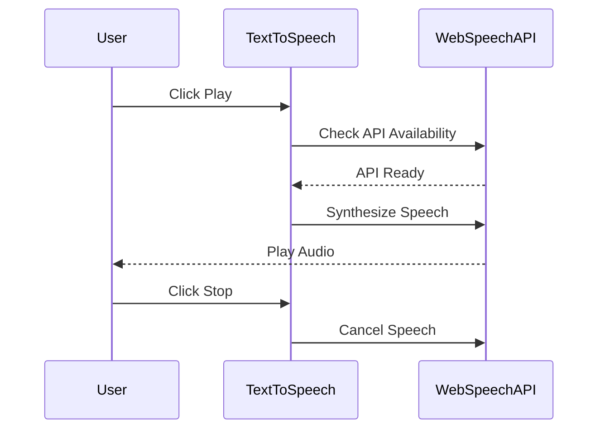

In the latest release of my portfolio blog, version **5.4.0**, we've introduced some exciting new features, bug fixes, and improvements that enhance both the user experience and performance of the site. Let’s dive into the details!

#### **New Features**

- **Text-to-Speech Blog Reader**: One of the major updates in this release is the addition of a **Text-to-Speech component** that enables users to have blog content read aloud. This feature enhances accessibility and provides a more interactive experience for visitors who prefer listening to the content instead of reading. With this addition, users can simply click to hear the blog posts, making the website more inclusive for a wider audience.

- **Dynamic Content Fetching with Feature Flags**: To improve performance and flexibility, we’ve enhanced the way blog content is rendered. The blog posts now fetch dynamic content based on **feature flags**, allowing for more targeted content delivery. This helps in enabling or disabling features without needing to redeploy, making future updates easier to manage.

#### **Bug Fixes**

- **Improved Error Handling**: We’ve also worked on improving error handling by adding a redirection to a **404 page** in cases where feature flag checks fail. This ensures that users won’t encounter unexpected behaviors or broken pages when a feature flag is missing or misconfigured.

#### **Chores and Optimizations**

- **Updated Version in `package.json`**: As part of this release, the version number has been updated in the `package.json` from **5.3.0** to **5.4.0** to reflect the new updates.
- **New Dependency for React Icons**: To enhance the UI and add more visual appeal, a new dependency for **React icons** has been added. This allows for easy and customizable icons throughout the website.

- **Optimized Build Configuration**: The build configuration has been optimized for the newly added React icons to ensure that everything runs smoothly and efficiently.

#### **Check Out the Pull Request**

For a more detailed view of the changes, check out the [pull request for version 5.4.0](https://github.com/rafay99-epic/Astro-Portfolio-Blog/pull/76). It includes all the technical details and commits related to this update.

#### **Sequence Diagram**

