## 🎨 Complete UI Redesign with Tokyo Night Theme

### **Core Theme Implementation**

- **Tokyo Night Color Palette**: Implemented consistent color scheme across all components
  - Primary Blue: `#7aa2f7`
  - Purple Accent: `#bb9af7`
  - Green Accent: `#9ece6a`
  - Background: `#1a1b26`
  - Text Primary: `#c0caf5`
  - Text Secondary: `#a9b1d6`
  - Muted Text: `#565f89`

## 🏗️ Centralized Theme Engine Architecture

### **Theme System Overview**

Version 8.0 introduces a revolutionary centralized theme management system that provides:

- **Single Source of Truth**: All colors managed in one configuration file
- **Multiple Usage Methods**: CSS variables, React hooks, Tailwind classes, and direct imports
- **Easy Theme Switching**: Change entire website theme with one line of code
- **Type Safety**: Full TypeScript support with interfaces and type checking
- **Performance Optimized**: CSS variables for best rendering performance
- **Future Extensibility**: Ready for additional themes and customization

### **Theme Engine Components**

#### **1. Core Configuration (`src/config/theme/colors.ts`)**

```typescript
interface ColorPalette {
  primary: string;
  secondary: string;
  accent: string;
  background: {
    primary: string;
    secondary: string;
    card: string;
    overlay: string;
  };
  text: { primary: string; secondary: string; muted: string; accent: string };
  border: { primary: string; secondary: string; accent: string; hover: string };
  status: { success: string; warning: string; error: string; info: string };
  interactive: {
    hover: string;
    focus: string;
    active: string;
    disabled: string;
  };
  gradients: {
    primary: string;
    secondary: string;
    accent: string;
    rainbow: string;
  };
  social: {
    twitter: string;
    facebook: string;
    linkedin: string;
    whatsapp: string;
    github: string;
    youtube: string;
    upwork: string;
  };
}
```

#### **2. React Hook System (`src/hooks/useTheme.ts`)**

- **`useTheme()`**: Main theme management hook
- **`useThemeColors()`**: Quick access to color values
- **`useThemeStyles()`**: Pre-built style functions and CSS classes
- **Dynamic CSS Variables**: Automatic CSS custom property updates
- **LocalStorage Persistence**: Theme preferences saved across sessions

#### **3. CSS Integration (`src/styles/theme.css`)**

- **CSS Custom Properties**: All theme colors as CSS variables
- **Universal Classes**: Pre-built utility classes for common patterns
- **Component Styles**: Ready-to-use component styling
- **Responsive Helpers**: Adaptive design utilities

#### **4. Tailwind Integration (`tailwind.config.mjs`)**

- **Theme Colors**: All colors available as Tailwind classes
- **Semantic Naming**: Meaningful class names like `bg-theme-primary`
- **Social Colors**: Platform-specific colors for social media integration

### **Theme Flow Architecture**

```mermaid
graph TD
    A[🎨 Theme Configuration<br/>src/config/theme/colors.ts] --> B[Color Palette Definition]
    A --> C[Theme Registry]
    A --> D[Type Definitions]

    B --> E[Tokyo Night Colors]
    B --> F[Cyberpunk Colors]
    B --> G[Future Themes]

    C --> H[Current Theme Selection]
    H --> I[🔄 Theme Switching Logic]

    I --> J[⚛️ React Hooks<br/>src/hooks/useTheme.ts]
    I --> K[🎨 CSS Variables<br/>src/styles/theme.css]
    I --> L[🌪️ Tailwind Classes<br/>tailwind.config.mjs]

    J --> M[useTheme Hook]
    J --> N[useThemeColors Hook]
    J --> O[useThemeStyles Hook]

    M --> P[🔄 Dynamic Updates]
    N --> Q[📱 Component Usage]
    O --> R[🎯 Style Helpers]

    K --> S[CSS Custom Properties]
    S --> T[--color-primary]
    S --> U[--color-secondary]
    S --> V[--gradient-accent]

    L --> W[Tailwind Classes]
    W --> X[bg-theme-primary]
    W --> Y[text-theme-accent]
    W --> Z[border-theme-secondary]

    P --> AA[💾 LocalStorage]
    P --> BB[🖼️ CSS Variable Updates]

    Q --> CC[🧩 React Components]
    R --> DD[🎨 Style Functions]

    S --> EE[📄 Global Stylesheets]
    W --> FF[🎯 Component Classes]

    CC --> GG[🌐 Rendered UI]
    DD --> GG
    EE --> GG
    FF --> GG

    style A fill:#7aa2f7,stroke:#bb9af7,stroke-width:3px,color:#fff
    style J fill:#bb9af7,stroke:#9ece6a,stroke-width:2px,color:#fff
    style K fill:#9ece6a,stroke:#7aa2f7,stroke-width:2px,color:#fff
    style L fill:#f7768e,stroke:#bb9af7,stroke-width:2px,color:#fff
    style GG fill:#24283b,stroke:#7aa2f7,stroke-width:3px,color:#c0caf5
```



### **Theme Usage Patterns**

#### **Method 1: CSS Variables (Best Performance)**

```css
.my-component {
  background: var(--color-bg-primary);
  color: var(--color-text-primary);
  border: 1px solid var(--color-border-accent);
}

.gradient-text {
  background: var(--gradient-accent);
  -webkit-background-clip: text;
  -webkit-text-fill-color: transparent;
}
```

#### **Method 2: Tailwind Classes (Most Convenient)**

```tsx
<div className="bg-theme-card text-theme-primary border-theme-accent">
  <h1 className="text-gradient-primary">Beautiful Header</h1>
  <button className="bg-theme-social-twitter hover:bg-theme-hover">
    Share on Twitter
  </button>
</div>
```

#### **Method 3: React Hooks (Dynamic)**

```tsx
import { useThemeColors } from "@hooks/useTheme";

const MyComponent = () => {
  const colors = useThemeColors();

  return (
    <div
      style={{
        background: colors.bgCard,
        color: colors.textPrimary,
        border: `1px solid ${colors.accent}`,
      }}
    >
      Dynamic themed content
    </div>
  );
};
```

#### **Method 4: Pre-built Classes (Ready to Use)**

```html
<div class="card-glassmorphism">Glass card effect</div>
<button class="btn-primary">Themed button</button>
<input class="input-theme" placeholder="Themed input" />
<div class="bg-gradient-accent">Gradient background</div>
```

### **Theme Switching Implementation**

#### **Quick Theme Change**

```typescript
// In src/config/theme/colors.ts
export const CURRENT_THEME: ThemeName = "cyberpunk"; // Just change this!
```

#### **Programmatic Theme Switching**

```tsx
import { useTheme } from "@hooks/useTheme";

const ThemeSelector = () => {
  const { currentTheme, switchTheme } = useTheme();

  return (
    <select onChange={(e) => switchTheme(e.target.value as ThemeName)}>
      <option value="tokyo-night">Tokyo Night</option>
      <option value="cyberpunk">Cyberpunk</option>
    </select>
  );
};
```

### **Available Themes**

#### **🌃 Tokyo Night (Default)**

- **Primary**: `#7aa2f7` (Blue)
- **Secondary**: `#bb9af7` (Purple)
- **Accent**: `#9ece6a` (Green)
- **Character**: Professional, modern, developer-focused

#### **🌆 Cyberpunk**

- **Primary**: `#ff0080` (Hot Pink)
- **Secondary**: `#00ff80` (Neon Green)
- **Accent**: `#8000ff` (Electric Purple)
- **Character**: Futuristic, high-energy, neon aesthetic

#### **🌊 Ocean & 🌲 Forest**

- **Status**: Ready for customization
- **Structure**: Complete ColorPalette interfaces prepared
- **Extensibility**: Easy to add new color schemes

### **Component Integration Examples**

#### **Before Theme Engine (Hardcoded)**

```tsx
// ❌ Old approach - hardcoded colors
<div style={{
  background: '#7aa2f7',
  color: '#c0caf5',
  border: '1px solid #565f89'
}}>
```

#### **After Theme Engine (Centralized)**

```tsx
// ✅ New approach - theme-aware
<div className="bg-theme-primary text-theme-primary border-theme-border-primary">
```

### **Performance Benefits**

- **CSS Variables**: Hardware-accelerated color changes
- **Single Source**: Eliminates duplicate color definitions
- **Bundle Optimization**: Reduced CSS size through reuse
- **Runtime Efficiency**: Minimal JavaScript execution for theme changes

### **Developer Experience**

- **IntelliSense**: Full TypeScript autocompletion
- **Type Safety**: Compile-time color validation
- **Hot Reload**: Instant theme changes during development
- **Documentation**: Comprehensive usage examples and patterns

### **Component Redesigns**

#### **1. Footer Component (Footer.astro)**

- **Size Optimization**: Reduced padding by 75% (py-8 → py-2) for better space utilization
- **Simplified Design**: Removed complex animations and floating background orbs
- **Layout Improvement**: Changed from 3-column grid to horizontal layout
- **Dynamic Version**: Implemented automatic version reading from package.json
- **Code Cleanup**: Removed 80+ lines of unused CSS animations and styles
- **Color Updates**: Applied muted Tokyo Night colors for better visual hierarchy
- **Spacing Reduction**: Further reduced gaps and margins to minimize empty space
- **Mobile Optimization**: Better mobile footer experience with reduced vertical space
- **Performance**: Eliminated unused @keyframes, animations, and CSS classes
- **Theme Integration**: Now uses `var(--color-text-muted)` and theme variables

#### **2. WikiPost Component (WikiPost.tsx)**

- **Complete Redesign**: Modern Tokyo Night theme with glassmorphism effects
- **Mobile-First Responsive**: Dynamic layout detection for optimal mobile experience
- **Enhanced Cards**: Version badges, metadata displays, and progress indicators
- **Animation System**: Staggered entrance animations with framer-motion
- **Empty States**: Beautiful no-content states with glassmorphism styling
- **Pagination**: Enhanced with Tokyo Night styling and smooth transitions
- **Background Optimization**: Removed unnecessary gradient backgrounds for performance
- **Theme Integration**: Uses `useThemeColors()` hook for dynamic theming

#### **3. SubjectGrid Component (subjectGride.tsx)**

- **Icon Diversity**: Added varied subject icons (FaBookOpen, FaGraduationCap, FaPenFancy, FaLightbulb)
- **Progress Indicators**: Visual progress based on note count
- **Interactive Elements**: Corner accents, hover effects, and animated bottom accent lines
- **Statistics Dashboard**: Summary statistics for better overview
- **Background Cleanup**: Removed background elements as requested
- **Theme Integration**: Migrated from hardcoded colors to theme system

#### **4. MS_Notes Components**

- **MS_NotesUi.tsx**: Complete mobile-first redesign with enhanced filter system
- **Beautiful Empty States**: Glassmorphism effects with gradient icons
- **Enhanced Cards**: Rich metadata and animated elements
- **MS_Notes.tsx**: Redesigned with interactive status indicators
- **Theme Integration**: Full theme color migration with CSS classes

#### **5. Error Pages Enhancement**

- **404-Component.tsx**: Code-style 404 display with animated color-changing elements
- **GSAP Dependency Removal**: Replaced with CSS animations for better performance
- **Personality**: Added coding comments for character
- **Glassmorphism**: Modern container styling
- **Theme Integration**: Uses `text-gradient-accent` and theme classes

#### **6. Experience Section (ExperienceSection.tsx)**

- **Timeline Redesign**: Alternating layout for desktop, vertical for mobile
- **Visual Enhancements**: Gradient timeline, corner accents, technology badges
- **Icon Integration**: Briefcase icons and calendar metadata
- **TypeScript Fixes**: Removed non-existent location property
- **Statistics**: Summary showing positions, technologies, and responsibilities
- **Theme Integration**: Complete migration to centralized theme colors

#### **7. Blog TOC (BlogTOC.astro → BlogTOC.tsx)**

- **React Conversion**: Converted from Astro to React for better performance
- **Responsive Design**: Improved UI fitting and mobile responsiveness
- **Performance Optimization**: Memoized components and throttled scroll listeners
- **Enhanced UX**: Compact height calculations and smoother scroll indicators
- **Accessibility**: Better focus states and keyboard navigation
- **Theme Integration**: Uses theme variables and CSS classes

#### **8. ShareButtons Component (socialButton.tsx)**

- **React Icons Migration**: Replaced simple-icons with react-icons for better performance and easier maintenance
- **Icon Centering Fixes**: Resolved icon positioning issues with proper flex centering
- **Background Removal**: Removed unnecessary dark backgrounds and borders per user request
- **Platform Colors**: Maintained platform-specific colors for brand recognition using theme system
- **Size Optimization**: Improved icon and button proportions
- **User Experience**: Fixed "broke" state where page only showed "Research Methods"
- **Simplified Animations**: Removed complex framer-motion animations that caused issues
- **Progressive Enhancement**: Multiple iterations based on user feedback for optimal positioning
- **Theme Integration**: Social colors now managed through theme system

#### **9. Layout Templates Redesign**

- **Reusable Components**: Created ArticleHeader.astro and ContentContainer.astro
- **Enhanced Layouts**: Updated MSNotes, Newsletter, Project, Wiki, and BlogPost layouts
- **Reading Progress**: Added progress bars with Tokyo Night colors via CSS variables
- **Typography**: Enhanced typography systems across all layouts
- **Background Cleanup**: Removed problematic gradients that didn't match site background
- **Theme Integration**: All layouts now use centralized theme system

#### **10. BlogPostLayoutHeader Component**

- **Tokyo Night Integration**: Applied theme while maintaining layout structure
- **Gradient Text**: Title uses all three accent colors via `text-gradient-accent`
- **Enhanced Tags**: Blue/purple gradients with improved hover effects
- **Metadata Styling**: Author info, dates with consistent Tokyo Night colors
- **Theme Integration**: Complete migration to theme classes and variables

#### **11. AboutMe Component (aboutme.tsx)**

- **Theme Color Migration**: Replaced all hardcoded colors with theme system
- **Dynamic Theming**: Added `useThemeColors()` hook for reactive color updates
- **CSS Class Integration**: Uses theme classes like `text-gradient-accent`, `bg-theme-card`
- **Fallback Content**: Added default content to prevent empty rendering
- **Performance Optimization**: Removed complex inline gradients for CSS classes
- **Responsive Design**: Maintained mobile and desktop layouts with theme integration

#### **12. DiagramEnhancer Component (New)**

- **Complete New Feature**: Interactive enhancement system for Mermaid diagrams
- **Blog/Wiki Integration**: Added to BlogPost.astro and Wiki.astro layouts with `client:load`
- **Smart Detection**: Automatically finds and enhances `img[id^='mermaid']` elements
- **Theme Integration**: Uses centralized theme colors with classes like `bg-theme-primary`, `text-theme-text-primary`
- **Responsive Controls**: Hover-triggered buttons with glassmorphism styling
- **Modal System**: Fullscreen viewer with escape key and click-outside functionality
- **Visual Feedback**: Immediate green success states with automatic 2-second reset
- **Performance Optimized**: Mutation observers with throttled enhancement execution
- **Error Handling**: Comprehensive clipboard API fallbacks and error logging
- **Mobile First**: Responsive design works across all device sizes
- **Accessibility**: Keyboard navigation, proper ARIA labels, and focus management

## 🚀 Performance Optimizations

### **Scroll Performance Fixes**

- **Auto-scroll Issues**: Resolved blog post auto-scrolling problems
- **Scroll Lag**: Fixed MS Notes scroll lag issues
- **Event Listener Optimization**: Throttled scroll events with passive listeners
- **Conflict Resolution**: Fixed multiple scroll listeners conflicting
- **Memory Management**: Improved cleanup and bounds checking

### **Component Performance**

- **React Migration**: Converted Astro components to React where beneficial
- **Memoization**: Added proper memoization for expensive computations
- **Animation Optimization**: Reduced reflows and improved GPU acceleration
- **Bundle Size**: Removed unused dependencies and code

### **Theme System Performance**

- **CSS Variables**: Hardware-accelerated theme switching
- **Lazy Loading**: Theme resources loaded on demand
- **Memory Efficiency**: Optimized color object management
- **Bundle Optimization**: Reduced CSS duplication through centralization

### **Code Optimization**

- **Import Path Updates**: Standardized imports to use `@hooks/useIsMobile`
- **TypeScript Improvements**: Fixed type errors and improved type safety
- **Unused Code Removal**: Eliminated dead code and unused styles
- **Tree Shaking**: Better dead code elimination through proper exports

## 🐛 Major Bug Fixes

### **Scrolling Issues Resolution**

- **Multiple Scroll Listeners**: Fixed conflicts between BlogTOC and progress bar
- **Scroll Offset Mismatch**: Corrected TOC scroll calculations
- **ScrollIntoView Conflicts**: Removed problematic auto-scrolling
- **Performance Issues**: Optimized scroll event handling

### **BlogTOC Fixes**

- **UI Fitting**: Resolved layout issues in blog posts
- **Dynamic Spacing**: Implemented smart spacing based on content length
- **Scroll Glitches**: Fixed component movement and glitching on hover
- **Responsive Behavior**: Improved mobile and tablet experiences

### **Component Fixes**

- **ShareButtons**: Fixed "broke" state and icon positioning
- **Icon Sizing**: Corrected icon proportions and spacing
- **Background Issues**: Resolved background conflicts
- **Animation Conflicts**: Eliminated problematic animations

### **Theme System Fixes**

- **Hook Conflicts**: Resolved duplicate property errors in `useThemeColors`
- **CSS Variable Updates**: Fixed dynamic CSS property updates
- **Type Safety**: Corrected TypeScript interface definitions
- **Performance**: Optimized theme switching performance

## ✨ New Features

### **Interactive Mermaid Diagram Enhancement System**

- **Smart Diagram Detection**: Automatically detects and enhances Mermaid diagrams generated by rehype-mermaid
- **Copy SVG Functionality**: One-click copying of SVG markup to clipboard for reuse in other projects
- **Fullscreen Viewer**: Modal view for detailed diagram inspection with enhanced visibility
- **Visual Feedback**: Green success states with checkmarks when copying diagrams
- **Keyboard Shortcuts**: ESC key support for quick modal dismissal
- **Click-to-Close**: Intuitive click-outside-modal closing behavior
- **Theme Integration**: Uses centralized Tokyo Night theme colors for consistent styling
- **Multiple Access Points**: Copy and fullscreen buttons on hover, plus modal toolbar
- **Mobile Optimized**: Responsive design works across all device sizes
- **Automatic Enhancement**: DOM mutation observers ensure dynamic content gets enhanced
- **Error Handling**: Graceful fallbacks and comprehensive error management
- **Performance Optimized**: Efficient element detection and event handling

#### **DiagramEnhancer Component Features**

```typescript
// Component automatically enhances all Mermaid diagrams
<DiagramEnhancer client:load />
```

- **Hover Controls**: Copy and Fullscreen buttons appear on diagram hover
- **SVG Extraction**: Decodes SVG content from img-svg data URLs
- **Visual States**:
  - Default: "Copy SVG" with copy icon
  - Success: "SVG Copied!" with checkmark and green background
  - Auto-reset after 2 seconds
- **Fullscreen Modal**:
  - Large diagram view with centered content
  - Header with title and action buttons
  - "ESC to exit" keyboard indicator
  - Copy functionality within modal
  - Theme-consistent styling

#### **Technical Implementation**

- **Strategy Compatibility**: Works with rehype-mermaid `img-svg` strategy
- **DOM Manipulation**: Dynamic wrapper creation with theme classes
- **Event Management**: Proper event delegation and cleanup
- **Clipboard API**: Modern clipboard integration with fallback handling
- **React Hooks**: useState for modal state, useEffect for DOM enhancement
- **Responsive Design**: Adapts to container sizes and screen dimensions

### **Centralized Theme Management**

- **Single Configuration**: All colors managed in `src/config/theme/colors.ts`
- **Multiple Access Methods**: CSS variables, React hooks, Tailwind classes
- **Easy Theme Switching**: One-line theme changes
- **Type Safety**: Full TypeScript support
- **Performance Optimized**: CSS variables for hardware acceleration
- **Extensible**: Ready for additional themes

### **Theme Manager Component**

- **UI Theme Switcher**: Beautiful dropdown for theme selection
- **Theme Previews**: Color previews for each theme
- **Dark Mode Toggle**: Built-in dark/light mode support
- **LocalStorage**: Persistent theme preferences
- **Accessibility**: Keyboard navigation and screen reader support

### **Dynamic Version Display**

- **Package.json Integration**: Automatic version reading
- **Footer Enhancement**: Dynamic version display in footer
- **Maintenance Reduction**: No more manual version updates

### **Enhanced Advertisement System**

- **AdSense Integration**: Proper ad initialization and error handling
- **Tokyo Night Styling**: Themed advertisement sections using theme system
- **Mobile Optimization**: Responsive ad containers
- **Dynamic Spacing**: Smart spacing based on content

### **Improved Mobile Experience**

- **Mobile-First Design**: All components redesigned with mobile priority
- **Touch Interactions**: Better touch targets and gestures
- **Responsive Typography**: Adaptive text sizing with theme integration
- **Navigation**: Improved mobile navigation patterns

### **Enhanced Content Management**

- **Wiki System**: Improved wiki documentation system
- **Tag System**: Better tag management and filtering
- **Content Organization**: Enhanced content structure
- **Diagram Integration**: Interactive Mermaid diagram system with copy and fullscreen capabilities

## 🛠 Technical Improvements

### **Development Experience**

- **TypeScript**: Improved type safety across components and theme system
- **Error Handling**: Better error boundaries and user feedback
- **Code Structure**: More maintainable component architecture
- **Documentation**: Enhanced code documentation with theme examples

### **Theme Development**

- **Hot Reload**: Instant theme changes during development
- **Type Checking**: Compile-time validation of theme configurations
- **IntelliSense**: Full autocompletion for theme properties
- **Documentation**: Comprehensive theme usage examples

### **Accessibility Improvements**

- **Keyboard Navigation**: Better keyboard support
- **Screen Readers**: Improved ARIA labels and descriptions
- **Focus Management**: Enhanced focus states and navigation
- **Color Contrast**: Improved contrast ratios with Tokyo Night theme
- **Theme Accessibility**: High contrast options and color blind support

### **SEO & Performance**

- **Core Web Vitals**: Improved loading times and performance metrics
- **Image Optimization**: Better image handling and loading
- **Code Splitting**: Optimized bundle sizes
- **Caching**: Improved caching strategies
- **Theme Performance**: Optimized CSS variable usage

## 📱 Responsive Design Enhancements

### **Breakpoint Optimization**

- **Mobile (320px-768px)**: Enhanced mobile experience with theme integration
- **Tablet (768px-1024px)**: Improved tablet layouts
- **Desktop (1024px+)**: Optimized desktop experience
- **Large Screens (1440px+)**: Better utilization of large displays

### **Component Responsiveness**

- **Grid Systems**: Improved grid layouts across all screen sizes
- **Typography**: Responsive text scaling with theme-aware colors
- **Spacing**: Adaptive spacing systems using theme variables
- **Navigation**: Responsive navigation patterns with theme integration

## 🎯 User Experience Improvements

### **Visual Hierarchy**

- **Color Coding**: Consistent color usage for information hierarchy through theme system
- **Typography**: Enhanced readability with proper font scaling and theme colors
- **Spacing**: Improved whitespace usage with theme-aware margins
- **Focus States**: Clear interactive element states using theme colors

### **Loading States**

- **Empty States**: Beautiful no-content displays with theme integration
- **Loading Animations**: Smooth loading transitions using theme colors
- **Error States**: User-friendly error messages with theme styling
- **Progress Indicators**: Clear progress feedback using theme gradients

### **Interaction Design**

- **Hover Effects**: Subtle and meaningful hover states using theme colors
- **Click Feedback**: Immediate feedback on interactions
- **Animation Timing**: Optimized animation durations
- **Gesture Support**: Better touch and swipe support
- **Theme Transitions**: Smooth color transitions when switching themes

## 🔧 Configuration & Customization

### **Feature Flags**

- **Dynamic Features**: Better feature flag implementation
- **A/B Testing**: Support for testing new features
- **Performance Monitoring**: Better performance tracking
- **User Preferences**: Enhanced customization options
- **Theme Preferences**: Persistent theme selection

### **Theme System Configuration**

- **Color Customization**: Systematic color management through single configuration
- **Component Theming**: Consistent theming across all components
- **Dark Mode**: Enhanced dark mode implementation
- **Accessibility**: Better contrast and readability options
- **Multi-theme Support**: Infrastructure for unlimited theme additions

### **Easy Theme Creation**

```typescript
// Example: Creating a new theme
const oceanTheme: ColorPalette = {
  primary: "#4a90e2",
  secondary: "#6bb6ff",
  accent: "#87ceeb",
  // ... complete the palette
};

// Register the theme
const themes: Record<ThemeName, ColorPalette> = {
  "tokyo-night": tokyoNightColors,
  cyberpunk: cyberpunkColors,
  ocean: oceanTheme, // Add new theme
};
```

## 📋 Migration Notes

### **Breaking Changes**

- **Component APIs**: Some component interfaces updated for theme integration
- **CSS Classes**: Updated class names for consistency with theme system
- **Import Paths**: Standardized import paths including new theme hooks
- **Color Usage**: Hardcoded colors replaced with theme system

### **Migration Path**

- **Gradual Migration**: Old hardcoded colors still work during transition
- **Theme Classes**: New components should use theme classes
- **Hook Integration**: React components can use theme hooks
- **CSS Variables**: Stylesheets can migrate to CSS variables

### **Upgrade Considerations**

- **Browser Support**: Minimum browser requirements updated for CSS variables
- **Dependencies**: Updated React and Astro versions
- **Performance**: Improved performance across all devices with theme system
- **Development**: New theme development patterns and best practices

## 🎉 Summary

Version 8.0 represents a complete transformation of the portfolio website with:

- **Revolutionary Theme Engine** providing centralized color management with multiple access methods
- **Interactive Mermaid Diagram System** with copy, fullscreen, and enhanced user interaction capabilities
- **Modern Tokyo Night Theme** applied consistently across all components
- **Significantly improved performance** with optimized scroll handling and reduced bundle sizes
- **Enhanced mobile experience** with mobile-first responsive design
- **Better maintainability** through cleaner code and component architecture
- **Improved accessibility** and user experience with theme-aware design
- **Dynamic features** like automatic version management and theme switching
- **Comprehensive bug fixes** addressing scrolling, layout, and performance issues
- **Developer-friendly** theme system with TypeScript support and comprehensive documentation
- **Future-ready architecture** for easy theme expansion and customization

### **Theme System Benefits**

- **🎨 Single Source of Truth**: All colors in one configuration file
- **⚡ Performance Optimized**: CSS variables for hardware acceleration
- **🔄 Easy Theme Switching**: Change entire website with one line
- **📱 Multiple Usage Methods**: CSS, React, Tailwind, direct imports
- **🛡️ Type Safe**: Full TypeScript support and validation
- **🚀 Developer Friendly**: IntelliSense, hot reload, comprehensive docs
- **🔮 Future Ready**: Extensible architecture for unlimited themes

This major release establishes a solid foundation for future development with modern design patterns, improved performance, exceptional user experience across all devices, and a powerful theme management system that makes customization effortless.

---

**Release Date**: January 21, 2025  
**Version**: 8.0.0  
**Previous Version**: 7.7  
**Total Changes**: 20+ components redesigned, 15+ bug fixes, 12+ new features, Complete theme engine implementation, Interactive diagram enhancement system

**Major New Files**:

- `src/config/theme/colors.ts` - Core theme configuration
- `src/hooks/useTheme.ts` - React theme hooks
- `src/styles/theme.css` - CSS variables and utilities
- `src/components/ReactComponent/layout/ThemeManager/ThemeManager.tsx` - Theme switcher UI
- `src/components/ReactComponent/blog/enhancements/diagram-renderer/DiagramEnhancer.tsx` - Interactive diagram enhancement
- `src/components/ReactComponent/blog/enhancements/diagram-renderer/MermaidWrapper.tsx` - Alternative diagram wrapper
- `src/components/ReactComponent/blog/enhancements/diagram-renderer/index.ts` - Export barrel file
